# Lab architecture

[Documentation home](../README.md) · [Platform contracts](../reference/platform/README.md)

The VM owns the Linux kernel, hwsim radios, wmediumd and nested LXD. Native
RDK-B userspace runs in containers: `bpibroadband` contains the controller and
colocated Agent-1; `bpiap`, `bpiap-001` through `bpiap-003` are extenders.
Twenty `wlan-client*` containers run real station software. Controller plus
Agent-1 are displayed separately, so five mesh containers appear as six roles.

## Ownership

| Subsystem | Owns | Does not prove |
| --- | --- | --- |
| hwsim + wmediumd | Frame delivery, modeled loss/signal, radio identity | Real-world propagation fidelity |
| OneWifi / HAL / hostapd / supplicant | AP/STA interfaces, association, security and traffic | Controller model freshness |
| EasyMesh controller and agents | IEEE 1905 exchanges, reported topology/metrics, native steering transactions | An optimal autonomous policy |
| Configurator / room runner | World-to-RF compilation, atomic generations, exact restoration | Native measurements or completed BTM |
| External optimizer | Candidate evaluation and bounded requests | Forced station compliance |
| Room / topology / Console | Geometry / controller model / medium observations | Interchangeable sources of truth |
| Prometheus / Grafana | Infrastructure resource trends | RF or handover timing |

A frame crosses real Linux Wi-Fi/network paths through the simulated medium.
The management bridges are for provisioning/control, not a substitute for
verifying the wireless client data path. A successful steer requires agreement
between station association, controller ownership and traffic.

## Startup and isolation

The radio host prepares stable inventory and medium before admitting mesh and
client roles. The controller must form its own model through native onboarding;
do not repair it by injecting associations into the UI. VM startup reconstructs
this inventory through the packaged systemd units. Daily operation uses those
units, not a second hand-written provisioning sequence.

The RDK single-wiphy/VAP model and stable MAC mapping are detailed in
[the radio contract](../reference/platform/single-wiphy-radio-model.md).
prplMesh uses its own radio inventory and NBAPI adapter; do not copy RDK
container/BSSID assumptions into that backend.

See [RF simulation](rf-simulation.md), [steering policy](steering-policy.md),
[room coordination](../reference/rooms/architecture.md) and
[patch ownership](../reference/platform/patch-set.md) for the relevant boundary.
