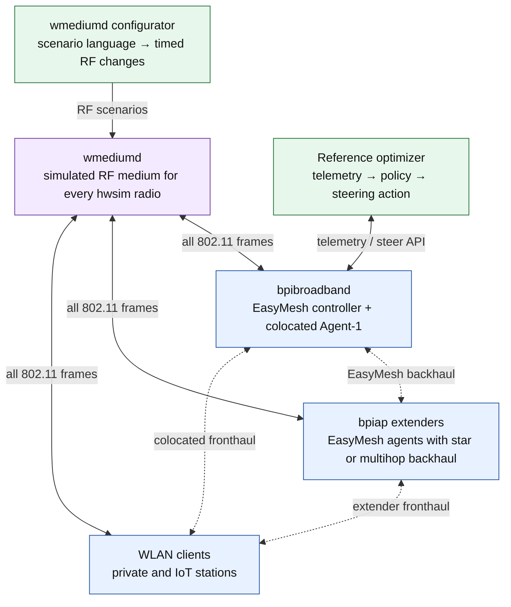
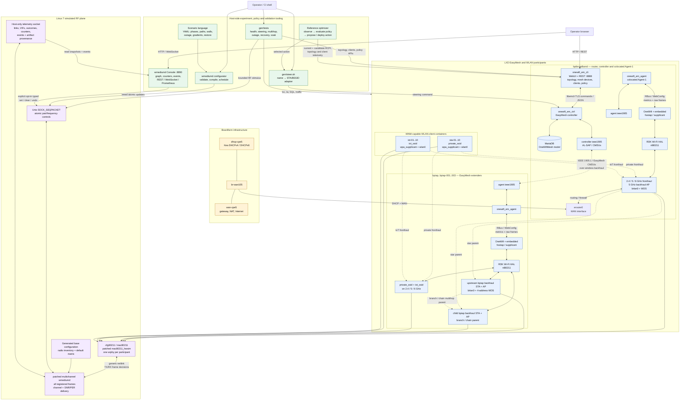

# Architecture

## What is simulated

The physical Banana Pi R4 platform is replaced by x86 RDK-B userspace in LXD.
The radio and propagation environment are simulated; the Wi-Fi, bridging,
IEEE 1905.1, WSC, topology and steering protocol paths remain real.

```text
physical platform                 evaluation lab
-------------------------------   --------------------------------------
BPI controller board              bpibroadband LXD container
BPI extender board                bpiap[-NNN] LXD container
MT7988 radios                      mac80211_hwsim wiphy
radio propagation                 patched multichannel wmediumd
phone/laptop                      WNM-capable wlan-client LXD container
board kernel                      shared Linux 7.0 VM/host kernel
```

`bpibroadband` contains an EasyMesh controller and a colocated agent. Each
`bpiap` is an agent-only extender. The accepted scale is four extenders and
twenty client stations: ten private and ten IoT.

## Lab at a glance

This simplified view is the starting point for presentations and first-time
readers. Every Wi-Fi relationship passes through wmediumd even though the
backhaul and fronthaul associations are shown directly.



[Open the static overview SVG](easymesh-lab-overview.svg).

## Complete lab map

The diagram is the project-level introduction. Solid arrows are API, local
software or wired boundaries. Dashed arrows are wireless relationships carried
as real 802.11 frames through hwsim and wmediumd. Blue nodes are the RDK-B and
EasyMesh system under test, green nodes are experiment tooling, purple nodes
are the simulated medium, and amber nodes provide WAN infrastructure.



[Open the static complete architecture SVG](easymesh-lab-architecture.svg).

Only the controller has a wired WAN leg. Do not connect an extender to the
controller LAN: wireless backhaul already joins their bridge domains and a
second path creates a loop. Client `eth0` is management-only; WLAN tests must
use `wlan0`.

## Radio model

Every BPI container receives exactly one hwsim wiphy. `FEATURE_SINGLE_PHY`
projects it into three logical EasyMesh radios:

```text
one hwsim wiphy
|-- wifi0    2.4 GHz, channel 6
|-- wifi1    5 GHz, channel 36
`-- wifi2    6 GHz, 20 MHz, operating class 131
```

This is a hard invariant. Three physical wiphys are not equivalent and break
OneWifi's single-phy assumptions.

The official lab uses Linux 7.0.0-28 with `radios=32 channels=3 regtest=5`.
`regtest=5` selects the 6 GHz-capable `custom_03` regulatory domain. 2.4, 5 and
6 GHz have been validated together. Linux 6.8 is no longer an official runtime
target because its 6 GHz regulatory and multi-context behavior differs.

Bare hwsim gives every link a flat signal. wmediumd owns RF delivery,
interference and per-radio-pair SNR. Frequency belongs to the active VIF, not to
the parent wiphy; the multichannel patches isolate simultaneous 2.4/5/6 GHz
contexts.

## Identities

```text
AL-MAC    one IEEE 1905/EasyMesh device
RUID      one logical radio owned by that device
BSSID     one AP service on a radio
STA MAC   a client or backhaul station interface
```

A device identity is `{AL-MAC, RUID set}`. Preserve all of it when restarting
the same logical device, or regenerate all of it with `bpi.sh -F`. Reusing old
RUIDs under a new AL-MAC creates a stale-device collision.

## Processes and interfaces

| Boundary | Interface |
| --- | --- |
| browser to CLI/UI | HTTP on controller port 8888 |
| `em_cli` to controller | libemcli/TLS command channel |
| controller/agent to 1905 | local AL-SAP socket |
| controller to agents | IEEE 1905.1 CMDUs, EtherType `0x893a` |
| agent to OneWifi | RBus WebConfig subdocs and raw-frame actions |
| OneWifi/HAL to kernel | embedded hostap/supplicant plus nl80211 |
| hwsim to wmediumd | generic netlink registration/frame transport |
| configurator to wmediumd | Unix `SOCK_SEQPACKET`, `/run/wmediumd-control.sock` |
| controller model | MariaDB database `OneWifiMesh` |

Runtime ownership:

| Component | Services/processes |
| --- | --- |
| controller | `em_ctrl`, `ieee1905_em_ctrl`, MariaDB |
| colocated/remote agent | `em_agent`, `ieee1905_em_agent` |
| Wi-Fi management | `onewifi`; HAL and hostap state machines are embedded |
| UI/CLI | `em_cli` / `onewifi_em_cli` |
| client | standalone WNM-enabled `wpa_supplicant` |
| medium | host/VM `wmediumd.patched` |

## Onboarding sequence

```text
1. hwsim wiphy enters the container namespace.
2. OneWifi creates the controller backhaul/fronthaul VAPs.
3. Extender backhaul STA associates and completes the four-way handshake.
4. Authorized WDS/AP-VLAN interfaces join brlan0 and forward.
5. Agent sends AP-Autoconfiguration Search; controller responds.
6. Agent sends WSC M1 with RUID and capabilities.
7. Controller sends WSC M2 with SSID, security and role.
8. Agent converts M2 to WebConfig and OneWifi creates its VAPs.
9. Topology, radio, BSS and client reports converge in the controller model.
```

The controller model gate is not interchangeable with service readiness. A
healthy scaled lab must show five EasyMesh devices, fifteen radios, fifty
BSSs, four associated backhaul STAs and twenty associated WLAN clients. The
database total is therefore `5/15/50/24`.

## Control and data planes

Control:

```text
em_ctrl -> AL-SAP -> ieee1905 -> WLAN -> ieee1905 -> em_agent
        -> RBus/WebConfig -> OneWifi -> HAL/nl80211
```

Client data through an extender:

```text
client wlan0 -> extender fronthaul AP -> extender brlan0
 -> extender backhaul STA -> controller WDS port -> controller brlan0
 -> DHCP/gateway/WAN
```

Association without an authorized forwarding WDS path is not success: control
frames may be visible while DHCP and data fail.

## Failure localization

Diagnose from the bottom up:

```text
radio/channel/regulatory state
-> AP and backhaul association/security
-> WDS and bridge forwarding
-> IEEE 1905 transport
-> WSC M1/M2 transaction
-> WebConfig/OneWifi application
-> topology/radio/BSS/client model
-> steering decision and BTM outcome
```

Place a fix at the lowest owner of the broken contract. A malformed nl80211
attribute belongs in HAL; protocol transaction state belongs in
unified-wifi-mesh; unsupported simulated-radio behavior belongs behind an hwsim
feature gate; namespace and persistent-volume lifecycle belongs in `gen/`.

## Current boundaries

- Clean deployment, commanded steering and unattended cold-boot reconstruction
  are validated at four extenders and twenty WLAN clients.
- Complete RF isolation now ages a remote IEEE1905 neighbor, probes it through
  a bounded standard Topology Query, removes only its active publication and
  restores the same identity when valid traffic returns.
- The wmediumd configurator safely controls both radio-pair SNR and sparse,
  frequency-qualified SNR overrides on a shared hwsim radio. This supplies
  band-specific RF stimulus; autonomous band steering still requires fresh
  candidate-BSSID measurements and a policy decision.
- The external reference optimizer observes current and candidate telemetry,
  evaluates bounded policies and emits explainable proposals. Steering action
  deployment remains an explicit opt-in through `gen/steer.sh`; no autonomous
  policy engine runs inside the BPI containers. See [optimizer](optimizer.md)
  and [steering policy](steering-policy.md).
