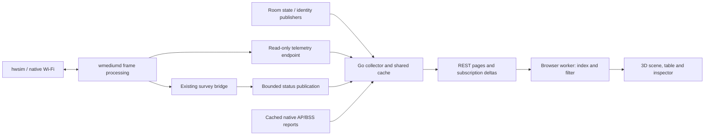

# wmediumd Console: interactive medium explorer

**Status: Console NG implementation supplied; runtime qualification pending.**
The [operator manual](../guide/wmediumd-console-ng.md) describes the shipped UI.
`gen/wmediumd/observer/internal/explorer`, `web/ng` and daemon patch 0032 implement
the read-only explorer, demand-driven collection, selected subtype/header
windows and service accounting. The room supplies a side-effect-free observer
endpoint. No BPI or hwsim ABI changes are required. Compilation is not a measured
performance claim; the acceptance campaign below remains operator-run.

This document retains the design rationale and acceptance targets, not promises
that older deployed binaries support the new records. Capability statements below are
verified against the repository's wmediumd patches, hwsim patches, Go observer
and room implementation. They do not certify the binaries in a running VM.
Negotiate capabilities and show actual availability on every connection.

The desired result is a navigable **3D model of the medium**, linked to a
collapsible graphical table and a readable properties inspector. A user should
quickly answer: who exists, who can hear whom, which frames are being processed,
why a delivery failed, what changed the RF state, and why a provisioned client
is absent from the room. Keep the console usable without the room service.

Navigation: [semantics](#1-what-the-console-represents),
[existing capabilities](#2-confirmed-capabilities-and-gaps),
[visual model](#3-the-visual-model),
[table and properties](#4-graphical-table-and-properties),
[offline clients](#5-explaining-the-100-client-pool),
[collection](#7-collection-and-api-design),
[browser implementation](#8-browser-rendering-implementation),
[delivery plan](#9-implementation-order),
[acceptance](#10-acceptance-plan),
[possible controls](#11-optional-future-controls).

## 1. What the console represents

**A radio pair is not a packet stream or a Wi-Fi association.** Use these
distinct objects throughout the interface and API:

| Object | Meaning and identity |
| --- | --- |
| Device | Human identity such as `agent-1`, `ext-2`, `sta-0a` or `iot-14`; owns radio/interface identities |
| hwsim radio | Kernel radio identity, correlated to wmediumd's transmitter identity; not necessarily one radio per advertised band |
| VIF/BSS | Interface/BSSID owned by a radio; multiple BSSs can share that radio |
| Directed pair | Configured potential RF relationship `source radio → destination radio`; reverse direction is independent |
| Frequency rule | Exact-frequency override for a directed pair; otherwise its current pair SNR applies |
| Observed packet path | Bounded telemetry for `source radio → receiver radio @ frequency`; contains processing outcomes, including multicast fan-out |
| Association | Separate protocol-positive ownership evidence; never inferred solely from SNR, traffic volume or proximity |
| Receive context | Kernel operating/scan/ROC context with frequency, width and lifecycle identity; not the same as the last transmitted frequency |
| Survey | Modeled busy/active time over a window at a frequency or observer context |

Call the main table **Radios and paths**, with explicit **Observed traffic** and
**Configured RF** views. Explain “stream” as an informal packet path; this
implementation does not maintain TCP/UDP sessions or application flows. One
path may carry many packet types and BSSs. A beacon transmission may produce
many receiver outcomes. Those outcomes do not represent many transmitted
beacons or many associated clients.

The full configured matrix has `N × (N−1)` directed pairs. For example, 105
daemon radio identities imply 10,920 pairs, before frequency overrides. Derive
`N` from the daemon; do not derive it from the number of room icons, BSSs,
logical bands, configured kernel radios or client containers.

## 2. Confirmed capabilities and gaps

### Available data versus required integration

| Requirement | Repository support today | Work required for the explorer |
| --- | --- | --- |
| Radio names, owners and VIF mapping | Generated identity inventory maps radio identities to EM CLI names; observer enriches radios without querying LXD | Make names primary everywhere; preserve stable identities and expose alias conflicts |
| Directed SNR and frequency overrides | Atomic generations, exact-frequency readback and paged matrix dumps | Effective-value inspector, reverse-direction comparison, indexed browsing and cache invalidation |
| Frame classes | Global and radio/frequency counters: management, control, data, EAPOL, unicast/multicast | Windowed breakdowns with explicit counter scope; EAPOL is an overlapping classification |
| Packet paths | Frames/bytes, attempts/retries, ACK/no-ACK, injections, drop categories, last signal/SNR/PER, last type/subtype/access category | Rates, freshness and useful grouping; no existing complete per-path subtype histogram |
| Path retention | Active-path table bounded to 4,096 entries; event ring to 1,024 entries | Show occupancy, eviction, history gaps and retention scope; never claim unlimited history |
| Associations | Protocol-positive ledger from successful acknowledged association/data exchanges, with confirmed departure handling | Keep it distinct from packet paths; current Go lookup selects client roles, not comprehensive backhaul station ownership |
| Radio channels | Radio/frequency activity and VIF frequency observations | Show last-observed activity honestly; integrate context data for current listening/scan state |
| Survey/load | Daemon channel survey opcode 15 and observer-survey opcode 16; hwsim cache and bridge implemented | Go console currently decodes only capability bits 0–11; add bits 12–15 and survey/bridge models |
| BSS Load | Native hostapd beacon/scan and AP-report paths supported by the qualified RF profile | Correlate cached native records by BSSID; no existing console BSS Load field or packet-payload decoder |
| RF modes | Default global contention per frequency; opt-in visibility reservations and bounded access-category admission | Display negotiated activation, profile and limits, not just installed features |
| Queue/transport health | Queue depth/max, last/max queue delay, retry/drop and netlink rejection counters | Explain sampling and scopes; per-AC depth, latency percentiles and detailed scheduler reasons need extensions |
| Control activity | Instance, generation and bounded `generation_applied` events including update count and pair/frequency kind | Decode existing metadata; add requesters, affected keys, rejects and timings |
| Room selection/presence | Read-only room APIs expose selected world, roles, presence, applied generation and recovery status | Optional cached adapter; no room ownership lease needed for viewing |
| Geometry | Room has coordinates, walls and movement; medium stores applied relationships | Optional room alignment; wmediumd does not independently know the floor plan |
| Physical fidelity | Qualified modeled legacy20 airtime and selected native reporting paths | Keep modern PHY capacity, independent noise, CSI, adjacent-channel overlap and physical collision claims unavailable |

The current event's generation value retains only the low 31 bits; use the
full status generation for identity and never reconstruct a complete audit
history from the event value alone.

Packet-type counters describe frames visible at the daemon's instrumented
boundaries. Modeled reverse ACK outcomes do not imply that each ACK appeared
as a separate ingress control frame. Likewise, `RXInjected` means submitted
through the simulated receive path, not delivered to an application.

Current active-path counters aggregate by radio pair and frequency. The
multicast flag indicates fan-out involvement; it is not a complete independent
unicast/multicast partition. Do not present mixed legacy records as two
separately measured streams. New partitioned records require a versioned wire
extension.

### Survey and BSS Load presentation

Preserve the existing [RF measurement contract](../reference/radio/virtual-rf-assessment.md).
Present three separately sourced values:

1. **Modeled channel activity:** `100 × Δbusy / Δactive`, with scope and window.
2. **Native reported utilization:** raw byte `0–255` and percentage conversion,
   with native report identity and age.
3. **Advertised BSS Load:** actual observed beacon/scan station count,
   utilization byte and admission-capacity field, when available.

BSS Load belongs to a BSS; survey activity belongs to a channel/context. Neither
is an intrinsic property of a pair. A pair inspector may link to the destination
BSS or show its parent radio's load, explicitly labeled. Never distribute radio
load between pairs from byte ratios, sum the same channel across BSSs, or
substitute survey utilization for an unobserved beacon field. Admission-capacity
zero is not proof of zero available throughput.

The survey bridge already writes `/run/wmdcfg-survey.json`, including channels,
context records, provider/epoch information and errors. Prefer reading this
bounded publication over making a second survey collector. Its normal 100 ms
sampling serves the RF system independently of the console. The driver cache
expires after one second; bridge status publication has a 250 ms minimum
interval. A slow console must retain the original sample time and mark stale
data rather than extending validity.

Observer surveys have up to 128 leased radio/frequency subscriptions, with
two-second leases. Under visibility reservations, new subscriptions allocate
accounting state. Even a read-only socket request can therefore add work.
Do not create a subscription for every potential pair or every browser.

### Source map for implementation

Paths are relative to the repository root; these are the owning implementation
surfaces, not new parallel specifications.

| Source | What was checked / where changes belong |
| --- | --- |
| [Go protocol client](../../../gen/wmediumd/observer/internal/wmdproto/client.go) | Full snapshot collection, paging, capability decoding and association lookups |
| [Go models](../../../gen/wmediumd/observer/internal/model/model.go) | Exact counters and current snapshot schema |
| [Collector](../../../gen/wmediumd/observer/cmd/wmediumd-observer/main.go), [store](../../../gen/wmediumd/observer/internal/state/store.go) | Two-second default collection, shared snapshots and replaceable subscriber updates |
| [HTTP API](../../../gen/wmediumd/observer/internal/httpapi/server.go), [browser](../../../gen/wmediumd/observer/web/app.js) | Full-snapshot broadcasts, full DOM redraws and 800-row presentation caps |
| [Identity generator](../../../gen/wmediumd/observer/generate-identity-inventory.sh), [matrix generator](../../../gen/wmediumd/gen-config.sh) | Human names, managed radios, spare exclusion and baseline pairs |
| [wmediumd patches](../../../gen/wmediumd/patches/) | 0014 telemetry; 0016/0017/0024 ownership; 0018 paging; 0020–0023 surveys/airtime/ACKs; 0027 receive contexts; 0028 bounded control I/O; 0029/0030 admission |
| [hwsim patches](../../../gen/hwsim/patches/) | 0009 survey cache, 0010 aggregate feedback, 0011 receive-context reporting |
| [Survey bridge](../../../gen/wmediumd/configurator/wmdcfg/survey_bridge.py), [RF contract](../../../gen/wmediumd/configurator/wmdcfg/rf_contract.py) | Reuse source/validity semantics and distinguish implemented, enabled and qualified |
| [Room pool](../../../gen/demo/room_demo/pool.py), [interactions](../../../gen/demo/room_demo/interactions.py), [client Wi-Fi](../../../gen/demo/room_demo/client_wifi.py) | Whole pool, applied RF, presence and supplicant disconnect/reconnect |
| [Room server](../../../gen/demo/room_demo/server.py), [room renderer](../../../gen/wmediumd/configurator/worlds/viewer/index.html) | Read-only context feeds and existing Three.js interaction conventions |

The [Linux hwsim documentation](https://wireless.docs.kernel.org/en/latest/en/users/drivers/mac80211_hwsim.html)
confirms that hwsim supplies simulated radios to mac80211 and supports normal
hostapd/supplicant operation. Lab-specific patches above supply the extra
medium/context behavior; upstream support alone does not establish it.
The [cfg80211 survey contract](https://cdn.kernel.org/doc/html/latest/driver-api/80211/cfg80211.html)
requires supported-field flags. This provider supplies active/busy time, not
independently measured noise or invented TX/RX counters.

## 3. The visual model

### One workspace, three synchronized views

Use a compact top bar, resizable left explorer, large central 3D canvas, and
collapsible right inspector. A resizable bottom drawer holds the table and
timeline. Fullscreen should preserve access to the selected properties. World
name, connection freshness and “Observer” fit in the top bar; avoid a separate
title panel taking canvas space.

```text
World / lab     100 provisioned · 20 present · 80 room-excluded    Fresh / stale
┌────────────────┬──────────────────────────────────────┬────────────────────┐
│ Search/filter  │  Navigable 3D medium                 │ Selected pair      │
│ Devices        │  Room / Radio-frequency / Top-down   │ Applied RF         │
│ ▸ agent-1      │                                      │ Observed frames    │
│ ▸ ext-1        │  Exact frequency slices, arrows,     │ Reverse direction  │
│ ▸ sta-01       │  selected paths and load gauges      │ Context / history  │
│ ▸ Excluded 80  │                                      │ Evidence / age     │
├────────────────┴──────────────────────────────────────┴────────────────────┤
│ ▾ Radios and paths    Observed traffic | Configured RF | Pair matrix       │
│ Expandable rows · windowed rates · signal bars · last type · reason       │
└───────────────────────────────────────────────────────────────────────────┘
```

### Two 3D arrangements

**Room alignment:** reuse room coordinates when identity and world revision
match. Follow movements without changing camera orientation. Render walls
faintly or hide them; selected paths remain legible through walls. Location is
room input, not a position measurement made by wmediumd. A missing room feed
leaves the medium fully observable and marks coordinates unavailable/stale.

**Radio-frequency arrangement:** a stable exploded view, with device bases,
their radio/context markers, and labeled frequency slices grouped under
2.4/5/6 GHz. Separating slices is a diagram convention, not vertical physical
distance. Different frequencies within one band remain distinct. Hovering a
context reveals operating versus scan/ROC status only when published evidence
supports that distinction. A single physical radio may have several contexts;
these must not look like several independent radios.

Without room geometry, use a deterministic device grid grouped by role and
identity. Avoid continuously running force-layout physics. Provide orbit, pan,
zoom, fit-visible, focus-selected, top-down, reset-camera and keyboard
equivalents. Dragging changes the camera or diagram arrangement only; it must
never move a room role or alter RF.

### Edges, activity and legibility

- Default to recent observed traffic, summarized by device. Expanding a device
  reveals radio/frequency paths. A selected pair displays both directions as
  separated arrows; unrelated edges fade.
- Configured relationships are thin dashed edges, with explicit overrides
  marked by a small symbol. A solid observed edge does not mean association.
  Association is a separate toggle with its own evidence badge.
- Selected multicast transmissions show a fan-out bundle. Expanding it shows
  receiver outcomes and expected off-channel exclusions. Never draw multicast
  fan-out as a mesh topology or report it as failed unicast traffic.
- Moving markers represent **activity over the displayed sampling window**.
  They are rate-limited visual tokens, not one animation per packet and not
  accurate packet flight time. A paused view freezes presentation only.
- Reuse [the shared signal meter](../../../gen/wmediumd/configurator/worlds/viewer/signal-meter.js):
  red/yellow/green segments with grey unlit segments. Label SNR in dB and
  signal in dBm; the palette's fixed reference is not measured noise.
- Reserve red/orange device styling for the controller/extenders, retain
  private/IoT distinctions, and use purple selection outlines. Use text,
  patterns and icons as well as color; band labels must not look like signal
  quality. Model errors and unavailable data require different symbols.
- Render names first. Preserve selected and focused names at every zoom;
  overview clusters show member counts, expanding to searchable named clients.
  Arrange labels in screen space with collision avoidance and leader lines.
  Never shorten a client name into a different identity.
- Initially draw at most 200 traffic edges by relevance, plus the selection.
  Display “200 of … paths shown” with a table link. The complete maintained
  state stays browsable; a drawing budget must not become an API data limit.

Selection, filters and time window synchronize all three views. Keep expansion,
scroll, camera and inspector position stable on updates. Live values update in
place with tabular numerals; do not reorder a hovered row or resize panels
because a status sentence changed.

## 4. Graphical table and properties

### Hierarchy and columns

Offer grouping by source device, destination device, frequency and presence.
The default expandable hierarchy is:

```text
ext-2                              device summary
  Radio <stable short identity>    owner, contexts and aliases
    5 GHz · channel 36 · 5180 MHz   radio/frequency counters and survey
      → sta-0a                    selected directional path
        Effective rule            frequency override → pair fallback
        Observed traffic          counts, rates, outcomes and sample age
        Reverse path              separately measured/configured values
        Interfaces / BSSs          known aliases; no invented flow attribution
```

Root-level counters always identify their scope. Device totals deduplicate
radio identities; candidate delivery counts must not inflate transmitted
frame/byte totals. Expand all is paged/virtualized, never thousands of DOM rows.

Default leaf columns: names/direction, band/channel/frequency, effective SNR,
rule source, frames/s, bytes/s, retries, ACK outcome, delivered candidates,
last frame type, age, and state/reason. Compact bars and sparklines supplement
numbers; hover explains definitions. Show windowed and lifetime values in
separate tabs rather than mixed slash-separated strings.

Optional columns include MAC/BSSID, container, interface, radio identity,
observed signal/SNR/PER, individual drop reasons, EAPOL and access category
where available. A “show addresses” toggle affects labels only; addresses
remain searchable and copyable in the inspector. Match EM CLI's `sta-*` and
`iot-*` mapping exactly; do not infer a new ordinal from sorting containers.

Filters must include name/address, role/cohort, online/room-excluded/spare,
associated/unassociated/unknown, source/destination/direction, exact frequency,
band, rule override/fallback, changed recently, current/stale/history,
frame class/subtype availability, retries/drop reason and SNR/load ranges.
Provide presets: **Active now**, **Excluded by room**, **Changed RF**,
**Unicast delivery problems**, **Beacon fan-out**, **All configured pairs**.

Allow numeric sorting on every meaningful scalar, deterministic identity
tie-breaks, and explicit ordering for missing values. Freeze order while
inspecting; enable deliberate live sorting separately. Sorting must cover the
whole filtered collection, not just the loaded DOM page. Export exactly the
filtered snapshot with timestamps, identities and coverage metadata.

### Inspector contract

1. **Identity:** source/destination names, direction, radio and interface aliases,
   frequency/context, observation age and association evidence.
2. **Applied RF:** current pair value; exact-frequency override and presence;
   resolved effective value; reverse value; instance/generation; readback time.
   Startup config is a separate baseline. A pair value itself can be changed
   dynamically; “pair” does not mean “static.”
3. **Intent and change:** room presence/position and writer attribution when
   available, with their own revision. If intent and readback disagree, show
   pending/mismatched explicitly. Do not infer a writer from generation alone.
4. **Frames:** last type/subtype, AC, sample counters and valid rates; a future
   selected-path histogram shows beacon/probe/auth/association/deauth/data
   breakdowns only after the corresponding telemetry is implemented.
5. **Delivery:** forward reception, reverse ACK outcome, retries, off-channel,
   CCA/interference/PER/no-receiver decisions and transport rejections. Explain
   overlap: existing drop counters do not establish a unique end-to-end loss
   percentage. Do not sum them into one without a defined denominator.
   Last PER is a modeled probability for the recorded processing decision,
   not the measured packet-loss rate over the displayed window.
6. **Channel/BSS:** modeled survey with its scope/window; linked BSS native load
   and advertisement evidence; provider/epoch/freshness; unsupported fields.
7. **History:** bounded RF changes and sampled activity, gaps and resets, plus
   “copy diagnostic snapshot.” Stored replay is labeled recorded throughout.

Each field has a short definition, units, origin, validity and “why missing”
text. Render unsupported as `Not supported`, unsampled as `Not collected`,
stale as its age, and valid zero as `0`. Do not grey out a known low SNR as
though it were unknown. A configured override may be old and still current;
last modification time and last successful readback time are different.

## 5. Explaining the 100-client pool

All 100 client containers can remain provisioned while a room selects 20.
In the current room implementation:

1. Unselected pool roles remain bound but their room presence is false.
2. Geometry assigns absent endpoint links the layout's minimum SNR. The room
   applies directed, frequency-qualified client/AP rules and verifies them.
   Show the actual clamp/readback; do not hard-code absence as SNR zero.
3. The room also issues `wpa_cli disconnect` in those client containers and
   journals the paused clients. This is supplicant control, not a wmediumd
   container-off switch. Presence restoration reconnects the supplicant and
   reapplies the room RF state.
4. Their radios remain provisioned and can remain in wmediumd's matrix. Other
   pair rules, including client-to-client relationships outside the room's
   applied set, must not be assumed disabled. Low SNR alone is not a universal
   administrative packet-drop rule.

Therefore display separate totals for **provisioned**, **present in room**,
**RF exclusion verified**, **disconnect requested/verified**, **observed
associated** and **recently transmitting**. The room's paused-client journal is
intent/recovery evidence; fresh native state is needed to claim disconnected.
No association entry means “no ownership reported,” not proof of radio silence.

Use a collapsible **Excluded by room (80)** tray beside the 20 positioned
clients. Expanding any client shows an evidence chain:

```text
Room: excluded → RF: minimum overrides on applicable AP/frequency keys
               → Supplicant: disconnect requested / confirmed / unknown
               → Medium: last TX age, TX delta, receiver outcomes
               → Ownership: association reported / departure / unavailable
```

Show **Unexpected activity** when a fresh TX delta occurs for a supposedly
excluded client; retain the frame class and timing for diagnosis. Excluded
radios can still be considered as multicast receivers, and disconnect-related
management frames or queued work can exist. Candidate/drop counters are not
proof that those clients originated traffic. The interface must expose these
facts rather than promising “offline costs nothing.”

Distinguish provisioned-but-excluded clients from spare kernel radios. The
matrix generator excludes unused host-side pool radios and the launcher
quiesces them. Show spares only if an inventory publisher reports them; do not
claim visibility of all 128 kernel radios from a smaller daemon station dump.
Room metadata unavailable means presence is unknown, not that all clients are
present or excluded.

## 6. Control services and operational modes

Replace the large disabled control form with a compact **Services and modes**
strip. Clicking a service opens its status and recent activity:

| Component | Present now | Additional visibility to implement |
| --- | --- | --- |
| Daemon / netlink transport | Instance, traffic, errors and queue summary | Context capability/build identity and per-boundary timing where instrumented |
| Scenario/control endpoint `-C` | Generation, applied pair/frequency kind and update count | Writer identity, affected keys, accepted/rejected totals and bounded latency histogram |
| Metrics endpoint `-R` | Read-only status/rule/survey capabilities | Request rate, bytes, timeouts and client count per service class |
| Telemetry endpoint `-O` | Packet counters, pages, VIFs and events | Collection budgets, delayed work and slow-reader disconnects |
| Survey bridge | Published contexts, source, epoch, writes and errors | Freshness and coverage shown beside native cache state |
| Room / external RF writer | Optional room state and generation | Correlated apply/readback receipts, lease/owner/fault metadata |
| Console collector | Last attempt/success/error | Duration, bytes, cache hits, subscriptions, skipped detail work and API backlog |

Label socket capability, peer availability, application activity and Linux
service state separately. A missing cached status is not proof that a service
is stopped. Do not probe the writable socket from the observer merely to draw
a green badge. Publish small service records through existing owners or a
bounded host inventory/status publisher; keep LXD and root debugfs access out
of the Go process.

Show backend, SNR/frequency support, survey accounting enabled/disabled,
global contention versus visibility reservations, AC admission enabled/disabled,
model profile, synthetic fixture mode and current context frequencies/widths.
Expose independent ACK and receive-context support only with build/protocol
evidence; no dedicated activation flag should be invented. Kernel-medium mode
has different telemetry: mark userspace wmediumd counters unavailable rather
than displaying the previous userspace snapshot.

The mode inspector must also inventory startup-only options. Publish a small
validated startup manifest beside the existing binary/config hashes, then
correlate it with runtime capabilities. A file setting alone does not prove
the running process uses that setting.

| Mode/parameter | Display contract |
| --- | --- |
| Medium model | Normal lab `snr`; upstream perfect/`prob`/`path_loss` modes are not qualified lab profiles |
| SNR baseline | Configured default and explicit startup links, separately from dynamically updated pair and frequency values |
| Error model | Built-in legacy rate/PER mapping or external `-x` table with artifact identity; no inferred HE/EHT capacity |
| Interference/fading | Actual startup enablement and coefficients where known; generated baseline disables interference and does not use random fading |
| Geometry/movement | Room-applied geometry versus upstream path-loss/direction-vector mode; these are different producers |
| Contention/admission | Global or visibility profile, per-transmitter/frequency queue behavior, optional AC priority; no calibrated EDCA claim |
| Transport/capture | Normal netlink, alternate transport if detected, daemon capture enabled/disabled; unsupported vhost/time-control observation labeled explicitly |

Consult [wmediumd internals](../reference/radio/wmediumd-internals.md) for these
startup contracts. Show unsupported/unqualified modes in the capability list
without implying that the normal lab can switch into them live. Exact-frequency
isolation does not simulate overlapping channel spectra.

Service colors stay stable across routine polls. Distinguish idle/healthy,
collecting, stale/degraded and unavailable. Record actual changes in a compact
timeline. A generation-applied event identifies a change, not which client,
pair or service caused it until correlated evidence exists.

## 7. Collection and API design

### Current cost to remove

The existing collector reads the full pair matrix, overrides and telemetry
every two seconds even without an open browser. Association enrichment then
issues per-client lookups. HTTP routes serve cached snapshots, which is good,
but hiding a browser panel currently does not reduce this backend work.
WebSocket updates include whole snapshots and the browser rebuilds large DOM
sections. Pagination today bounds wire messages; it does not provide a
demand-driven collector or a consistently frozen packet-history snapshot.

The telemetry page protocol already accepts `since_sequence` filters. Use
these for incremental updates, with periodic bounded reconciliation for entry
eviction; they do not yet provide arbitrary selected-pair filtering. Until a
targeted path-read extension is available, a cache miss may require a bounded
scan. Report its progress and age instead of promising instant complete detail.

### Proposed data path



No browser operation executes `lxc`, `iw`, tcpdump or shell commands. No
per-browser daemon collector. Adapter URLs/files are configured for this VM;
do not accept arbitrary proxy targets from browser requests. Missing room or
native-report adapters must not block medium observation.

### Collection classes and initial budgets

These are qualification targets, not achieved measurements. The implementation
uses a two-second default status target while visible (configurable down to one
second), one-second room/cache reads, and lazy complete-page traffic scans with
capture sequence bounds. Larger collections can take longer than these targets.
Selected properties bypass the need for a complete matrix. Optional controls
remain deliberately excluded from NG. Advertised BSS Load is parsed only in a
leased selected header window; no active capture service is started.

| Collection | With visible demand | Without demand |
| --- | --- | --- |
| Status/global counters | Once per second, shared across browsers | Five-second health sampling; preserve explicitly configured Prometheus needs |
| Visible radio/path summaries | Two-second shared updates; bounded pages | Stop after a short subscription grace period |
| Selected properties | Cached immediately; refresh up to once/second; explicit refresh coalesced | Release selection interest |
| Complete configured matrix | Lazy pages; explicit coherent export | Retain bounded cache; no periodic full dump |
| Room coordinates/presence | Cached stream or capped polling; small room changes at up to 2 Hz | Close overlay subscription |
| Survey/native load | Read existing cache once/second while visible | No console reads; RF provider continues independently |
| Events/type-detail history | Selection/filter interest; bounded ring | Drop interest; retain only fixed diagnostic summary |

One browser interest lease lasts 15 seconds and renews while visible. Hidden
tabs release high-detail interest immediately; disconnected tabs expire even
if browser timers stop. Merge identical interests. New details may warm up;
show that interval instead of manufacturing prior history.

Use one fair request scheduler for daemon observation. Deduplicate in-flight
reads, bound queues, cancel abandoned jobs between messages and prefer small
status/selected-key requests over scans. Start with a 128-record page limit,
maximum 10 observer requests/second and 256 KiB/second background read budget;
make measured deployment overrides explicit. A slow scan resumes later rather
than monopolizing the socket. Measure server work per page: a response-size
limit alone does not bound a C handler that scans an entire table.

Keep the daemon's bounded event-loop I/O/fairness safeguards. A console cannot
promise zero overhead; expose collection cost and qualify it against the same
traffic workload. RF timer deadlines and mandatory survey service cadence must
not change to improve console scores.

### Cache, identity and consistency

Key configuration by daemon instance, generation, source, destination and
optional exact frequency. Cache startup baseline separately from current pair
state. Read exact selected keys using existing pair/frequency readback
operations. On a new generation invalidate affected values if known; otherwise
mark them unverified and refresh demanded keys. Do not redump the whole matrix
on every moving-room generation. A full export must either obtain coherent
pages or fail/retry within a deadline, clearly reporting incomplete coverage.

Packet counters use daemon instance, telemetry sequence, path key and entry
lifetime. Record capture start/end sequence for non-atomic collection; do not
call it simultaneous. Treat eviction/reappearance, restart and counter
regression as resets and warm up rate calculations. Return removed/reset keys
explicitly. Preserve 64-bit counters as decimal strings in the proposed JSON
contract; browser `BigInt` calculates deltas before converting bounded rates.
Compute ages within the source's clock domain. Publish boot/instance and clock
anchors when joining processes; a daemon uptime timestamp must not be compared
directly with a browser wall clock. Fetch time is not association evidence time.

Association lookups are currently per client and generation checked. Coalesce
them, cache independently, and invalidate on relevant evidence. A batched,
capability-negotiated association dump is a later protocol extension; detail
collection must not require a fresh 100-client scan for every hover.
Until batching exists, schedule demanded identities first and report sweep age
and incomplete coverage within the same request budget.

New per-path subtype breakdowns, precise unicast/fan-out separation, control
client statistics and selected-context details need versioned records/opcodes.
Preserve old record sizes and endpoints. Publish capability flags and bounded
memory/work costs; older binaries retain the honest smaller feature set.

For selected type detail, extend bounded path accounting with frame-class and
subtype counters at the same documented TX/RX boundaries. A separate optional
leased header-metadata ring may retain recent selected events: timestamp,
source/destination identities, frequency, length, type/subtype, AC and outcome.
Copy no payload, allocate no per-frame heap objects, cap matching interests and
ring size, and report overwrites. A read-only diagnostic subscription may
change telemetry collection only. It must never change RF state or send probes.

### Proposed API contracts

Introduce `/api/v2/` for the explorer while retaining v1 compatibility.
Every response carries availability, daemon instance, capture time/age,
relevant generation/sequence, collection scope and partial/gap/reset markers.

| Route | Contract |
| --- | --- |
| `GET /api/v2/overview` | Compact counts, global rates, source health, modes and collection cost |
| `GET /api/v2/radios` | Stable IDs, names, aliases, contexts, presence provenance and pagination |
| `GET /api/v2/pairs` | Filters, sorting, directed configuration rows, totals and coverage |
| `GET /api/v2/paths` | Maintained packet paths, activity window, lifetime/rate fields and retention |
| `GET /api/v2/pair` | Selected exact identities/frequency, both directions, readback and linked observations |
| `GET /api/v2/services` | Source/service records with observation age and attribution confidence |
| `GET /api/v2/events` | Bounded cursor history, filters and explicit missing-history markers |
| `GET /api/v2/export` | Bounded coherent diagnostic export; never starts a packet capture |
| `WS /api/v2/stream` | Validated subscribe/update/unsubscribe messages, compact deltas and resync |

WebSocket subscription messages change observer interest only. Implement a
bounded masked-frame parser/validator, payload limits, heartbeats and lease
expiry; the current broadcast-only stream is not a subscription protocol.
Each delta names a baseline sequence; a gap requests resync. Keep one queued
replaceable update per topic/subscriber instead of unbounded history.

Paged queries use snapshot tokens with expiry and a cursor; sorting/filtering
apply to the full collection at that token. Expired/incompatible tokens return
an explicit retry response. Warming collection returns partial coverage, not
an empty-success assertion. Supported filters are discoverable; filtering
on unavailable subtype counts must say unavailable rather than return zero.

Example **proposed** field envelope:

```json
{
  "field": "effective_snr",
  "value": 24,
  "unit": "dB",
  "state": "valid",
  "source": "wmediumd_frequency_readback",
  "scope": "directed_radio_pair_frequency",
  "instance_id": "example-instance",
  "generation": "42",
  "age_ms": 120,
  "last_changed_at": null,
  "writer": null
}
```

Use `null` plus a reason for unavailable values. The RF rule's writer and
last-change time remain unknown until actual metadata supplies them. Never
merge sources solely because their display labels match.

## 8. Browser rendering implementation

Use **Three.js ES modules with WebGL2** for the scene, semantic HTML/CSS for
the table/inspector, and a browser Web Worker for indexing, filtering and
aggregation. Keep the current Go server and embedded static assets. No Node
runtime belongs in the appliance; Node/package tooling is build-time only.

Pin one reviewed Three.js version and matching addons in a lockfile, vendor the
production assets with license/checksum records, and serve them locally. The
existing room bundles an older global-script Three.js build: reuse its visual
conventions and pure identity/projection helpers, not undocumented renderer
internals or an assumed compatible addon version. The new console should not
require changing the room renderer simultaneously.

[Three.js WebGLRenderer](https://threejs.org/docs/pages/WebGLRenderer.html)
uses WebGL2; provide a fully functional table and 2D pair-matrix fallback when
it is unavailable. [InstancedMesh](https://threejs.org/docs/pages/InstancedMesh.html)
supports shared geometry for repeated device/context markers.
[OrbitControls](https://threejs.org/docs/pages/OrbitControls.html) provides
orbit/pan/zoom; support perspective and orthographic cameras with identical
selection behavior.

Suggested modules under `gen/wmediumd/observer/web/`:

| Module | Responsibility |
| --- | --- |
| `data-client.js` | Capability negotiation, interest leases, connection state and delta resync |
| `model-worker.js` | Normalized indexes, safe counter deltas, filtering, sorting and aggregate views |
| `scene.js` / `scene-layout.js` | Geometry, cameras, instanced markers, edge buffers and stable layouts |
| `selection.js` | Shared selection/focus and URL state |
| `path-table.js` | Virtualized expandable rows, accessible keyboard navigation and column controls |
| `inspector.js` / `services.js` | Stable properties, provenance explanations and service activity |
| `timeline.js` | Bounded local history and recorded-view controls |
| `format.js` | Shared units, colors, names, availability and timestamp formatting |

Use reusable `BufferGeometry` attributes for lines and a small shared marker
pool for animation; avoid one mesh, texture or DOM node per packet. Instanced
arrows or width-aware edge geometry give direction without relying on
platform-dependent line widths. Raycast against visible nodes and a simplified
edge picking representation. Update screen-space labels at a bounded rate;
pick/hover must use cached summaries and debounce requested detail.

Render on dirty state and camera changes; while activity is visible, cap at
30 fps initially. Coalesce data updates to the newest pending frame. No
animation loop or high-detail subscription should survive a hidden tab;
use the [Page Visibility API](https://developer.mozilla.org/en-US/docs/Web/API/Page_Visibility_API).
Resume with a fresh baseline and keep stale geometry visibly stale. Camera
interpolation may smooth verified positions but must not invent RF samples.

The table uses fixed-height summary rows, a bounded rendered window and pinned
selection. Provide keyboard expand/collapse, accessible names and a noncanvas
equivalent for every meaningful property. Respect reduced motion. Handle GPU
context loss by retaining the data model and falling back to the table; dispose
buffers/materials when replacing a world or closing a view.

Update Go `web/assets.go` embedding and MIME handling for modules, workers and
vendor subdirectories. Add same-origin/CSP rules compatible with those assets;
no runtime CDN calls. Preserve configurable VM proxy ports and relative URLs.
Persist presentation preferences per lab identity; daemon restarts invalidate
observations without erasing the user's camera or column preferences.

## 9. Implementation order

| Phase | Deliverable and owning area | Completion condition |
| --- | --- | --- |
| 1 — Readable facts | Go/DOM: names everywhere, source/age labels, service strip, expandable virtualized table, filters/sort, separate configuration/traffic/ownership; remove obsolete control form | Existing telemetry can be explored without MAC-first walls of text or silent row truncation |
| 2 — Collection discipline | Go collector/store/API: interest scheduler, independent caches, selected reads, bounded pages/deltas, capability bits, survey-status adapter | Closing detail panels reduces actual collection; more viewers share work |
| 3 — Navigable medium | Three.js/worker modules: radio-frequency arrangement, room adapter, synchronized inspector/table, excluded-client tray and fullscreen | Entire 100-client pool is discoverable and a selected pair is understandable in both directions |
| 4 — Missing explanations | Minimal daemon telemetry extensions and publisher metadata: path classes/subtypes, writer/control activity, contexts, native BSS/report adapter | Required fields are exposed with negotiated support, bounded overhead and accurate provenance |
| 5 — Qualification and packaging | Observer tests, bounded live acceptance, documentation and binary packaging | Acceptance gates pass; old peers degrade explicitly; the observer-only service remains deployable independently |

Phases 1–2 are the low-risk starting work, but the redesign is complete only
after the 3D and missing-data requirements are delivered. A 2D cleanup alone
does not satisfy this plan. Reuse the common medium model for prpl through
identity/native-report adapters; do not make RDK topology schema mandatory for
core console operation.

Most browser/API work requires rebuilding and installing only the Go console.
New publishers need their service integration. Daemon wire extensions require
a coordinated wmediumd replacement/restart and renewed collection baselines.
Prefer existing hwsim context publications; add kernel changes only for a
demonstrated missing observable, with separate module acceptance. None of this
document requires rebuilding or modifying the running VM now.

## 10. Acceptance plan

Tests below are requirements for implementation, not tests executed for this
design. Retain machine-readable results and measured budgets outside this
concept document.

1. **Truthfulness fixtures:** directional asymmetry, override precedence,
   current pair changed after startup, valid zero, unsupported/stale values,
   overlapping EAPOL classification, multicast fan-out, reset/eviction and
   missing room metadata. Configuration must never become association proof.
2. **Protocol/collection:** old read-only peers, new capability bits, changing
   generations mid-page, telemetry evolution mid-snapshot, expired cursors,
   counter overflow/precision, partial inventories and slow/disconnected
   subscribers. Enforce bounded retry/memory and release interest leases.
3. **Browser fixtures:** 100 clients and full directed matrix; all rows reachable
   despite virtualization; deterministic sorting; selection across views;
   names/addresses; no jumping focus or labels; keyboard/reduced-motion,
   fullscreen, WebGL2 failure and context loss. Inspector opening requests only
   its topic; hover sweeps cannot flood the server.
4. **Pool demonstration:** load a 20-client room, inspect all 80 exclusions and
   their applicable RF keys, disconnect evidence and activity. Then use a
   50-client room and restore. Counts, presence, ownership and telemetry may
   transition at different times; show each timestamp and pending state.
5. **Packet demonstration:** existing bounded traffic, association/reassociation
   and beacon observations. Correlate TX, candidate deliveries and ACK outcomes
   without assuming equality. Compare selected subtype counters to a separate
   bounded capture at the same boundary; console viewing itself starts no capture.
6. **RF/mode demonstration:** asymmetric SNR, exact-frequency override, existing
   load scenario, provider loss/return and an independently arranged contention
   mode change. Native BSS Load, modeled survey and fixture values stay distinct.
   Unsupported modern PHY/noise controls remain clearly unavailable.
7. **Service failure:** room unavailable, inventory stale, observer reconnect,
   daemon restart and contaminated writer ownership. Show the fault; never reset
   RF, recovery records or services through an observer action.
8. **Performance:** bounded repeated A/B runs with no console, collector idle,
   one active explorer, selected detail, and five browsers with shared interest.
   Record observer CPU/RSS, requests/bytes, wmediumd queue/deadline lateness,
   traffic performance and control apply/readback latency. Keep workload and
   host capacity comparable; noisy comparisons are inconclusive.

Initial acceptance targets: no new event gaps or transport errors attributable
to viewing; less than 5% repeatable traffic degradation; p95 control latency
increase at most the greater of 1 ms and 5% of baseline. Target under 5% of one
CPU core and 128 MiB RSS for the Go observer at 100 clients. These budgets may
be revised with evidence, never silently by shortening RF convergence gates.

At 1080p on a recorded reference browser/GPU, target p95 active render time
under 33 ms, selection feedback under 100 ms, and cached filter results under
200 ms. Cap browser history/worker memory with a target below 150 MiB; default
history is five minutes of summaries and selected paths, not every pair or
packet. With all tabs hidden, detailed daemon requests cease after lease expiry.
Five identical views must not multiply source polling fivefold.

## 11. Optional future controls

The redesigned product is an **observer**. Remove the existing pair/frequency
input form from the standard UI; keep mutation disabled in the normal service.
Presentation controls, subscriptions, filtering, diagnostic export and local
recorded replay are part of observation. Existing optional typed mutation
support does not make an RF action part of this redesign.

Potential high-value additions for a separately enabled experiment mode:

| Candidate | User value | Required integration |
| --- | --- | --- |
| Timed directed attenuation, then restore | Demonstrate uplink/downlink asymmetry and roaming | Existing SNR operations plus room writer ownership, preconditions, readback and restoration receipt |
| Include/exclude one client | Explain presence transitions without changing container capacity | Delegate to room presence/supplicant workflow, not an arbitrary pair-only toggle |
| Bounded traffic on a selected client | Observe airtime, retry and native-load response | Reuse existing traffic-experiment owner, duration/rate limits and cleanup |
| Compare contention profiles | Demonstrate shared-frequency versus visibility reservations | Explicit maintenance action; current startup flags require restart, not a live UI switch |
| Scoped diagnostic header capture | Resolve a management exchange absent from summary telemetry | Explicit capture service, identity/frequency filter, bounded duration/bytes and export; no always-on payload storage |

Do not expose an unqualified noise, BSS-load or throughput “slider.” Fixed BSS
Load is a labeled reporting fixture, not generated congestion; modern PHY
capacity and independent noise need RF development first. Any future RF writer
must participate in the room's ownership, instance/generation and recovery
protocol so an experiment cannot silently contaminate an active room.

Maintain this document as the implementation input. As phases ship, replace
proposed contracts with their actual behavior here and link the compact
[Console reference](../reference/radio/console.md) to the resulting operator
guide; avoid creating competing “new” and “final” design documents.
