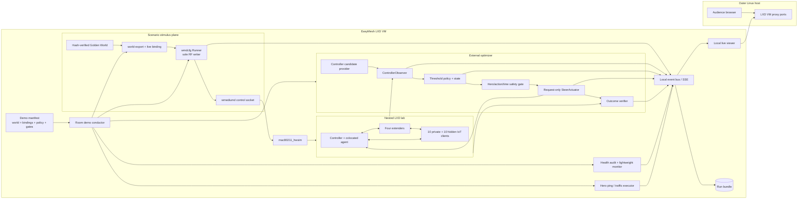

# Live EasyMesh Room Scenario Demonstration

## Architecture, current project state, and implementation plan

| Field | Value |
|---|---|
| Status | Complete implementation available: live observation, recommend, bounded act, evidence and replay |
| Project baseline | `boardfarmdevs/meta-cmf-bananapi-vcpe` |
| Baseline branch | `codex/0902-clean` |
| Date | 2026-09-03 |
| Repository path | `doc/easymesh/live-room-demo/design.md` |
| First supported live claim | One external-optimizer-driven, same-band steer of one `private_ssid` client while the complete 20-client, dual-network lab remains active |

## 1. Executive summary

The project is ready to support a strong live demonstration in which a device moves through a modeled home, real RF conditions change in the LXD-based EasyMesh laboratory, the external reference optimizer observes controller-reported measurements, and one real EasyMesh Client Steering Request results in an 802.11v BTM-driven reassociation.

The demonstration should be built as one synchronized experiment rather than as three loosely related views:

1. A deterministic Golden World provides position, walls, and RF stimulus.
2. `wmdcfg` applies the resulting RF generations to wmediumd.
3. mac80211_hwsim, OneWifi, Unified WiFi Mesh, the controller, agents, and real `wpa_supplicant` clients produce the network response.
4. The external optimizer consumes only controller-facing observations.
5. The optimizer sends one bounded request-only steering action.
6. A local live viewer displays scenario truth, network observations, optimizer state, and the verified outcome on one shared clock.
7. The run is restored, audited, and retained as a replayable evidence bundle.

Both existing WLAN networks must remain in the demonstration:

- `private_ssid`: ten clients;
- hidden `iot_ssid`: ten clients.

The initial closed-loop action should target one `private_ssid` client. The ten hidden IoT clients remain associated, visible, measured, and represented in the room, but are initially observe-only because hidden-SSID BTM candidate resolution is a known unresolved defect. Broadcasting `iot_ssid` is not part of the design.

The first polished demo should deliberately make a narrow, defensible claim:

> Twenty clients and five tri-band EasyMesh devices remain active while one private 5 GHz client walks between rooms. The external optimizer detects a sustained, measured same-band advantage, sends one real EasyMesh steering request, verifies the reassociation and controller convergence, maintains traffic, and restores the exact RF baseline without restarting EasyMesh or OneWifi.

The implemented entry point is `gen/demo/room-demo`. The default manifest is
`gen/demo/manifests/private-client-room-walk.json`; it selects the dedicated
240-second world, swaps one private client into the hero mobility role, limits
candidate collection and action to that client, provides `stimulus`,
`recommend`, and confirmed `act` modes, and produces a hash-indexed replayable
evidence directory. The live/replay viewer consumes the same centrally ordered
events retained as evidence. Operational detail is in the
[immersive room demo manual](manual.md).

## 2. Objectives

### 2.1 Primary objectives

The live room demo shall:

- run inside the existing EasyMesh LXD VM that owns the nested LXD, hwsim, and wmediumd environment;
- retain the accepted five-device, 20-client topology;
- retain both `private_ssid` and hidden `iot_ssid`;
- use a checked-in, hash-verified Golden World;
- apply RF changes through the existing atomic wmediumd control path;
- keep the scenario runner as the only writer of simulated RF;
- feed the optimizer exclusively from controller-reported facts;
- show why the optimizer waits, recommends, acts, or declines to act;
- issue no more than one steering action in the first live profile;
- verify the client’s physical BSSID, controller ownership, API view, traffic, and service stability;
- restore the exact pre-run RF state on success, failure, or handled interruption;
- retain a complete run bundle that can be replayed without the live lab.

### 2.2 Presentation objectives

An audience should be able to understand the following sequence without reading terminal logs:

1. The client is physically represented in one room.
2. It is currently associated with a particular AP.
3. Its serving link becomes weaker as it moves.
4. Another same-SSID, same-band BSSID becomes measurably better.
5. The optimizer does not act immediately because margin, hold, dwell, freshness, or cooldown gates are visible.
6. The optimizer becomes eligible and chooses an exact target BSSID.
7. EasyMesh transports the request and the serving agent sends BTM.
8. The client reassociates.
9. The controller and viewer converge on the new parent.
10. Traffic continues and the optimizer enters cooldown.

### 2.3 Non-goals for the first release

The first room demo does not claim:

- that OneWifi or the EasyMesh agent contains the optimizer;
- that wmediumd SNR is an optimizer input;
- autonomous cross-band steering;
- successful BTM steering of hidden `iot_ssid`;
- load-based steering driven by accepted application traffic metrics;
- backhaul topology optimization;
- channel-width optimization;
- throughput gains from 40, 80, 160, or 320 MHz operation;
- multi-action or unrestricted fleet optimization;
- production behavior on physical radios.

Those can be later scenario families with separate capability and acceptance gates.

## 3. Current project state

### 3.1 Accepted lab topology

The current small profile provisions:

- one controller with a colocated agent;
- four extender agents;
- five mesh devices total;
- tri-band operation;
- ten private clients;
- ten IoT clients;
- 20 WLAN clients total.

The accepted controller model is:

```text
5 devices / 15 radios / 50 BSS / 24 associated stations
```

The 24 associated stations are the 20 WLAN clients plus four wireless backhaul stations.

`gen/wlan-client-pool.sh` already treats the two WLAN populations as first-class deterministic cohorts:

```text
private: 10 clients on private_ssid
iot:     10 clients on iot_ssid
```

It stores cohort, ordinal, SSID, security, and band information in LXD instance metadata and verifies the active SSID and band when assessing client readiness.

The private cohort currently includes ordinary WPA2 clients plus specifically band-constrained coverage:

- ordinary auto-band WPA2 clients;
- one private client constrained to 2.4 GHz;
- one private client constrained to 6 GHz using SAE.

The IoT cohort uses WPA2 and auto-band client configuration. `iot_ssid` is hidden at the AP configuration boundary, while the client profiles use `scan_ssid=1`.

### 3.2 Golden World and wmediumd configurator

The project already has the principal RF stimulus machinery under:

```text
gen/wmediumd/configurator/
```

Current capabilities include:

- deterministic 2D layouts;
- static and mobile station roles;
- fixed-loss walls;
- directed link asymmetry;
- per-band 2.4, 5, and 6 GHz SNR;
- deterministic Golden World generation;
- hash verification;
- live LXD/hwsim inventory;
- frozen role-to-radio binding;
- compilation into an event plan;
- atomic generation updates;
- per-generation readback;
- exact captured-state restoration;
- userspace wmediumd and optional kernel-medium backends.

The Golden World front end produces `wmdcfg.world-plan.v1`. The current world export can emit either a single-band pair projection or simultaneous frequency-qualified values for all three bands:

```bash
python3 -m wmdcfg.cli world-export \
    worlds/golden/home-a-slow-walk-ten.world.json \
    --band all \
    -o /tmp/home-a-slow-walk-ten-all.wmd
```

The all-band export protects backhaul and changes only fronthaul RF values. This is appropriate for the initial client-steering demo.

The scenario runner already:

- checks actuator capabilities;
- captures touched RF state;
- checks the complete mesh before execution;
- applies timed generations;
- records deadline lateness and observed state;
- restores the captured values in a `finally` path;
- verifies restoration by readback;
- checks the complete mesh after execution;
- writes a machine-readable summary.

The runner can tolerate a generation number changing underneath it, but that conflict retry is a safety mechanism, not permission to operate two RF writers during the demo.

### 3.3 Existing worlds

The checked-in suite currently includes:

- stationary;
- slow walk with ten mobile clients;
- shifted-layout slow walk;
- border hover;
- fast transit;
- disappear/reappear;
- extender loss/recovery;
- flash crowd;
- asymmetric link;
- small three-band walk.

The existing `home-a-slow-walk-ten` world is 60 seconds long with a two-second tick. It is useful for visualization and RF-path acceptance, but is too short for a polished live optimizer narrative when controller candidate measurements can consume tens of seconds.

### 3.4 Existing world viewer

The browser viewer already:

- loads all checked-in Golden Worlds;
- renders the home, walls, APs, and clients in 3D;
- interpolates movement between generations;
- displays movement trails;
- selects 2.4, 5, or 6 GHz;
- colors the Golden World’s strongest link by SNR;
- optionally displays backhaul;
- exposes per-node distance, wall loss, and bidirectional SNR;
- provides play, pause, speed, and scrub controls;
- exports a small `window.__viewer` control surface including `setTime`, `select`, and `setBand`;
- is published from `gh-pages`.

The viewer retains its static mode and now also has a first `?mode=live`
milestone. In live mode, time comes from typed runner events, local playback
controls are disabled, and the same Golden World is served by a read-only
REST/SSE service. Its strongest simulated link still derives from Golden World
SNR. It does not yet know:

- the real associated BSSID;
- controller-observed RCPI;
- candidate measurement age;
- optimizer state;
- BTM action state;
- traffic state;
- health state;

It also loads Three.js from cdnjs, which creates an avoidable network dependency for a live demonstration.

### 3.5 Existing optimizer

The external optimizer under:

```text
gen/optimizer/
```

already provides:

- normalized immutable snapshots from controller APIs;
- identity and association information from `/topology`, `/clients`, `/devices`, and `/bsses`;
- current associated-client RCPI with receipt time;
- active same-band candidate RCPI through EasyMesh Unassociated STA Link Metrics;
- exact Agent/RUID-to-BSSID mapping;
- explicit missing and stale measurement handling;
- threshold, margin, hold, dwell, timeout, cooldown, and exponential failure-backoff state;
- `observe`, `recommend`, `act`, `evaluate`, `replay`, and `simulate` modes;
- a hash-chained JSON-lines journal;
- a bounded actuator and association verifier.

The observer already retains both WLAN populations. It labels each client’s cohort from the current SSID:

```text
private_ssid -> private
iot_ssid     -> iot
```

Candidate inventory is restricted to the client’s current SSID, so the two networks remain logically separate.

The current threshold policy is:

```yaml
current_rcpi_below: 100
minimum_target_gain_rcpi: 16
condition_hold_seconds: 5
minimum_dwell_seconds: 20
steer_timeout_seconds: 10
post_steer_cooldown_seconds: 30
failure_backoff_seconds: 60
maximum_failure_backoff_seconds: 600
reject_stale_metrics_after_seconds: 60
band_upgrade_enabled: false
expected_devices: 5
expected_clients: 20
```

These are reference-policy values, not EasyMesh standard parameters and not production recommendations.

The candidate provider currently:

- treats Unassociated STA Link Metrics as a same-band primitive;
- requires an explicit simulated-provider opt-in in the hwsim lab;
- limits each query to eight STAs because of the current controller/agent boundary;
- serializes Agent work because the HTTP/libemcli path is not safely concurrent;
- rejects missing, malformed, uncorrelated, stale, or unexpected results;
- does not turn cross-band BSS inventory into a quality measurement.

The complete 20-client collection can require roughly 30–40 seconds. Restricting the first demo’s candidate acquisition to one explicitly selected hero STA reduces work and, more importantly, guarantees that unrelated clients cannot become action targets.

### 3.6 Existing dynamic optimizer test

`gen/tests/optimizer-dynamic.sh` already proves a narrower closed loop:

1. discover live radio identities;
2. select one client and one target;
3. compile a five-AP crossover scenario;
4. run the wmediumd stimulus;
5. collect controller candidate measurements;
6. run recommend or act mode;
7. verify the expected recommendation or successful action;
8. verify scenario restoration.

This is the closest existing foundation for the room demo. The room demo should reuse its proven observation and action contracts rather than replace them.

### 3.7 Existing health audit

`gen/tests/health-audit.sh` already checks:

- controller topology and SQL model counts;
- 20 unique live WLAN clients;
- fresh wireless-backhaul signal rows;
- persistent NVRAM bindings;
- physical BSSID versus controller/API ownership;
- one unique IPv4 address per WLAN client;
- EasyMesh and OneWifi restart counters;
- traffic from all WLAN clients to `10.0.0.1`;
- final memory visibility.

This should remain the authoritative full preflight and postflight gate.

## 4. Current gaps between the project and the room demo

| Area | Current state | Required change |
|---|---|---|
| Dual networks | Already provisioned and observed | Preserve both; add explicit demo policy and visual identity |
| RF stimulus | Complete, atomic, restorable, and emits typed live events | Add the dedicated hero-client room world |
| Optimizer | Complete narrow same-band loop | Add hero-STA scope and request-only actuation |
| Steering helper | `--request-only` already exists | Wire optimizer actuator to it |
| Current actuator | Calls `gen/steer.sh STA BSSID` | Prevent its default temporary RF bias during a running world |
| Viewer | Static player plus stimulus-only live mode | Add replay and actual-network overlays |
| Clock | Runner-monotonic in live mode | Reuse it for optimizer and traffic events |
| Event integration | Typed runner events persisted and streamed over SSE | Add optimizer, traffic, and health event producers |
| Scenario duration | Existing room walks are 60 seconds | Add a 240-second demo world or a later generic time-scale option |
| Network truth | Viewer shows Golden RF-best link | Add real associated AP as a separate visual |
| Action scope | Optimizer evaluates all clients | Collect/act only for an explicit hero allowlist while retaining all 20 in health |
| Traffic | Full audit is pre/post; traffic-plan compiler exists | Add a bounded live ping executor and display |
| Evidence | Separate run directories | Produce one run manifest and bundle |
| Offline dependency | Viewer loads Three.js from CDN | Vendor the browser dependency locally |
| Hidden IoT steering | Status 7 caused by unresolved hidden target SSID | Keep IoT observe-only until repaired |
| Cross-band quality | BSS inventory exists; exact measured cross-band quality does not | Keep first action same-band |

## 5. Core architectural rules

### 5.1 Keep both `private_ssid` and hidden `iot_ssid`

The room demo shall always start with:

```text
private_ssid: 10/10 clients present
iot_ssid:     10/10 clients present
total:        20/20 clients present
```

The first action policy is:

```text
private_ssid: eligible only for the explicitly selected hero STA
iot_ssid:     observe-only
```

Observe-only means the IoT clients are still:

- running as real LXD containers;
- associated to hidden `iot_ssid`;
- included in topology and client APIs;
- represented in the room;
- included in health checks;
- eligible for passive telemetry display;
- included in the post-run integrity check.

It does not mean `iot_ssid` is broadcast or omitted.

### 5.2 Separate stimulus, observation, decision, and verification truth

| Plane | Source | May drive optimizer decisions? | Viewer representation |
|---|---|---:|---|
| Scenario truth | Golden World and wmdcfg plan | No | Position, walls, intended RF-best AP, scenario time |
| Network observation | Controller APIs and EasyMesh measurement responses | Yes | Current BSSID, current RCPI, candidate RCPI, age |
| Optimizer decision | Versioned policy and prior state | Yes | Stable, holding, eligible, steering, cooldown, reason |
| Action | Controller steering command and EasyMesh/BTM path | N/A | Requested target and protocol progress |
| Verification | Client link, controller/API ownership, traffic, service health | No new decision input for the same transaction | Passed, rejected, timed out, unexpected roam |
| Evaluator truth | wmediumd readback and expected scenario target | No | Debug/acceptance layer, clearly labeled |

The Golden World can say that Extender-4 should now be physically best. The optimizer must independently learn enough through EasyMesh measurements before acting.

### 5.3 Exactly one RF writer

During a room run:

```text
wmdcfg room scenario runner = the only wmediumd writer
optimizer                   = read, decide, request steer
viewer                      = read only
traffic worker              = data-plane traffic only
```

The default `gen/steer.sh` mode is not suitable because it temporarily modifies wmediumd and later restores its captured state. If the room world advances during that interval, the steering helper can restore an older RF generation and corrupt the room timeline.

The room demo must invoke:

```bash
gen/steer.sh --request-only STA TARGET
```

or the controller-native steering command with equivalent validation.

The existing wmdcfg generation-conflict retry remains enabled as a defensive measure, but a detected unexpected RF writer should fail the demo.

### 5.4 Keep the complete lab visible while limiting the first action

The optimizer snapshot and health model must continue to contain all 20 clients. Do not shrink `expected_clients` to one and do not hide the IoT cohort.

Instead, add a separate candidate/action scope:

```text
observation scope: all 20 clients
health scope:      all 20 clients
candidate-query scope: one hero private STA
action scope:          one hero private STA
```

This avoids a 20-client candidate sweep on every demo cycle and prevents an unrelated client from consuming the single permitted action.

### 5.5 Failure must remain visible

The conductor must not recover a failed run by restarting individual EasyMesh or OneWifi services.

On failure it should:

1. close the action gate;
2. stop the optimizer;
3. request an orderly scenario stop;
4. allow exact RF restoration;
5. collect post-failure health;
6. retain all logs and journals;
7. mark the viewer and summary as failed.

A full lab reconstruction is an operator recovery transaction after evidence has been preserved, not part of a successful room demo.

## 6. Target architecture



## 7. Proposed first scenario

### 7.1 Scenario name

```text
private-client-room-walk
```

Suggested audience story:

> A private laptop starts in the lower-right room near Extender-2, crosses the wall and hallway, pauses at the cell boundary, and enters the upper-right room near Extender-4. The optimizer waits until the current link is weak and the measured target advantage is sustained, then sends one BTM steer.

The existing `home-five-agent` layout supports a clean path on the right side:

```text
Extender-2: [18, 2]
Extender-4: [18, 12]
Office wall: y=5 from x=11 through x=20
```

This path naturally creates a wall-loss and distance crossover while keeping the gateway and left-side extenders less competitive.

### 7.2 Duration and tick

For the first implementation, create a dedicated world instead of changing generic timing semantics:

```text
duration: 240 seconds
tick:       5 seconds
```

A dedicated 240-second world is simple, reviewable, hash-verifiable, and easy to publish. A generic `--time-scale` option can be added later if the same 60-second world needs different preview and live speeds.

### 7.3 Narrative phases

| World time | Scenario | Expected optimizer behavior |
|---:|---|---|
| 0–30 s | Hero stationary near serving Extender-2 | Stable; current link acceptable |
| 30–90 s | Hero walks toward the wall and hallway | Current RCPI declines; no immediate action |
| 90–140 s | Hero pauses near the cell boundary | Current link may be weak, but target gain remains too small or hold is not met |
| 140–180 s | Hero crosses into the upper-right room | Target advantage becomes measurable and sustained |
| 180–210 s | Eligibility/action window | One exact-BSSID steer may be issued |
| 210–240 s | Post-steer residence | Verify target association, traffic, API convergence, and cooldown |
| End | Scenario closes action gate and restores RF | Exact baseline restore and full health audit |

Narrative markers belong in the demo manifest, not in optimizer inputs.

### 7.4 Role and cohort bindings

The existing accepted bindings map the ten static roles to private clients and the ten mobile roles to IoT clients. The first room demo needs one private client to own a mobile role without changing either network’s population.

Use a deterministic swap:

```text
sta_mobile_01 <- one ordinary private WPA2 auto-band client
sta_static_N  <- the IoT client displaced from sta_mobile_01
```

A suitable preferred binding is:

```text
sta_mobile_01 <- wlan-client-007
sta_static_08 <- wlan-client-010
```

All other role bindings remain unchanged.

The conductor must verify at preflight that the selected hero:

- has `user.easymesh.cohort=private`;
- is associated to `private_ssid`;
- is using WPA2;
- is currently on 5 GHz;
- has a fresh associated-client metric;
- has exactly one current physical/API BSSID;
- has a reachable traffic path.

If any condition is false, the run must abort or use an explicitly selected alternate private client. It must not silently move the client to a different band or network.

### 7.5 Other clients

The remaining 19 clients should be stationary in the first Golden World. That gives the audience a recognizable home full of devices while preventing unrelated mobility from obscuring the hero narrative.

A later variant can move several devices, but the first action acceptance should not combine:

- ten moving clients;
- hidden-SSID steering;
- multiple recommendations;
- multiple actions;
- cross-band measurements.

## 8. Proposed demo manifest

Add a versioned manifest, for example:

```yaml
schema: easymesh.room-demo.v1
name: private-client-room-walk
description: One private 5 GHz client crosses from Extender-2 to Extender-4.

world:
  layout: gen/wmediumd/configurator/worlds/layouts/home-five-agent.json
  mobility: gen/wmediumd/configurator/worlds/mobility/private-client-room-walk.json
  golden: gen/wmediumd/configurator/worlds/golden/home-a-private-client-room-walk.world.json
  export_band: all

bindings:
  base: gen/optimizer/scenarios/rev130-small-bindings.json
  overrides:
    sta_mobile_01: wlan-client-007
    sta_static_08: wlan-client-010

networks:
  - ssid: private_ssid
    expected_clients: 10
    hidden: false
    action_policy: hero-only
  - ssid: iot_ssid
    expected_clients: 10
    hidden: true
    action_policy: observe-only
    blocker: hidden-ssid-btm-candidate-resolution

hero:
  role: sta_mobile_01
  container: wlan-client-007
  expected_ssid: private_ssid
  expected_band: "5"
  friendly_name: Private-Laptop
  candidate_scope: true
  action_scope: true

optimizer:
  policy: gen/optimizer/configs/threshold-policy.yaml
  mode: act
  candidate_provider: controller
  allow_simulated_candidates: true
  steer_mode: request-only
  max_actions: 1
  action_window_ms: [180000, 210000]

traffic:
  target: 10.0.0.1
  hero_ping_interval_ms: 200
  all_client_full_check: pre-and-post

viewer:
  selected_band: "5"
  follow_role: sta_mobile_01
  show_scenario_best: true
  show_actual_association: true
  show_optimizer_target: true

narrative:
  - {time_ms: 0,      label: Stable in first room}
  - {time_ms: 30000,  label: Walking away from serving AP}
  - {time_ms: 90000,  label: Paused near cell boundary}
  - {time_ms: 140000, label: Crossing into target room}
  - {time_ms: 180000, label: Steering eligibility window}
  - {time_ms: 210000, label: Cooldown and verification}

acceptance:
  devices: 5
  radios: 15
  bsses: 50
  associated_stations: 24
  clients_total: 20
  clients_private: 10
  clients_iot: 10
  maximum_actions: 1
  maximum_service_restarts: 0
  require_exact_rf_restore: true
  require_expected_target_role: extender_4
```

`require_expected_target_role` is evaluator-only. The expected target must not be inserted into the optimizer’s candidate score or action request.

## 9. Unified event model

Every live event should have a common envelope:

```json
{
  "schema": "easymesh.room-demo.event.v1",
  "run_id": "20260903T190000Z-private-client-room-walk",
  "sequence": 42,
  "recorded_at": "2026-09-03T19:02:14.123Z",
  "world_time_ms": 134123,
  "kind": "optimizer.evaluation",
  "payload": {}
}
```

Required event kinds:

| Kind | Producer | Purpose |
|---|---|---|
| `demo.state` | conductor | planning, preflight, ready, running, restoring, passed, failed |
| `scenario.started` | wmdcfg runner | authoritative start and duration |
| `scenario.clock` | conductor/runner | viewer synchronization |
| `scenario.generation` | wmdcfg runner | applied generation, lateness, readback |
| `scenario.mark` | conductor | audience narrative phase |
| `network.snapshot` | optimizer observer | actual client and candidate observations |
| `optimizer.evaluation` | policy | decision, reason, scores, state |
| `optimizer.action` | actuator | exact STA, source, target, command result |
| `optimizer.verification` | verifier | association/API convergence |
| `traffic.sample` | traffic worker | hero reachability and RTT/loss |
| `health.sample` | health monitor | topology counts, network counts, restarts |
| `rf.restore` | wmdcfg runner | exact restoration result |
| `run.completed` | conductor | final acceptance summary |

Events streamed to the browser and events retained in the run bundle should derive from the same objects. The viewer must not create authoritative action or health events.

## 10. Live viewer design

### 10.1 Retain three operating modes

The same viewer source should support:

```text
static:
    Existing GitHub Pages Golden World preview.
live:
    VM-served Golden World plus synchronized live events.
replay:
    Recorded Golden World plus run-bundle events.
```

Static mode keeps the existing play, pause, speed, scrub, band, trail, and inspector behavior.

Live mode:

- gets time from the scenario runner;
- disables browser Play and scrub controls;
- may retain camera orbit, zoom, pan, band display, trail, and inspector controls;
- reconnects to the event stream;
- uses `Last-Event-ID` or an initial state endpoint to recover after browser refresh;
- shows a clear `LIVE` marker and run ID.

Replay mode restores play, pause, speed, and scrub, but replays recorded network and optimizer events rather than inventing them.

### 10.2 Correct the link semantics

The current viewer’s strongest Golden World link must not be presented as the actual serving link.

Use separate visual encodings:

| Meaning | Suggested rendering |
|---|---|
| Golden World RF-best AP | Dashed line, labeled `scenario best` |
| Actual associated AP | Solid bright line, labeled with live BSSID/AP |
| Optimizer proposed target | Animated or pulsing arrow |
| In-flight steering action | Highlight source, STA, and target |
| Verified reassociation | Brief success pulse, then solid actual-association line moves |
| Stale/unknown measurement | Muted or hollow candidate indicator |
| Hidden IoT client | Small `I`/hidden badge, not a different RF-strength color |
| Private client | Small `P` badge |

Do not overload node color with both cohort and RF strength. Use badges or rings for SSID/cohort identity.

In the companion RDK Network Topology view, use a ten-segment vertical signal
meter beside each STA/IoT icon. It spans the icon height, changes fill and
quality color with fresh associated-link telemetry, and is placed on the side
opposite the squiggly serving-AP line. Recalculate that side after client drag
or reassociation. Keep exact RSSI/RCPI in hover details and update the meter in
place so telemetry polling never disturbs the graph layout.

### 10.3 Hero panel

The selected hero panel should display:

```text
Client:             Private-Laptop
SSID:               private_ssid
Band:               5 GHz
Actual parent:      Extender-2
Current BSSID:      xx:xx:xx:xx:xx:xx
Current RCPI:       94
Current age:        1.2 s
Best measured AP:   Extender-4
Target BSSID:       yy:yy:yy:yy:yy:yy
Target RCPI:        120
Gain:               +26 RCPI
Policy threshold:   current < 100
Required gain:      +16 RCPI
Hold:               3.0 / 5.0 s
State:              holding
Traffic:            reachable, 4.1 ms
```

The panel should show explicit reasons such as:

```text
current_link_acceptable
minimum_dwell_not_met
current_metric_stale
fresh_candidate_metric_missing
candidate_gain_too_small
condition_hold_not_met
threshold_margin_hold_satisfied
steer_pending
target_association_observed
post_steer_cooldown
steer_timeout_backoff
```

### 10.4 Whole-lab panel

Keep a compact always-visible summary:

```text
Mesh:        5 devices / 15 radios / 50 BSS / 24 associated
Clients:     20/20
Networks:    private 10/10 | hidden IoT 10/10
Restarts:    0
RF writer:   room scenario
Actions:     0/1
Run state:   LIVE
```

### 10.5 Local asset requirement

Vendor the required Three.js file under the viewer source and serve it from the VM. The live demo must not depend on cdnjs or general Internet access.

The GitHub Pages publication can use the same vendored asset.

## 11. Demo conductor design

Add a narrow orchestration package:

```text
gen/demo/
|-- README.md
|-- room-demo
|-- room_demo/
|   |-- __init__.py
|   |-- cli.py
|   |-- manifest.py
|   |-- conductor.py
|   |-- events.py
|   `-- server.py
|-- manifests/
|   `-- private-client-room-walk.json
|-- bindings/
|   `-- private-client-room-walk.json
`-- tests/
```

Implemented operator interface:

```bash
gen/demo/room-demo check
gen/demo/room-demo run --mode recommend
gen/demo/room-demo run --mode act --yes-act
gen/demo/room-demo replay /path/to/run-directory
```

### 11.1 Conductor responsibilities

The conductor owns orchestration, not policy:

- parse and validate the manifest;
- acquire an exclusive demo/RF-writer lock;
- create a unique run directory and run ID;
- verify Golden World and policy hashes;
- discover live inventory;
- resolve and validate all role bindings;
- verify both SSID populations;
- run the full preflight health audit;
- compile the world into an all-band event plan;
- start the local static/SSE server;
- start the traffic worker;
- start the scenario runner;
- wait for an authoritative scenario-start event;
- start the optimizer session;
- stream normalized events;
- close the action gate at the configured deadline;
- wait for any in-flight verification;
- stop the optimizer;
- allow scenario completion and exact restoration;
- run the full postflight health audit;
- write the final summary and bundle hashes.

It must not:

- calculate optimizer scores;
- read wmediumd values as optimizer observations;
- choose the target for the optimizer;
- repair EasyMesh with individual process restarts;
- force a direct `wpa_cli roam`.

### 11.2 Startup order

```text
1. Validate manifest and files.
2. Acquire exclusive RF/demo lock.
3. Run health audit.
4. Validate 10 private + 10 IoT clients.
5. Validate hidden IoT remains hidden.
6. Validate hero private/5 GHz/current metrics.
7. Discover live hwsim/LXD inventory.
8. Resolve roles to current permanent radio identities.
9. Compile all-band room plan.
10. Create run bundle and start viewer server.
11. Start hero traffic.
12. Start wmdcfg runner.
13. Wait for scenario.started.
14. Start optimizer in selected mode.
15. Open action gate only inside the manifest window.
16. Monitor event streams and invariant checks.
```

### 11.3 Shutdown order

```text
1. Close action gate.
2. Let an already-issued verification transaction finish within its bound.
3. Stop new optimizer observation cycles.
4. End hero traffic and record result.
5. Let wmdcfg restore the exact captured RF state.
6. Verify restoration readback.
7. Run postflight health audit.
8. Finalize event sequence, summary, and hashes.
9. Release the exclusive lock.
```

### 11.4 Signal handling

On `SIGINT` or `SIGTERM`:

- set a shared stop flag;
- close the action gate immediately;
- signal the optimizer to stop after the current bounded operation;
- signal the wmdcfg runner through its existing handled-interrupt path;
- preserve process exit codes;
- wait for RF restoration;
- write an interrupted summary;
- leave the run directory intact.

One `Ctrl-C` should be safe. A second forced termination cannot guarantee cleanup and should be documented as emergency behavior.

## 12. Implementation plan

### Phase 0 — Baseline and capability lock

#### Work

- Add this design document.
- Record the current branch commit used for implementation.
- Run:
  - `worlds/build-goldens.sh --check`;
  - wmdcfg tests;
  - optimizer tests;
  - `gen/tests/health-audit.sh`;
  - `gen/tests/optimizer-dynamic.sh recommend` for a private client;
  - `gen/tests/optimizer-dynamic.sh act` for a private client.
- Record hidden-IoT steering as a known blocker, not as a disabled network.
- Confirm local agent steering remains disabled for optimizer experiments.

#### Exit gate

The existing five-device/20-client lab and narrow private-client dynamic action pass without service restarts.

### Phase 1 — Safe request-only optimizer actuation

#### Files

```text
gen/optimizer/optimizer/actuator.py
gen/optimizer/optimizer/cli.py
gen/optimizer/tests/
gen/tests/optimizer-dynamic.sh
```

#### Work

1. Extend `SteerActuator` with an explicit mode:

   ```text
   request-only
   deterministic-rf-bias
   ```

2. In request-only mode, build:

   ```bash
   gen/steer.sh --request-only STA TARGET_BSSID
   ```

3. Add a CLI option such as:

   ```text
   --steer-mode request-only|deterministic-rf-bias
   ```

4. Preserve current behavior as the compatibility default outside the room demo if required, but make the room manifest require `request-only`.

5. Add an action guard callback or equivalent checks for:

   - selected STA allowlist;
   - action window;
   - source BSSID unchanged;
   - target still eligible;
   - maximum action count;
   - no action while scenario is restoring.

6. Update the dynamic action test to exercise request-only mode while the crossover scenario is the sole RF writer.

#### Tests

- request-only command construction;
- source-changed rejection;
- target-no-longer-eligible rejection;
- out-of-scope STA rejection;
- closed action-window rejection;
- no wmediumd changes caused by optimizer action;
- successful bounded verification.

#### Exit gate

A private client can be steered by the optimizer while wmdcfg remains the only RF writer.

### Phase 2 — Hero STA candidate and action scope

#### Files

```text
gen/optimizer/optimizer/cli.py
gen/optimizer/optimizer/candidates.py
gen/optimizer/optimizer/policy.py or a new live-session wrapper
gen/optimizer/tests/
```

#### Work

Add repeatable live-mode selection such as:

```text
--sta 02:00:00:00:08:00
```

or an equivalent manifest-provided allowlist.

Required behavior:

- all 20 clients remain in the normalized snapshot;
- health still expects five devices and 20 clients;
- only selected STAs are passed to active candidate acquisition;
- only selected STAs can reach the actuator;
- decisions for non-selected clients may remain visible as observation-only reasons;
- action scope is recorded in the journal.

The existing candidate provider already accepts a `client_selector`. Compose the policy’s current-measurement gate with the demo STA allowlist instead of adding a second candidate implementation.

#### Exit gate

A live observation still reports 20 clients, but candidate transactions and action eligibility are limited to exactly one private hero STA.

### Phase 3 — Dedicated 240-second room world and bindings

#### Files

```text
gen/wmediumd/configurator/worlds/mobility/private-client-room-walk.json
gen/wmediumd/configurator/worlds/golden/home-a-private-client-room-walk.world.json
gen/wmediumd/configurator/worlds/build-goldens.sh
gen/demo/bindings/private-client-room-walk.json
gen/demo/manifests/private-client-room-walk.json
gen/wmediumd/configurator/worlds/viewer/
```

#### Work

- Add the 240-second, five-second-tick mobility source.
- Define one moving hero role and 19 stationary roles.
- Use the existing `home-five-agent` layout.
- Generate and verify the Golden World.
- Add deterministic private/IoT role swap bindings.
- Export and compile the all-band fronthaul plan.
- Publish the new Golden World to the static viewer.
- Add narrative markers in the demo manifest.
- Add evaluator-only expected source/target roles.

#### Tests

- Golden hash verification;
- exactly five AP and 20 station roles;
- unique role-to-container bindings;
- exactly ten private and ten IoT bindings;
- hero role maps to a private container;
- every fronthaul role pair initialized in the first generation;
- backhaul protected;
- all-band export compiles;
- standalone room run restores exactly;
- 5/15/50/24 and 20/20 remain healthy after the run.

#### Exit gate

The room world can run live without an optimizer, animate correctly, and leave the complete dual-network lab unchanged after restoration.

### Phase 4 — Runner event hook and authoritative clock

Implementation status: complete for the stimulus-only milestone. The runner
emits ordered preflight, start, clock, mark, applied-generation, restore,
postflight, and completion events. Optimizer/action-window events remain later
work.

#### Files

```text
gen/wmediumd/configurator/wmdcfg/runner.py
gen/wmediumd/configurator/wmdcfg/cli.py
gen/wmediumd/configurator/tests/
```

#### Work

Add optional, backward-compatible runner integration fields:

```python
Runner(
    ...,
    run_id=...,
    event_callback=...,
    run_directory=...,
)
```

Emit structured events for:

- preflight complete;
- scenario started;
- generation applied;
- generation readback;
- scenario mark;
- action-window timing if supplied by conductor;
- restoration started;
- restoration verified;
- postflight complete;
- final result.

The runner’s monotonic `execution_started` value is the authoritative live clock. The conductor should emit lightweight `scenario.clock` events between RF generations so viewer motion remains smooth.

Do not make the browser clock authoritative.

#### Optional later enhancement

Add:

```text
wmdcfg run --time-scale N
```

after the dedicated room world is accepted. Time scaling must affect both event deadlines and total duration, be recorded in the run manifest, and not change the Golden World hash.

#### Exit gate

A browser connected after scenario start can obtain the correct world time and current generation without estimating from process launch time.

### Phase 5 — Refactor optimizer live execution into an importable session

#### Files

```text
gen/optimizer/optimizer/live.py          # new
gen/optimizer/optimizer/cli.py
gen/optimizer/tests/
```

#### Work

Move the current `_live()` loop from `cli.py` into a reusable session object or function without changing decision semantics.

Suggested interface:

```python
LiveOptimizerSession(
    mode="act",
    observer=...,
    policy=...,
    actuator=...,
    verifier=...,
    journal=...,
    sta_allowlist=...,
    event_callback=...,
    stop_requested=...,
    action_gate=...,
)
```

The CLI becomes a thin wrapper. The room conductor imports the same implementation used by the CLI.

This avoids parsing console text, allows exact action-window checks immediately before actuation, and sends typed evaluation/action/verification events directly to the viewer.

#### Exit gate

CLI regression tests pass, and the conductor can start and stop a typed optimizer session while preserving the existing hash-chained journal.

### Phase 6 — Demo conductor and run bundle

#### Files

```text
gen/demo/
```

#### Work

Implement:

- manifest validation;
- exclusive lock;
- inventory and binding resolution;
- full preflight/postflight;
- local event bus;
- scenario and optimizer lifecycle;
- hero traffic;
- action window;
- invariant monitoring;
- run bundle;
- summary and exit status;
- safe interruption.

Suggested run directory:

```text
$XDG_STATE_HOME/easymesh-room-demo/runs/RUN_ID/
|-- manifest.yaml
|-- manifest.resolved.json
|-- source-world.json
|-- event-plan.json
|-- bindings.json
|-- policy.yaml
|-- hashes.json
|-- events.jsonl
|-- medium-events.jsonl
|-- optimizer-journal.jsonl
|-- traffic-events.jsonl
|-- health-events.jsonl
|-- preflight.txt
|-- postflight.txt
`-- summary.json
```

The optimizer journal remains independently hash-chained. `hashes.json` should bind the world, event plan, policy, bindings, resolved manifest, and final event files.

#### Exit gate

One command performs a complete recommend-only run, restores RF, retains evidence, and exits nonzero on any failed gate.

### Phase 7 — Live and replay viewer

Implementation status: live stimulus mode is implemented in the existing
single-file viewer with REST/SSE reconnect state and disabled playback
controls. Replay, actual association, optimizer, traffic, health panels, and a
vendored Three.js dependency remain later work.

#### Files

```text
gen/wmediumd/configurator/worlds/viewer/index.html
gen/wmediumd/configurator/worlds/viewer/viewer.js
gen/wmediumd/configurator/worlds/viewer/live.js
gen/wmediumd/configurator/worlds/viewer/style.css
gen/wmediumd/configurator/worlds/viewer/vendor/three.min.js
gh-pages/viewer/
```

The current single-file viewer may be patched for an MVP, but splitting static rendering from live transport will make the long-term source maintainable.

#### Work

- retain static mode;
- add `?mode=live`;
- add `?mode=replay&run=...`;
- load initial run state from the local server;
- connect to SSE;
- synchronize to runner time;
- render scenario-best, actual association, and optimizer target separately;
- show both network counts;
- add hero and whole-lab panels;
- show action and verification pulses;
- disable Play/scrub in live mode;
- support refresh/reconnect;
- vendor Three.js;
- generate `gh-pages` from the same viewer source.

Suggested local endpoints:

```text
GET /api/demo/current
GET /api/demo/events
GET /api/demo/runs/RUN_ID
GET /api/demo/runs/RUN_ID/events
GET /worlds/NAME.world.json
GET /viewer/
```

SSE is sufficient because browser control of the experiment is not required for the first release.

#### Exit gate

The static GitHub Pages viewer still works, and the local live viewer tracks the real scenario, association, optimizer, and traffic state after a browser refresh.

### Phase 8 — Private-client live action acceptance

#### Work

Run the complete scenario first in recommend mode, then in act mode.

Act mode requirements:

- exactly one private hero STA is in candidate/action scope;
- `iot_ssid` remains hidden and has ten associated clients;
- `private_ssid` has ten associated clients;
- the optimizer uses controller measurement sources only;
- the exact target BSSID is selected by policy;
- request-only steering is used;
- one BTM transaction is sent;
- the client reassociates to the target;
- controller/API ownership converges;
- hero traffic remains within the configured bound;
- no EasyMesh or OneWifi process restarts;
- no unexpected RF writer appears;
- RF restoration passes;
- postflight health passes.

#### Exit gate

The final summary is `passed`, and static replay reproduces the complete visual sequence from the run bundle.

### Phase 9 — Failure and interruption acceptance

Test at least:

- browser disconnect/reconnect;
- optimizer observation error;
- candidate response omission;
- candidate metric stale;
- target no longer eligible before action;
- unexpected autonomous hero roam;
- BTM reject;
- association timeout;
- scenario interrupted once with `Ctrl-C`;
- optimizer interrupted during a candidate query;
- viewer unavailable;
- traffic worker failure;
- failed RF readback;
- failed final health audit.

A failed demo must still attempt exact RF restore and preserve evidence.

#### Exit gate

Every injected failure has a deterministic final state, nonzero command status, visible viewer reason, and retained run bundle.

### Phase 10 — Hidden IoT steering regression after the AP/probe fix

Do not change the initial private-client acceptance while fixing hidden SSID behavior.

After the hidden target’s directed Probe Response correctly populates `iot_ssid` in the station’s scan cache:

- add one IoT hero manifest;
- retain `iot_ssid` as hidden;
- add an SSID-specific scan preflight;
- require the BSS record to contain `iot_ssid`, not merely the target BSSID;
- run the same request-only BTM path;
- retain private clients in the room and health model;
- promote `iot_ssid` from observe-only to hero-only action for that manifest.

Broadcasting `iot_ssid` may be used as a diagnostic A/B control, but not as acceptance.

## 13. Acceptance criteria

### 13.1 Preflight

All must pass:

```text
controller model:     5 / 15 / 50 / 24
live WLAN clients:    20 unique
private clients:      10 associated
hidden IoT clients:   10 associated
service restarts:     0
physical/API BSSID:   coherent for all clients
IPv4 ownership:       one unique address per client
full traffic audit:   pass
hero network:         private_ssid
hero band:            5 GHz
hero metric:          fresh and non-zero
RF writer lock:       acquired
Golden World hash:    valid
policy hash:          recorded
bindings:             complete and unique
```

### 13.2 During the run

Required invariants:

- one scenario runner owns RF;
- all scenario generations read back successfully;
- both WLAN networks retain ten clients unless a transient reassociation is in progress;
- no service restart count increases;
- no client other than the hero is acted upon;
- no more than one action is attempted;
- no action occurs outside the action window;
- the action command contains `--request-only`;
- the optimizer journal identifies controller/EasyMesh measurement sources;
- Golden World SNR never appears as optimizer candidate RCPI;
- unexpected hero BSSID change before an action fails attribution;
- action, verification, and traffic status are visible.

### 13.3 Successful action

A steering action passes only when:

1. the policy decision names an exact source and target BSSID;
2. the target was eligible and freshly observed immediately before action;
3. the controller command succeeds;
4. the physical client link reaches the target BSSID;
5. the controller/API reports the same parent;
6. traffic remains within the configured demo bound;
7. the optimizer observes the target association or the verifier records it;
8. cooldown is entered;
9. no service restarts occurred.

Controller “send successful” alone is not a pass.

### 13.4 Postflight

All must pass:

```text
exact RF baseline restored: yes
controller model:           5 / 15 / 50 / 24
private clients:            10/10
hidden IoT clients:         10/10
full clients:               20/20
physical/API ownership:     coherent
full traffic audit:         pass
service restarts:           0
run bundle:                 finalized
event sequence:             contiguous
summary:                    passed
```

## 14. Risks and mitigations

| Risk | Consequence | Mitigation |
|---|---|---|
| Default steering helper applies RF bias | Corrupts Golden World timing and attribution | Require request-only actuator mode |
| Hidden IoT target SSID remains empty | BTM status 7 | Keep IoT hidden and observe-only until corrected |
| Full 20-client candidate collection is slow | Misses room crossover or makes UI appear stalled | Limit active candidate collection to the hero while retaining full health |
| Existing 60-second world is too short | Too few complete measurement cycles | Add dedicated 240-second world |
| Client roams autonomously | Action cannot be attributed to optimizer | Disable/avoid background roam triggers and fail on pre-action BSSID change |
| Viewer calls RF-best “serving” | Misrepresents actual network state | Draw scenario-best and actual association separately |
| Browser clock drifts | Room position and network events disagree | Use runner monotonic time |
| Browser refresh loses context | Audience sees incomplete state | Initial-state endpoint plus SSE replay |
| CDN unavailable | Viewer fails during demo | Vendor Three.js |
| BSSID changes across builds | Static mapping becomes stale | Resolve BSSIDs from live inventory; keep only logical role bindings checked in |
| Policy expected target differs from scenario | Demo may legitimately decline or select another AP | Use expected target only for evaluator checks; rehearse recommend mode |
| Action occurs near scenario restore | Outcome is unstable or restore races verification | Close action window well before world end |
| Multiple RF experiments run | Competing generations | Exclusive lock and sole-writer invariant |
| Full health audit distorts live timing | Large LXD/ping fan-out during scenario | Run full audit before/after; use lightweight monitoring during |
| Process is killed ungracefully | Restore may not complete | Managed process groups, one-safe-`Ctrl-C`, retained recovery state |
| Hidden and private clients are visually confused | Audience cannot understand two networks | Explicit cohort badges and counts |

## 15. Recommended operator flow

Inside the EasyMesh appliance VM:

```bash
cd /home/easymesh/git/meta-cmf-bananapi-vcpe

# Rehearsal: no action.
gen/demo/room-demo run --mode recommend

# Live closed loop: one request-only action.
gen/demo/room-demo run --mode act --yes-act
```

The conductor prints:

```text
room-demo: run 20260903T190000Z-private-client-room-walk; mode=act; hero=...
room-demo: immersive viewer http://127.0.0.1:8891/viewer/?mode=live
room-demo: evidence /tmp/easymesh-room-demo-runs/RUN_ID
```

Expose the viewer through one additional outer-VM proxy port, for example:

```text
EasyMesh topology:   OUTER_HOST:18889
wmediumd console:    OUTER_HOST:18890
Room demo viewer:    OUTER_HOST:18891
```

The live audience should need only the room viewer. The existing topology WebUI can remain open on a second screen as an independent controller view.

## 16. Demonstration script for the presenter

### Opening

> This is a real five-device EasyMesh network running 20 WLAN clients on two networks: ten private devices and ten devices on a hidden IoT SSID. The floor plan and movement are deterministic, but the optimizer cannot read that simulated truth. It sees only what the EasyMesh controller reports.

Point to:

```text
Mesh: 5 / 15 / 50 / 24
Private: 10/10
Hidden IoT: 10/10
Actions: 0/1
```

### Movement

> The private laptop is moving away from Extender-2. The dashed line shows which AP is physically best in the scenario. The solid line is where the client is actually associated.

### Boundary pause

> The current link has weakened, but the measured advantage is not yet large or stable enough. The optimizer is deliberately waiting instead of ping-ponging.

Point to the policy reason and hold timer.

### Eligibility

> The controller has now reported a fresh same-band candidate with enough gain, and the condition has held for the configured interval. The optimizer selects an exact target BSSID.

### Action

> The optimizer sends one EasyMesh Client Steering Request. The serving agent sends an 802.11v BTM request. No script is forcing a reassociation and the optimizer is not changing RF.

### Verification

> The physical client moved, the controller learned the new parent, traffic continued, and the optimizer entered cooldown.

### Closing

> The room scenario now restores the exact RF state. The same 20 clients and both networks remain healthy, and the run can be replayed from its evidence bundle.

## 17. Future extensions

After the first room demo is accepted, add separate manifests rather than increasing one demo’s complexity:

1. Hidden `iot_ssid` hero after directed-probe behavior is fixed.
2. Border-hover comparison of conservative versus aggressive policies.
3. BTM reject and ignore client behaviors.
4. Multiple private clients with bounded action concurrency.
5. Flash-crowd observations and later load-based action.
6. Cross-band steering after trustworthy exact-BSSID cross-band measurements exist.
7. Extender loss/recovery with optimizer action disabled.
8. Backhaul-plan visualization as recommendation-only.
9. Channel-width recommendation visualization as recommendation-only.
10. Side-by-side replay of two policies against the same recorded controller snapshots.

## 18. Definition of done

The first release is complete when one checked-in command can reliably produce this result:

- the LXD VM starts from the accepted five-device/20-client state;
- both `private_ssid` and hidden `iot_ssid` have ten associated clients;
- a hash-verified 240-second room scenario starts;
- the viewer follows the runner’s live clock;
- one private 5 GHz hero client moves through the home;
- the optimizer sees only controller-reported current and candidate metrics;
- threshold, gain, freshness, dwell, hold, and action state are visible;
- exactly one request-only EasyMesh steering action is issued;
- physical association, controller/API ownership, and traffic verify the move;
- no EasyMesh or OneWifi service restarts;
- all RF changes restore exactly;
- the postflight model remains `5/15/50/24`;
- both networks remain `10/10`;
- the command exits successfully;
- a self-contained replay bundle remains available.

## 19. Project references

- [EasyMesh demonstration runbook](../guide/demonstrations.md)
- [External optimizer architecture](../reference/optimizer-architecture.md)
- [Optimizer development manual](../experiments/optimizer-development.md)
- [Optimizer scenario suite](../experiments/optimizer-scenarios.md)
- [wmediumd configurator reference](../reference/wmediumd-configurator.md)
- [External optimizer implementation](../../../gen/optimizer/README.md)
- [wmediumd configurator implementation](../../../gen/wmediumd/configurator/README.md)
- [Golden World viewer and renderer](../../../gen/wmediumd/configurator/worlds/README.md)
- [Current client-pool implementation](../../../gen/wlan-client-pool.sh)
- [Current dynamic optimizer test](../../../gen/tests/optimizer-dynamic.sh)
- [Current health audit](../../../gen/tests/health-audit.sh)
- [Public Golden World viewer](https://boardfarmdevs.github.io/meta-cmf-bananapi-vcpe/viewer/)
