# External optimizer user and extension manual

## Purpose and boundary

This is the operator and developer manual for `gen/optimizer`. The optimizer is
a Python process on the lab host. It is not part of `em_ctrl`, `em_agent`,
OneWifi, wmediumd, or the WebUI.

The production decision path is deliberately one way:

```text
wmediumd RF stimulus
        |
        v
hwsim frames -> AP/STA behavior -> EasyMesh metric reports
                                      |
                                      v
controller read-only APIs -> normalized Snapshot v1
                                      |
                                      v
external policy -> recommendation -> optional steer.sh action
                                      |
                                      v
controller association observation -> outcome and cooldown/backoff
```

wmediumd holds evaluator truth. The optimizer must never read its configured
SNR, a world file, an intended client path, or the selected phase as an input.
It acts only on timestamped measurements that came back through the Wi-Fi and
EasyMesh observation path. Offline simulation is explicitly marked synthetic
and is for algorithm regression, not a live result claim.

## Visual model: stimulus, observation and control

The three components have deliberately different jobs. The configurator says
what happens to the simulated RF world, wmediumd applies that world to real
802.11 frames, and the optimizer reacts only to what the Wi-Fi/EasyMesh system
subsequently reports.

```mermaid
flowchart LR
    subgraph AUTHOR[Scenario and experiment inputs]
        WMD[.wmd phases]
        WORLD[2-D home, paths, walls,<br/>presence and seed]
        TRAFFIC[Independent traffic profile]
    end

    subgraph STIMULUS[Configurator - evaluator stimulus plane]
        COMP[Parse, validate and compile]
        PLAN[Timestamped atomic<br/>directed-link generations]
        RUN[Scenario runner and<br/>exact restore]
        TGEN[Traffic runner]
    end

    subgraph MEDIUM[wmediumd - RF execution plane]
        WRITE[Writable scenario socket]
        WM[Radio-pair SNR/PER,<br/>frequency isolation, retries,<br/>airtime and frame delivery]
        READ[Read-only candidate<br/>metrics socket]
    end

    subgraph WLAN[Real lab behavior]
        HWSIM[Linux 7 mac80211_hwsim]
        STACK[OneWifi, hostapd,<br/>wpa_supplicant and WLAN clients]
        EM[EasyMesh agents and controller]
    end

    subgraph DECISION[External optimizer - decision plane]
        API[Read-only topology,<br/>client and BSS APIs]
        OBS[Observer to Snapshot v1<br/>with receipt times]
        POLICY[Policy plug-in:<br/>gate, score, hold, cooldown]
        REC[Recommendation journal]
        ACT[Optional bounded steer.sh]
        VERIFY[Association verifier and<br/>failure backoff]
    end

    WMD --> COMP
    WORLD --> COMP
    COMP --> PLAN --> RUN --> WRITE --> WM
    TRAFFIC --> TGEN --> STACK
    WM <--> HWSIM <--> STACK <--> EM
    WM --> READ -->|HAL measurement only| EM
    EM --> API --> OBS --> POLICY --> REC
    POLICY -->|only in explicit act mode| ACT --> EM
    EM --> VERIFY --> POLICY
```



There is intentionally no configurator-to-optimizer or wmediumd-to-optimizer
arrow. That would leak the test's answer into the algorithm. The candidate
metrics socket is mounted read-only in the BPI containers and is consumed by
the hwsim HAL only when an EasyMesh Unassociated STA Link Metrics request is
processed. The optimizer receives the resulting controller response, marked
as simulated, through the same observation boundary as every other metric.

The practical simulation vocabulary is:

| Experiment concept | Configurator expression | What wmediumd actually does | What the optimizer may observe |
| --- | --- | --- | --- |
| client walks through a home | positions, timed paths, walls and a deterministic seed | applies new directed radio-pair SNR generations at each tick | associated RCPI changes, candidate RCPI changes, retries/rates and possible reassociation |
| client hovers at a cell edge | alternating or interpolated link values around a threshold | changes frame success probability without knowing a policy threshold | noisy/oscillating measurements; policy hold and hysteresis behavior |
| asymmetric link | different A-to-B and B-to-A values | evaluates each frame against its directed matrix cell | different uplink/downlink consequences where the stack reports them |
| extender RF outage and return | atomically attenuate every link to one radio, then restore | stops useful frame exchange but does not delete a topology object | client recovery plus controller liveness/aging and re-onboarding behavior |
| flash crowd | timed presence plus an independent traffic schedule | includes present radios in the matrix; handles their actual frames and contention | associations, load/traffic metrics that the current adapters expose |
| band preference/crossover | band-specific AP/BSSID targets plus available measurements | isolates different frequencies, but one radio-pair SNR cell still spans that pair's bands | same-band candidate RCPI today; cross-band action remains gated without a sound adapter |

Traffic generation is orthogonal to RF geometry. Multiplying deterministic RF
worlds by deterministic traffic profiles produces repeatable experiments
without making wmediumd pretend to be an application-load generator. See
`wmediumd.md` for the detailed frame model and `optimizer-scenarios.md` for the
world-by-traffic test matrix.

Current implemented domains are:

- ordinary same-band client steering using associated and Unassociated STA
  Link Metrics RCPI;
- an opt-in, offline-capable exact-BSSID band-upgrade baseline;
- deterministic replay and closed-loop simulation;
- recommendation-only pre-association, backhaul-tree, and channel-width
  baselines; and
- deterministic RF-world, traffic-profile, and scale-case generation.

The live hwsim candidate provider is simulated-radio infrastructure. It is
accepted only when `--allow-simulated-candidates` is explicit. A physical Wi-Fi
deployment must report real channel and candidate measurements and must not use
that flag. The current Unassociated STA query is a same-band primitive. A
cross-band target needs a Beacon/Probe/capability observation adapter before a
live band-upgrade action is sound.

## Source, install, and test

Use the canonical checkout and keep generated environments outside Git:

```sh
export EM_REPO=/path/to/meta-cmf-bananapi-vcpe
cd "$EM_REPO/gen/optimizer"
python3 -m venv .venv
. .venv/bin/activate
python -m pip install -e '.[test]'
python -m pytest -q

cd "$EM_REPO/gen/wmediumd/configurator"
python3 -m pytest -q
```

`em-optimizer --help` lists the installed entry point. Running
`python3 -m optimizer.cli` from `gen/optimizer` is equivalent and is useful
without an editable installation.

The optimizer tests are deterministic and require no live lab. Configurator
tests include one skipped live test unless a compatible wmediumd control socket
is available.

At revision `6336f3d`, the optimizer suite passes all 64 tests. The
configurator suite passes 24 tests with its one control-socket environment test
skipped outside a live medium. The freshly deployed rev120 and rev150 0821 VMs
each passed three live smoke cycles with five devices, ten clients, seven
candidate transactions, all 40 expected same-band candidates and no action at
the healthy baseline.

After a live lab reaches the accepted small profile, run the read-only
multi-Agent gate. It requires complete same-band measurements for every client
over three consecutive cycles and never steers:

```sh
cd "$EM_REPO"
python3 gen/tests/optimizer-live-smoke.py
```

## Live readiness

Before using `recommend` or `act`, verify the controller API and medium:

```sh
curl -fsS http://127.0.0.1:8888/api/v1/devices | jq '.devices | length'
curl -fsS http://127.0.0.1:8888/api/v1/clients |
  jq '[.clients[] | {mac, bssid: .connected_bssid,
      rcpi: .client_metrics.rcpi,
      measured: .client_metrics.last_updated}]'
curl -fsS http://127.0.0.1:8888/api/v1/bsses |
  jq '[.bsses[] | select(.haul_type == "Fronthaul")] | length'

cd "$EM_REPO/gen/wmediumd/configurator"
python3 -m wmdcfg.cli status
```

At the accepted small profile the full controller model is five Agents,
fifteen radios, fifty BSS records, and twenty clients: ten on `private_ssid`
and ten on `iot_ssid`. `/api/v1/bsses` exposes the
thirty fronthaul identities used as client targets. `PolicyConfig` currently
gates actions on five non-controller mesh-device records and twenty clients.

Every active client must have a nonzero RCPI and a real metric receipt time.
Inventory-only candidates are allowed in a snapshot but have `rcpi: null` and
cannot trigger an action.

## Safe operating progression

Use the modes in this order for a new input, policy, or lab revision.

### 1. Observe only

```sh
cd "$EM_REPO/gen/optimizer"
em-optimizer observe \
  --base-url http://127.0.0.1:8888 \
  --count 10 --interval 1 \
  --journal /tmp/em-observe.jsonl
```

This records raw API payloads and normalized snapshots. It does not query
candidate radios, evaluate policy, or steer.

### 2. Recommend with live candidate measurements

```sh
em-optimizer recommend \
  --base-url http://127.0.0.1:8888 \
  --candidate-provider controller \
  --allow-simulated-candidates \
  --policy configs/threshold-policy.yaml \
  --count 10 --interval 1 \
  --journal /tmp/em-recommend.jsonl
```

The provider groups clients per Agent radio, splits each group into transactions
of at most eight STAs (the controller data-model limit), and queries those
transactions sequentially. The last fully measured provider-cycle acceptance
used ten clients, seven transactions, and 40 same-band candidate links per
complete cycle. The current small runtime has 20 clients, so collect and retain
a new complete-cycle result before permitting all-client actions. `--interval`
is the delay after a completed cycle, not a fixed wall-clock sampling period.
Inspect printed decisions and the journal. A healthy but ineligible cycle is a
successful no-action result with an explicit reason.

The default observation error policy stops at the first candidate-collection
failure. For a non-acting soak, this option records a failed cycle and
continues without evaluating the incomplete observation:

```sh
--observation-error-policy continue
```

Never use a partial set of candidates for an action. Failed cycles contain an
`observation_error` record with the exact Agent, radio, request, and error.

### 3. Act explicitly

First save and review a recommendation run. Then use a bounded action run:

```sh
em-optimizer act \
  --base-url http://127.0.0.1:8888 \
  --candidate-provider controller \
  --allow-simulated-candidates \
  --policy configs/threshold-policy.yaml \
  --steer-script "$EM_REPO/gen/steer.sh" \
  --count 10 --interval 1 \
  --max-actions 1 \
  --journal /tmp/em-act.jsonl \
  --yes-act
```

Without `--yes-act`, act mode exits before sending a command. The actuator
revalidates source and target, sends an exact target BSSID through `steer.sh`,
and the verifier polls association without starting more candidate queries.
Successful association enters cooldown. A missing association enters bounded
exponential backoff. `--max-actions` defaults to one and terminates the run
after that actuator attempt and its verification. Increase it only for an
explicit multi-action experiment with its own acceptance criteria.

## Reading results

Each output decision has:

- `sta_mac`, exact `source_bssid`, and optional exact `target_bssid`;
- `action`: `none` or `steer`;
- an explicit `reason`;
- current/target band and RCPI when known;
- hold duration; and
- all eligible candidate scores used by the baseline.

Common no-action reasons are:

| Reason | Meaning |
| --- | --- |
| `mesh_device_count_mismatch` | The model is incomplete; do not act |
| `client_count_mismatch` | Expected client inventory is incomplete |
| `current_metric_missing` | No current RCPI was reported |
| `current_metric_stale` | Current metric is older than policy permits |
| `fresh_candidate_metric_missing` | No measured target is usable |
| `current_link_acceptable` | Threshold policy sees no need to steer |
| `candidate_gain_too_small` | Best target lacks the required margin |
| `condition_hold_not_met` | Condition has not persisted long enough |
| `recommendation_unchanged` | Recommend mode already emitted this unchanged source/target choice |
| `minimum_dwell_not_met` | Client associated too recently |
| `post_steer_cooldown` | A return steer is intentionally inhibited |
| `steer_failure_backoff` | A prior action did not converge |

The journal is append-only JSON Lines with a SHA-256 chain. Records include raw
observations, normalized snapshots, evaluations, actions, and verifications.
Do not edit a journal. `Journal` validates its complete chain before appending.

## Policy input

The YAML files in `gen/optimizer/configs` use a deliberately flat subset so no
external YAML runtime is required. Copy a file, change one hypothesis at a
time, and commit it beside the test evidence.

| Field | Unit and effect |
| --- | --- |
| `policy_version` | Schema version; currently exactly `1` |
| `decision_interval_seconds` | Recorded policy intent; the CLI interval is separate |
| `current_rcpi_below` | Current link must be below this for ordinary steering |
| `minimum_target_gain_rcpi` | Minimum candidate-current delta; 2 RCPI is 1 dB |
| `condition_hold_seconds` | Continuous winning-target time before action |
| `minimum_dwell_seconds` | Minimum current-association age |
| `steer_timeout_seconds` | Association-verification deadline |
| `post_steer_cooldown_seconds` | No new action after success |
| `failure_backoff_seconds` | Initial timeout/rejection backoff |
| `maximum_failure_backoff_seconds` | Cap on exponential backoff |
| `reject_stale_metrics_after_seconds` | Maximum age of current/candidate metrics; current live default is 15 seconds |
| `band_upgrade_enabled` | Enables the separate higher-band rule |
| `minimum_band_upgrade_target_rcpi` | Minimum higher-band target quality |
| `maximum_band_upgrade_loss_rcpi` | Permitted RCPI loss for an upgrade |
| `expected_devices` | Required non-controller mesh-device count |
| `expected_clients` | Required active-client count |

These are external algorithm parameters, not EasyMesh Policy Configuration TLV
primitives and not the WebUI conservative/balanced/aggressive labels.

## Supplying a normalized snapshot

`evaluate` is the simplest supported input boundary for another team. It does
no controller or wmediumd I/O:

```sh
cd "$EM_REPO/gen/optimizer"
em-optimizer evaluate \
  --input scenarios/examples/normalized-snapshot.json \
  --policy configs/threshold-policy.yaml \
  --output /tmp/evaluation.json \
  --state-out /tmp/policy-state.json
jq '.evaluation.decisions' /tmp/evaluation.json
```

For the next chronological snapshot, preserve hold/cooldown/backoff state:

```sh
em-optimizer evaluate \
  --input /tmp/next-snapshot.json \
  --policy configs/threshold-policy.yaml \
  --state-in /tmp/policy-state.json \
  --state-out /tmp/policy-state-next.json \
  --output /tmp/evaluation-next.json
```

The input is one plain JSON `Snapshot` object. Its contract is:

```text
Snapshot v1
  schema_version        integer, exactly 1
  sequence              non-negative integer
  observed_at           RFC3339 timestamp with timezone
  controller_url        provenance string
  health
    devices             integer or null
    clients             integer or null
    radios              integer or null
    bsses               integer or null
    source              provenance string
  clients[]             complete active client set
  candidates[]          zero or more target observations
```

Each client requires:

```text
sta_mac, connected_device_id, connected_device_name, connected_bssid,
rcpi, association_uptime_seconds, metric_observed_at,
measurement_source, band
```

Each candidate requires:

```text
sta_mac, bssid, device_id, device_name, rcpi,
metric_observed_at, measurement_source, band, eligible
```

MAC addresses use colon notation. RCPI is an integer from 0 through 220;
`null` means unknown. Approximate dBm is `RCPI / 2 - 110`. Bands normalize to
`"2.4"`, `"5"`, or `"6"`. Timestamps must name a timezone; RFC3339 nanosecond
timestamps from the controller are accepted and normalized for comparison.

The snapshot time must be at or after every included metric time. Do not stamp
a metric when the adapter merely read it: use its report receipt time. Do not
turn absence into zero. Give every measured field a specific source such as
`associated_sta_link_metrics` or
`easy_mesh_unassociated_sta_link_metrics:<provider>`.

`evaluate` validates the model and writes `optimizer.evaluation.v1`. It does
not execute a steer even when the decision says `steer`.

## Supplying a replay sequence

Use the recorder rather than hand-authoring hashes:

```python
import json
from optimizer.model import Snapshot
from optimizer.recorder import Journal

journal = Journal("/tmp/team-input.jsonl")
for filename in ("snapshot-000.json", "snapshot-001.json"):
    with open(filename, encoding="utf-8") as source:
        snapshot = Snapshot.from_dict(json.load(source))
    journal.append("snapshot", snapshot.to_dict(),
                   recorded_at=snapshot.observed_at)
```

Then replay it deterministically:

```sh
em-optimizer replay \
  --input /tmp/team-input.jsonl \
  --policy configs/threshold-policy.yaml \
  --journal /tmp/team-evaluation.jsonl
```

Replay maintains state across records. Identical input bytes and policy produce
identical output bytes.

## Adding a live input adapter

Keep transport, normalization, and policy separate. `ControllerObserver`
accepts two injection points:

```python
observer = ControllerObserver(
    "http://controller:8888",
    fetcher=my_json_get,
    candidate_provider=my_candidate_provider,
)
snapshot = observer.observe()
```

`my_json_get(url)` must return decoded JSON matching `/topology`, `/clients`,
`/devices`, and `/bsses`. It should raise on transport or schema failure. Never
substitute canned WebUI data.

A candidate provider has this call contract:

```python
def my_candidate_provider(clients, inventory, raw_bsses, observed_at):
    # Return Iterable[CandidateObservation].
    ...
```

- `clients` is the immutable current-link tuple.
- `inventory` contains all same-SSID targets with unknown quality.
- `raw_bsses` retains transport-specific radio/channel fields.
- `observed_at` is the interval start; each result still needs its own metric
  receipt timestamp.

Return only measurements actually obtained. Match each result to an exact STA
MAC and BSSID, validate the responding Agent/radio, and preserve measurement
source and time. Raise `CandidateMetricsError` if collection is incomplete or
ambiguous; the live loop will not evaluate or act on that cycle. Add adapter
fixtures in `tests/test_candidates.py` or `tests/test_observer.py` before using
it against a lab.

The controller provider in `optimizer/candidates.py` is the reference: it
groups queries by `(Agent AL MAC, radio)`, maps response RUID to exact BSSID,
checks RCPI and receipt time, splits requests at the eight-STA controller
limit, and rejects simulator results without explicit opt-in. It requires the
complete expected response set; a partial batch invalidates the whole snapshot.

## Adding a new observed metric

Do not pass arbitrary dictionaries directly into policy code. Extend the
versioned boundary deliberately:

1. Name the measurement, unit, producer, receipt timestamp, and missing-value
   semantics.
2. Add an optional typed field to `ClientObservation`,
   `CandidateObservation`, `MeshHealth`, or a new typed observation object in
   `optimizer/model.py`.
3. Normalize it in `optimizer/observer.py`; never calculate it from wmediumd
   configuration.
4. Preserve backward compatibility in `from_dict`, or increment
   `schema_version` and add an explicit migration.
5. Add valid, missing, stale, out-of-range, and round-trip tests.
6. Add a policy gate with a named no-action reason before adding a score.
7. Capture a live raw payload, normalized snapshot, and independent oracle in
   the experiment journal.
8. Update this manual and the capability matrix.

For example, a channel-utilization input needs the EasyMesh AP Metrics source,
the radio/BSSID identity, percent or 0–255 unit definition, report receipt
time, and freshness rule. A zero returned by an hwsim HAL that cannot measure
utilization is unavailable—not evidence of an idle channel.

## Adding a new policy algorithm

The decision core performs no network I/O. A policy receives a `Snapshot` and
prior `PolicyState` and returns an `Evaluation`:

```python
evaluation = policy.evaluate(snapshot, prior_state)
```

To add an algorithm:

1. Put the implementation in a new module under `optimizer/`.
2. Reuse `Decision`, `Evaluation`, and `PolicyState`, or version their schemas
   explicitly if the new algorithm needs different state.
3. Keep candidate construction and measurements in adapters.
4. Give every abstention and action a stable reason string.
5. Make tie-breaking deterministic, normally by exact BSSID.
6. Add a versioned config and a digest over every decision parameter.
7. Add pure unit tests, recorded replay, isolated five-AP crossover, mobility
   border, failure, and scale cases.
8. Add an explicit CLI selection; do not silently replace the threshold
   baseline.
9. Promote from replay to recommend, and from recommend to one bounded act
   transaction only after the preceding level passes.

An ML model follows the same interface. Its artifact hash, feature schema,
training provenance, and inference configuration become part of the policy
identity. The scenario truth still cannot be a production feature.

## RF scenarios and optimizer tests

The isolated five-AP crossover makes one target unambiguous while keeping
three alternates weak:

```sh
cd "$EM_REPO/gen/wmediumd/configurator"
python3 -m wmdcfg.cli inventory -o /tmp/inventory.json
python3 -m wmdcfg.cli compile scenarios/optimizer-five-ap-crossover.wmd \
  --inventory /tmp/inventory.json \
  --bind client=wlan-client \
  --bind source=bpibroadband \
  --bind target=bpiap \
  --bind alternate_1=bpiap-001 \
  --bind alternate_2=bpiap-002 \
  --bind alternate_3=bpiap-003 \
  -o /tmp/optimizer-five-ap.plan.json
python3 -m wmdcfg.cli run /tmp/optimizer-five-ap.plan.json \
  --output-root /tmp/wmdcfg-runs
```

Run `recommend` concurrently in another terminal. RF application and
restoration evidence belongs to the configurator run; observations and
decisions belong to the optimizer journal. Correlate them by UTC time. The
optimizer receives no phase name.

The scenario lasts 130 seconds. Its unique target remains favorable for 90
seconds so the default hold can complete despite serialized metric collection.
Use a bounded `--count` that ends before scenario restore, or stop the optimizer
before restore. Candidate results react to the restored medium immediately,
while the periodic associated-link report can legitimately lag; continuing a
single experiment across that boundary mixes two RF epochs.

Role bindings are physical hwsim transmitter identities and remain fixed after
a roam. Every link must be initialized in the first phase. The runner applies
atomic generations, reads them back, and restores the captured baseline on
normal exit or handled interruption.

For a new `.wmd` test:

1. Declare roles, requirements, backhaul protection, and captured restore.
2. Initialize every station/AP pair in the first phase.
3. Make expected eligibility unambiguous before testing algorithm nuance.
4. Add parser/compiler tests and a policy test that uses measured-shaped
   fixtures rather than the scenario SNR.
5. Run live in recommend mode and require complete restore.

For larger pseudo-homes, edit layouts/worlds under
`gen/wmediumd/configurator/worlds`, rebuild goldens with
`worlds/build-goldens.sh --check`, and regenerate the case matrix:

```sh
cd "$EM_REPO/gen/optimizer"
em-optimizer matrix \
  --spec scenarios/home-suite.json \
  --output scenarios/generated/home-suite.matrix.json
```

Worlds and traffic profiles are independent evaluator axes. `traffic-plan`
binds a matrix case to actual containers. `simulate` converts a golden world
through an explicit synthetic sensor model and is never a substitute for live
EasyMesh measurements.

## Backhaul and channel-width inputs

The current planners are recommendation-only and have separate schemas:

```sh
em-optimizer backhaul-plan \
  --input scenarios/examples/backhaul-observations.json \
  --output /tmp/backhaul-plan.json
em-optimizer width-plan \
  --input scenarios/examples/radio-environment.json \
  --output /tmp/width-plan.json
```

Copy the example files when supplying team data. Preserve their schema names,
timestamps, identity, units, and freshness. These commands do not change
backhaul association, frequency, channel, or width.

## Acceptance for a new input or algorithm

A change is ready for team use only when all applicable gates pass:

1. Typed input and schema validation, including missing/stale cases.
2. Unit tests for every gate and deterministic tie.
3. Byte-deterministic replay.
4. Isolated crossover gives one explained recommendation and no extra action.
5. Border hover does not ping-pong; fast transit does not trigger a late roam.
6. Reject/ignore/timeout enters bounded backoff.
7. Five-Agent/20-client live model stays complete with ten private and ten IoT
   clients and no service restart.
8. Candidate collection completes for every queried Agent without partial use.
9. One explicit act converges in client link, controller API, and traffic.
10. Cooldown prevents immediate reversal.
11. wmediumd restores every touched key.
12. Journal contains source revision, policy hash, input provenance, decisions,
    action, verification, and failure evidence.

The 2026-08-21 rev130 vertical slice passed gates 1-4 and 7-9 for its isolated
crossover: three complete recommendation cycles stayed below 15 seconds metric
age; the scenario produced one exact-BSSID recommendation; and one bounded act
converged to `02:00:00:37:93:f7` in three verification polls (3.04 seconds).
Cooldown, border/fast-transit and longer scale cases remain separate scenario
acceptance work rather than assumptions from this proof.

## Troubleshooting

| Symptom | Check |
| --- | --- |
| Signal or RCPI is `N/A` | Metrics policy, traffic to stimulate hwsim, report receipt timestamp |
| All targets have unknown RCPI | `--candidate-provider controller` and controller candidate endpoint |
| HTTP 504 candidate query | `observation_error` Agent/radio; controller command completion; Agent health |
| Simulated provider rejected | Use opt-in only in the hwsim lab, never on physical Wi-Fi |
| Current metric appears from future | Snapshot must be timestamped after active queries finish |
| Repeated `condition_hold_not_met` | Preserve state and allow enough chronological observations |
| Health mismatch | Restore full onboarding before tuning policy |
| No safe band upgrade | Cross-band measurement/capability may be unavailable; do not infer it |
| Replay hash error | Do not edit journals; recreate with `Journal` |
| Act refuses to run | Supply `--yes-act`, a real candidate, correct lab health, and steer script |

Keep raw evidence. A no-action result with a precise reason is often the
correct and safest optimizer result.
