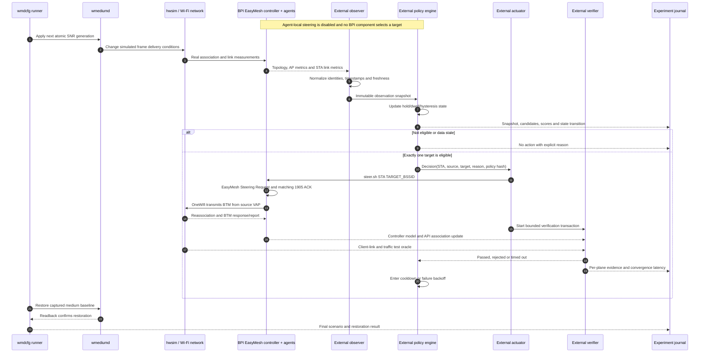

# External optimizer architecture

## Purpose and ownership

The steering optimizer is a completely external component. It runs on the lab
host or Vagrant VM, outside every BPI container and outside the EasyMesh,
OneWifi, WebUI and wmediumd processes.

The optimizer owns all optimization behavior:

- measurement interpretation and freshness rules;
- candidate construction, filtering, ranking and scoring;
- thresholds, margins, hysteresis, dwell and cooldown;
- per-client state and outstanding transactions;
- whether, when and where to steer; and
- decision, action and outcome records.

The BPI EasyMesh implementation supplies protocol facts and mechanisms only:

- topology, association, capability and measurement reports;
- standardized measurement queries and responses;
- Policy Configuration transport for reporting and exclusions;
- Client Steering Request transport, 1905 ACK and steering reports; and
- the OneWifi/HAL path that transmits BTM and reports reassociation.

It supplies no optimizer, target recommendation, candidate score, threshold
evaluation or steering trigger. Agent-local steering must be explicitly disabled
for controller-optimizer experiments so the external optimizer is the only
decision maker.

## Complete architecture


The absence of a decision edge from wmediumd or the BPI agents to the decision
engine is intentional. wmediumd knows the simulated truth, and the BPI agents
know local protocol state, but neither selects the target for this experiment.

## Interface contracts

| Interface | Producer | Consumer | Contract now |
| --- | --- | --- | --- |
| RF generation | `wmdcfg` | wmediumd | Atomic radio-pair SNR generations with verified restore |
| RF transport | wmediumd | hwsim | Frequency-isolated simulated frame delivery |
| live topology | controller/WebUI | external observer | `/api/v1/topology` with current devices, radios and BSSs |
| live association | controller/WebUI | external observer/verifier | Parent agent and STA MAC in `/api/v1/topology` |
| real metrics | EasyMesh reports/queries | external observer | Required adapter; current WebUI metric handlers are not valid |
| policy baseline | operator/external setup | controller and agents | Reporting/exclusion configuration; local agent steering set to mode 0 |
| steer action | external actuator | controller | `steer.sh STA TARGET_BSSID` at the current implementation stage |
| protocol action | controller | source agent | EasyMesh Client Steering Request in Mandate mode |
| WLAN action | source agent/OneWifi | client | 802.11v BTM Request from the source VAP |
| outcome | client/agent/controller | external verifier | link, BTM/report, model and API must converge |
| experiment truth | runner/client/health audit | recorder only | Scenario events, client link, traffic and restart counters |

### Observation boundary

Only the topology endpoint is accepted as live topology and association state.
The other WebUI endpoints below are not optimizer inputs at this stage:

- `/api/v1/clients` reads packaged `static/clients.json` demonstration data;
- `/api/v1/metrics/clients` returns canned demonstration clients and values;
- performance and interference endpoints also contain demonstration data.

The first implementation task is therefore a read-only observation adapter for
real EasyMesh Associated STA Link Metrics, AP Metrics and candidate-link
measurements. It should expose timestamped raw facts without scoring them. If a
small native bridge is required at the controller boundary, it remains an
interface adapter only: no optimizer state or algorithm may enter the image.

Direct MariaDB and `iw` reads are useful acceptance oracles. They must not
become the durable optimizer API because they bypass the EasyMesh observation
contract being evaluated.

### Action boundary

The current action hook is deliberately narrow:

```text
external actuator
  -> lxc exec bpibroadband -- /usr/bin/steer.sh STA TARGET_BSSID
  -> steer_drv / libemcli
  -> em_ctrl Client Steering Request
```

This path is already proven at scale. The actuator must resolve the current
source and validate the target immediately before execution. A later
authenticated steering API may replace `lxc exec`, but it must preserve the
same transaction and verification semantics.

## External optimizer components

The proposed host-side Python package is:

```text
gen/optimizer/
|-- pyproject.toml
|-- configs/
|   `-- threshold-policy.yaml
|-- optimizer/
|   |-- cli.py
|   |-- model.py
|   |-- observer.py
|   |-- policy.py
|   |-- state.py
|   |-- actuator.py
|   |-- verifier.py
|   `-- recorder.py
`-- tests/
```

Its execution modes are:

| Mode | Behavior |
| --- | --- |
| `observe` | Collect and record real snapshots; never recommend or steer |
| `recommend` | Run the complete state machine and record decisions; never act |
| `act` | Issue one validated action and verify the complete outcome |

The decision core should be a pure function over a snapshot, versioned policy
and prior client state. Network I/O belongs in adapters, not in scoring logic.
This makes recorded inputs replayable in unit tests.

## External policy model

The optimizer policy is its own versioned configuration, not an EasyMesh Policy
Configuration TLV and not a WebUI conservative/balanced/aggressive preset. The
following values illustrate the schema; they are not accepted tuning defaults.

```yaml
policy_version: 1
decision_interval_seconds: 1
current_rcpi_below: 100
minimum_target_gain_rcpi: 16
condition_hold_seconds: 5
minimum_dwell_seconds: 20
steer_timeout_seconds: 10
post_steer_cooldown_seconds: 30
maximum_in_flight_per_sta: 1
reject_stale_metrics_after_seconds: 3
```

Configured wmediumd SNR is never substituted for observed RCPI. The two are
different quantities and their relationship must be measured through the
actual Wi-Fi/EasyMesh reporting path.

EasyMesh policy configuration remains useful only to establish the experiment
environment:

- agent-local steering mode `0` so no BPI process makes a steering decision;
- empty local and BTM exclusion lists unless the experiment tests exclusions;
- reporting intervals and inclusion settings needed to obtain raw metrics; and
- no reliance on the misleading WebUI `Add Station Entry` label: per-radio
  settings are keyed by RUID, not client MAC.

## Decision and feedback sequence



The feedback loop belongs to the external optimizer: it observes the resulting
association and closes its own transaction. It never asks wmediumd whether the
steer should have worked.

## Health and safety gates

Action mode is inhibited unless all of these are true:

- expected `5/15/50` model and 10/10 active clients are present;
- the STA has one current association and a fresh current-link measurement;
- the target BSSID exists, is not the source and is eligible for the STA;
- candidate measurements are fresh and exceed the configured margin;
- minimum dwell and condition-hold periods are satisfied;
- no steering transaction or cooldown exists for the STA;
- wmediumd is healthy, but its link values are not read by the decision engine;
- controller/agent/OneWifi services have not restarted; and
- the experiment recorder is writable.

Missing, contradictory or stale data results in `NO_ACTION`, never an inferred
value or optimistic steer.

## Implementation stages

1. **Real observation vertical slice.** Return real hwsim client identities and
   changing EasyMesh metrics; prove correlation with a crossover without
   exposing wmediumd truth to the optimizer.
2. **Observe mode.** Record normalized snapshots from both rev130 and rev150-VM.
3. **Recommend mode.** Replay snapshots through a deterministic state machine
   and require exactly one recommendation in the active crossover.
4. **Act mode.** Use the proven `steer.sh` adapter, bounded verification and
   cooldown.
5. **Scale and fault tests.** Ten clients, four extenders, stale metrics,
   rejected BTM, missing target, delayed model convergence and process loss.
6. **Optional API hardening.** Replace `lxc exec` with authenticated observation
   and steering endpoints without moving optimization logic into the BPI image.

## Acceptance criteria

The first optimizer is accepted only when the same policy and scenario pass on
rev130 and rev150-VM with:

- identical policy/scenario hashes and frozen radio bindings;
- real measurement changes preceding the decision;
- exactly one explained steer for the selected STA;
- no unintended agent-local steering;
- client link, BTM/report, controller database and API agreement;
- bounded traffic impact and no service restarts;
- cooldown preventing an immediate return steer;
- verified wmediumd restoration; and
- a complete append-only record sufficient to replay the decision offline.

The WebUI may later display optimizer state or submit external policy files, but
it is never the decision engine. `Optimize Layout`, canned metrics and generic
steering presets remain outside this architecture.
