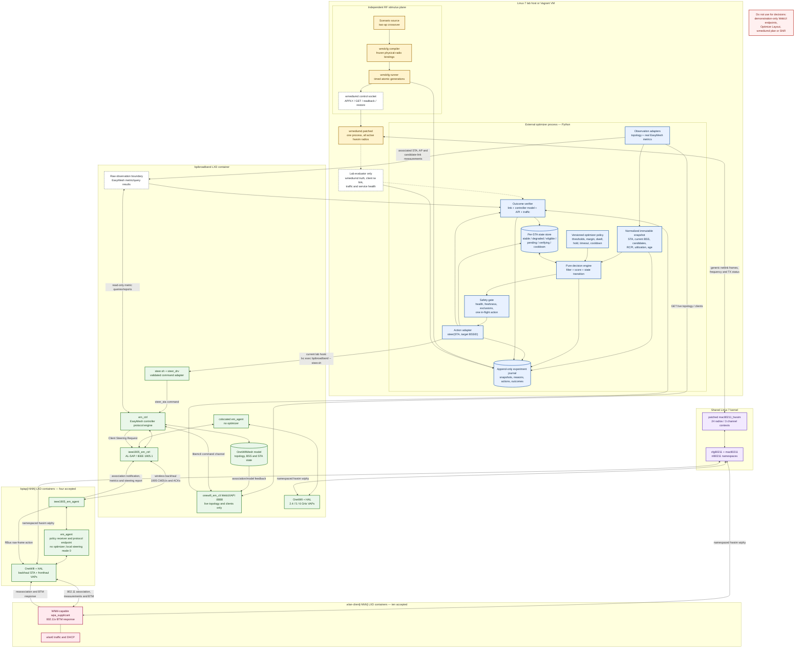
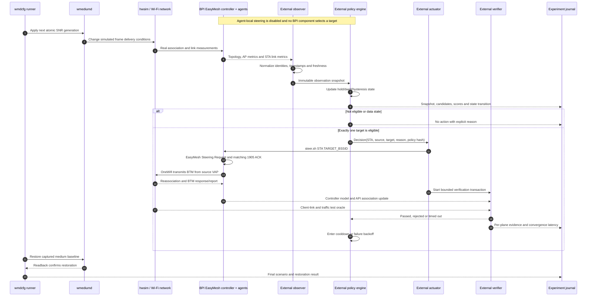

# External optimizer architecture

## Purpose and ownership

The steering optimizer is a completely external component. It runs on the lab
host or Vagrant VM, outside every BPI container and outside the EasyMesh,
OneWifi, WebUI and wmediumd processes.

The optimizer owns all optimization behavior:

- measurement interpretation and freshness rules;
- candidate construction, filtering, ranking and scoring;
- thresholds, margins, hysteresis, dwell and cooldown;
- per-client state and outstanding transactions;
- whether, when and where to steer; and
- decision, action and outcome records.

The BPI EasyMesh implementation supplies protocol facts and mechanisms only:

- topology, association, capability and measurement reports;
- standardized measurement queries and responses;
- Policy Configuration transport for reporting and exclusions;
- Client Steering Request transport, 1905 ACK and steering reports; and
- the OneWifi/HAL path that transmits BTM and reports reassociation.

It supplies no optimizer, target recommendation, candidate score, threshold
evaluation or steering trigger. Agent-local steering must be explicitly disabled
for controller-optimizer experiments so the external optimizer is the only
decision maker.

## Complete architecture



The absence of a decision edge from wmediumd or the BPI agents to the decision
engine is intentional. wmediumd knows the simulated truth, and the BPI agents
know local protocol state, but neither selects the target for this experiment.

## Interface contracts

| Interface | Producer | Consumer | Contract now |
| --- | --- | --- | --- |
| RF generation | `wmdcfg` | wmediumd | Atomic radio-pair SNR generations with verified restore |
| RF transport | wmediumd | hwsim | Frequency-isolated simulated frame delivery |
| live topology | controller/WebUI | external observer | compact `/api/v1/topology` supplies nodes/client placement; `/api/v1/bsses` supplies controller-owned fronthaul BSSID/device/radio/band/SSID identity |
| live association | controller/WebUI | external observer/verifier | Parent agent and STA MAC in `/api/v1/topology` and `/api/v1/clients` |
| current-link metrics | EasyMesh reports/queries | external observer | Live associated-client RCPI/rates/counters are available from `/api/v1/clients` |
| candidate-link metrics | EasyMesh reports/queries | external observer | Read-only adapter/capability evaluation still required |
| policy baseline | operator/external setup | controller and agents | Reporting/exclusion configuration; local agent steering set to mode 0 |
| steer action | external actuator | controller | `steer.sh STA TARGET_BSSID` at the current implementation stage |
| protocol action | controller | source agent | EasyMesh Client Steering Request in Mandate mode |
| WLAN action | source agent/OneWifi | client | 802.11v BTM Request from the source VAP |
| outcome | client/agent/controller | external verifier | link, BTM/report, model and API must converge |
| experiment truth | runner/client/health audit | recorder only | Scenario events, client link, traffic and restart counters |

### Observation boundary

`/api/v1/topology`, `/api/v1/devices`, `/api/v1/clients` and `/api/v1/bsses`
derive identity, association placement and target BSS identity from the current
controller tree. WebSocket initial state uses the same live inventory.
`/api/v1/clients` joins the controller's detailed associated-STA report by MAC
and exposes real RCPI, derived dBm, rate and traffic fields when present.
`/api/v1/bsses` deliberately exposes no candidate quality. Unknown values
remain unavailable rather than being invented. Performance, interference and
other demonstration endpoints still contain non-authoritative data and must
not be optimizer inputs.

The first implementation task is therefore to normalize the working
associated-client observation and add only the missing AP/candidate-link facts.
The adapter should expose timestamped raw EasyMesh measurements without scoring
them. If a small native bridge is required at the controller boundary, it
remains an interface adapter only: no optimizer state or algorithm may enter
the image.

Direct MariaDB and `iw` reads are useful acceptance oracles. They must not
become the durable optimizer API because they bypass the EasyMesh observation
contract being evaluated.

### Action boundary

The current action hook is deliberately narrow:

```text
external actuator
  -> lxc exec bpibroadband -- /usr/bin/steer.sh STA TARGET_BSSID
  -> steer_drv / libemcli
  -> em_ctrl Client Steering Request
```

This path is already proven at scale. The actuator must resolve the current
source and validate the target immediately before execution. A later
authenticated steering API may replace `lxc exec`, but it must preserve the
same transaction and verification semantics.

## External optimizer components

The host-side Python package is:

```text
gen/optimizer/
|-- pyproject.toml
|-- configs/
|   |-- threshold-policy.yaml
|   `-- band-upgrade-policy.yaml
|-- scenarios/
|   |-- capabilities-current.json
|   |-- traffic-profiles.json
|   |-- scenario-catalog.json
|   `-- generated/home-suite.matrix.json
|-- optimizer/
|   |-- cli.py
|   |-- model.py
|   |-- observer.py
|   |-- policy.py
|   |-- state.py
|   |-- actuator.py
|   |-- verifier.py
|   |-- experiments.py
|   |-- traffic.py
|   |-- simulator.py
|   |-- planners.py
|   |-- preassociation.py
|   `-- recorder.py
`-- tests/
```

Its execution modes are:

| Mode | Behavior |
| --- | --- |
| `observe` | Collect and record real snapshots; never recommend or steer |
| `recommend` | Run the complete state machine and record decisions; never act |
| `act` | Issue one validated action and verify the complete outcome |
| `simulate` | Run synthetic EasyMesh-shaped telemetry from a verified golden world; never a live claim |
| `backhaul-plan` | Build a recommendation-only weighted loop-free backhaul tree |
| `width-plan` | Produce explained recommendation-only channel-width choices |

The decision core should be a pure function over a snapshot, versioned policy
and prior client state. Network I/O belongs in adapters, not in scoring logic.
This makes recorded inputs replayable in unit tests.

## External policy model

The optimizer policy is its own versioned configuration, not an EasyMesh Policy
Configuration TLV and not a WebUI conservative/balanced/aggressive preset. The
following values illustrate the schema; they are not accepted tuning defaults.

```yaml
policy_version: 1
decision_interval_seconds: 1
current_rcpi_below: 100
minimum_target_gain_rcpi: 16
condition_hold_seconds: 5
minimum_dwell_seconds: 20
steer_timeout_seconds: 10
post_steer_cooldown_seconds: 30
failure_backoff_seconds: 60
maximum_failure_backoff_seconds: 600
maximum_in_flight_per_sta: 1
reject_stale_metrics_after_seconds: 3
```

Configured wmediumd SNR is never substituted for observed RCPI. The two are
different quantities and their relationship must be measured through the
actual Wi-Fi/EasyMesh reporting path.

EasyMesh policy configuration remains useful only to establish the experiment
environment:

- agent-local steering mode `0` so no BPI process makes a steering decision;
- empty local and BTM exclusion lists unless the experiment tests exclusions;
- reporting intervals and inclusion settings needed to obtain raw metrics; and
- no reliance on the misleading WebUI `Add Station Entry` label: per-radio
  settings are keyed by RUID, not client MAC.

## Decision and feedback sequence



The feedback loop belongs to the external optimizer: it observes the resulting
association and closes its own transaction. It never asks wmediumd whether the
steer should have worked.

## Health and safety gates

Action mode is inhibited unless all of these are true:

- expected `5/15/50` model and 10/10 active clients are present;
- the STA has one current association and a fresh current-link measurement;
- the target BSSID exists, is not the source and is eligible for the STA;
- candidate measurements are fresh and exceed the configured margin;
- minimum dwell and condition-hold periods are satisfied;
- no steering transaction or cooldown exists for the STA;
- wmediumd is healthy, but its link values are not read by the decision engine;
- controller/agent/OneWifi services have not restarted; and
- the experiment recorder is writable.

Missing, contradictory or stale data results in `NO_ACTION`, never an inferred
value or optimistic steer.

## Implementation stages

1. **Associated-link vertical slice — complete.** Live client identities,
   placement and changing reported RCPI are exposed; a reversible wmediumd run
   moved controller RCPI from 138 to 88 and back without injecting a value.
2. **Candidate observation and observe mode.** Expose fresh target/AP facts and
   record normalized snapshots from the pinned rev130 scenario.
3. **Recommend mode.** Replay snapshots through a deterministic state machine
   and require exactly one recommendation in the active crossover.
4. **Act mode.** Use the proven `steer.sh` adapter, bounded verification and
   cooldown.
5. **Scale and fault tests.** Ten clients, four extenders, stale metrics,
   rejected BTM, missing target, delayed model convergence and process loss.
6. **Optional API hardening.** Replace `lxc exec` with authenticated observation
   and steering endpoints without moving optimization logic into the BPI image.

## P1 implementation status

The first host-side package now exists in `gen/optimizer`. It implements the
immutable snapshot, controller observer, pure threshold/margin/hold/dwell/
cooldown state machine, deterministic replay, hash-chained journal, narrow
`gen/steer.sh` actuator and bounded association verifier. It has no wmediumd
import or simulator-truth input.

A live rev130 read-only check captured 5 mesh devices and 10 clients twice.
`recommend` correctly produced zero steering actions and the explicit reason
`current_metric_freshness_unknown` for all clients. This is not a failed policy
test: the current `/clients` endpoint rewrites `last_updated` when the API is
read, so that field cannot prove when the agent measured RCPI. The current
`/topology` projection also supplied no target-BSS list to this observer run.

### Measurement capability and exposure matrix

| Fact or mechanism | Standard/native implementation | Controller state | External exposure now | P1 disposition |
| --- | --- | --- | --- | --- |
| current association | topology notifications, Associated Clients repair | current STA owner and BSSID | `/clients` | use now |
| associated-link RCPI/rates/counters | periodic AP Metrics Response and Associated STA Link Metrics | persisted in STA model | `/clients`, but exact measurement time absent | use value; abstain on freshness until receipt time is exposed |
| AP/BSS utilization | AP Metrics and Radio Metrics TLVs | parser and model fields exist | values reach current model; hwsim HAL reports zero | expose with receipt time, but do not score zero synthetic survey data |
| candidate BSS identity | device/radio/BSS model | BSSList contains target identities | `/bsses` returns 30 fronthaul identities across five devices and three bands | use now; unknown quality remains unknown |
| Unassociated STA Link Metrics | Profile-3 CMDU and OneWifi method/event pieces exist but are not connected correctly | controller response parser can store RCPI/time-delta | POST `/api/v1/unassoc_sta_query` reports command submission only; no result GET/receipt timestamp | repair the four audited boundaries below, then add correlated result exposure |
| Beacon Metrics | query/response handlers and agent RBus beacon-report path exist | raw measurement-report elements are copied into the STA model | no external query/result API and no decoded candidate RCPI | evaluate after unassociated metrics; decode only required fields |
| client capability/BTM support | client capability query/report and reassociation parsing | capability data exists in STA model | not normalized for optimizer filtering | add read-only capability flags |
| steering | Client Steering Request, BTM, ACK/report | proven controller/agent transaction | `gen/steer.sh` | use through narrow actuator |

The shortest sound next slice is therefore not a scoring change. It is a
read-only controller adapter that returns correlated observation identity,
source, value, measurement age/receipt time and status for BSS inventory,
associated-link and Unassociated STA Link Metrics. Until that exists, live
recommend/act remain safely inhibited while capture and deterministic replay
are usable.

### Unassociated-metrics boundary audit (2026-08-21)

A source audit, compile test and targeted rev130 diagnostic separated four
independent defects. None is currently hidden by an optimizer workaround:

1. The controller chooses the first radio object for the requested Agent and
   starts the command only from `configured`. A live request selected the 6 GHz
   radio for a 5 GHz query and timed out while the otherwise complete runtime
   radio state was `channel_selected`. Candidate selection must match the
   requested operating class and accept operational synchronized/selected
   states without prematurely completing the command.
2. The Agent writes the nonexistent `Device.WiFi.UnAssoc.STA` property. OneWifi
   actually registers the per-VAP
   `Device.WiFi.AccessPoint.{i}.X_RDKCENTRAL-COM_GetNaSta` method and publishes
   `Device.WiFi.EM.NaStaResponse`.
3. OneWifi publishes a flat
   `UnassociatedSTALinkMetricsResponse.sta_list`, while the Agent parser expects
   different nesting and would discard a valid physical result.
4. The generic hwsim Wi-Fi HAL implementation of `wifi_getNASta` returns
   `WIFI_HAL_ERROR`; only the MXL-specific branch has a measurement provider.
   Correcting orchestration and JSON cannot create candidate RCPI in this lab.

The REST handler also returns `success: true` whenever native command execution
returns a tree; it does not expose `not-ready`, timeout, ACK or measurement
status. A safe adapter therefore needs a transaction ID and semantic status,
not merely a new GET over the current POST.

A local prototype connecting items 1–3 compiled successfully, but the runtime
could not cross item 4 and the accepted binaries were restored. It is not in
the layer patch set. The next implementation should first define an hwsim
measurement provider at the simulated radio/HAL boundary—not inside the
optimizer—then land and test the generic control/schema repair end to end.

Scenario preparation is also implemented. Two 2D Agent layouts, ten mobility/
presence worlds and five separate traffic profiles expand into a deterministic
148-case matrix across two policy baselines. The initial capability file marks
14 cases runnable and 134 blocked with exact missing mechanisms.
Frequency-qualified RF is now accepted; candidate freshness, load traffic,
controlled BTM response, backhaul actions,
channel width and 20-client scale must not be inferred from configuration
alone. See [optimizer-scenarios.md](optimizer-scenarios.md).

### Test ladder

The optimizer tests intentionally progress in layers:

1. model/MAC/timestamp validation and serialization;
2. observer normalization and the rule that API serialization time is not
   measurement time;
3. missing, stale, threshold, margin, dwell, hold, pending and cooldown policy
   transitions;
4. actuator source/target validation and verifier convergence;
5. hash-chain integrity and byte-deterministic replay; and
6. the existing `two-ap-crossover.wmd` phase contract combined with a recorded
   EasyMesh-observation stream, requiring exactly one recommendation; and
7. both 2.4-to-5 and 5-to-6 BSSID decisions against the ten-client small band
   world without reading its simulated SNR as policy input.

The crossover test reads the scenario only for phase/timing coordination. Its
RCPI inputs are explicitly labelled Associated STA Link Metrics and Beacon
Metrics observations; it never calculates them from the scenario SNR.

## Acceptance criteria

The first optimizer is accepted on rev130 with:

- recorded policy/scenario hashes and frozen radio bindings;
- real measurement changes preceding the decision;
- exactly one explained steer for the selected STA;
- no unintended agent-local steering;
- client link, BTM/report, controller database and API agreement;
- bounded traffic impact and no service restarts;
- cooldown preventing an immediate return steer;
- verified wmediumd restoration; and
- a complete append-only record sufficient to replay the decision offline.

The WebUI may later display optimizer state or submit external policy files, but
it is never the decision engine. `Optimize Layout`, canned metrics and generic
steering presets remain outside this architecture.
