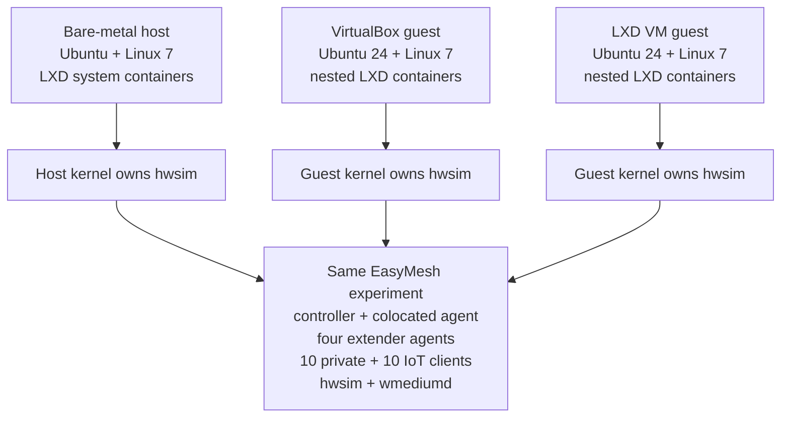

# EasyMesh lab deployment models

This reference compares the three supported ways to host the EasyMesh research
lab: directly on a Linux host, in a VirtualBox VM managed by Vagrant, and in an
LXD virtual machine. The EasyMesh experiment is intentionally the same in all
three cases. The deployment model changes isolation, lifecycle, portability,
performance, and who owns the simulated-radio kernel.

For the currently accepted source revision, image hashes, topology, and known
limitations, see [current state](../current-state.md).

## One lab, three outer boundaries

The invariant lab inside the selected boundary contains:

- Docker with the lean Boardfarm `ca-desk6` DHCP/NAT service and `br-wan101`;
- LXD system containers for `bpibroadband`, four extenders, and 20 clients;
- Linux 7 with the patched 32-radio, three-channel `mac80211_hwsim` module;
- patched multichannel wmediumd, its configurator, and the wmediumd Console;
- the EasyMesh WebUI/API, steering tools, optimizer, and acceptance tests; and
- persistent node identities and `/nvram` data across ordinary restarts.

This common inner shape is important. Results can be compared across deployment
models only when the source revision, BPI images, kernel, radio identities,
wmediumd build and configuration, topology, and scenario inputs are identical.

## Configuration at a glance

| Property | Bare metal | VirtualBox/Vagrant | LXD VM |
| --- | --- | --- | --- |
| Outer host | Ubuntu 24.04 with Linux 7 | Ubuntu 22.04 or 24.04 with VirtualBox and Vagrant | Ubuntu 24.04 with LXD VM support |
| Lab kernel | Host kernel | Ubuntu 24.04/Linux 7 guest kernel | Ubuntu 24.04/Linux 7 guest kernel |
| BPI/client boundary | LXD system containers on the host | LXD system containers nested in the guest | LXD system containers nested in the guest |
| VM implementation | None | VirtualBox `VBoxHeadless` | LXD-managed QEMU/KVM |
| Default allocation | Uses host resources directly | 6 vCPUs, 6144 MiB RAM, dynamic 64 GB disk | 6 vCPUs, 6 GiB RAM, dynamic 64 GiB disk |
| UI exposure | Host ports 8888 and 8890 | Vagrant forwards host 18889 and 18890 | LXD NAT proxy devices expose host 18889 and 18890 |
| Boot policy | Lab does not automatically reconstruct after a host reboot | Guest automatically reconstructs the lab | Guest automatically reconstructs the lab |
| Portable artifact | No single-machine image | Vagrant `.box` release bundle | LXD image export plus checksums |

The VM resource values are release defaults, not a claim that the lab consumes
all six CPUs continuously. They provide enough concurrency for Docker,
nested LXD, five EasyMesh nodes, 20 clients, wmediumd, both UIs, and acceptance
tests. Measurements, rather than the defaults, should drive a smaller profile.

## Bare-metal lab

### How it is configured

Ubuntu and Linux 7 run directly on the physical host. The host loads the
patched hwsim module, owns every simulated wiphy, runs wmediumd, Docker and
Boardfarm, and hosts all BPI and client LXD containers. The WebUI and Console
listen directly on host ports 8888 and 8890.

Provisioning follows the direct-runtime procedure in
[lab setup and operation](../guide/operations.md). The host must provide the
matching Linux headers/module, LXD, Docker, the single Boardfarm repository,
the controller and extender images, and the source checkout.

An ordinary physical-host reboot must not silently start the complete lab.
The operator starts or reconstructs it explicitly after confirming that host
networking, Boardfarm, hwsim, LXD, and the desired experiment state are ready.
This avoids an engineering workstation unexpectedly consuming radio, CPU, and
memory resources after every reboot.

### Advantages

- Lowest virtualization overhead and best packet-processing headroom.
- Direct access to the hwsim kernel, debugfs, netlink, namespaces, captures,
  wmediumd, and LXD state.
- Fastest environment for kernel, Wi-Fi HAL, wmediumd, and timing diagnosis.
- No outer VM agent, proxy, virtual disk, or nested-container control path.
- Best performance reference when comparing another deployment model.

### Disadvantages

- The host kernel and networking are part of the experiment and are easier to
  disturb with unrelated host changes.
- hwsim identities, Docker bridges, LXD networks, and host services share one
  operating system and require disciplined ownership.
- It is not distributed as one importable appliance; a new host needs a full
  installation and provisioning pass.
- Host reboot recovery is intentionally operator-driven.
- A failed or destructive experiment has the largest blast radius.

### Best use

Use bare metal for development, maximum scale, performance baselines, kernel
and medium debugging, and diagnosis of failures that might be caused by an
outer hypervisor or nested LXD.

## VirtualBox/Vagrant appliance

### How it is configured

VirtualBox provides an Ubuntu 24.04/Linux 7 guest. Vagrant owns VM creation,
SSH, resource settings, and host-to-guest port forwarding. Inside the guest,
Docker provides Boardfarm and nested LXD owns the same BPI and client system
containers as the bare-metal lab. The guest kernel, not the workstation
kernel, owns hwsim and wmediumd.

The complete release is a `.box` plus a generic `Vagrantfile`, checksums,
release notes, and an operator README. Installation and operation are described
in the [packaged VirtualBox guide](../../../gen/vm/packaged/README.md). Host
addresses and ports are environment overrides; they are not baked into the
box.

The guest's systemd chain reconstructs Boardfarm, the hwsim pool, controller,
extenders, wmediumd, and clients after a VM boot. The physical host itself does
not run those inner services.

### Advantages

- Most familiar portable handoff for engineers who do not operate LXD hosts.
- A release bundle contains the complete installed and accepted lab.
- The guest kernel and radio state are isolated from the workstation kernel.
- Vagrant gives a small, repeatable import/start/SSH/halt interface.
- VirtualBox snapshots and immutable base boxes make rollback straightforward.
- The same artifact works on supported Ubuntu 22.04 and 24.04 workstations.

### Disadvantages

- VirtualBox kernel modules must match the workstation kernel and can be
  blocked by Secure Boot.
- The complete `.box` is a multi-gigabyte artifact and each mutable VM consumes
  additional disk space.
- Virtual CPU scheduling and nested LXD add latency and reduce maximum packet
  throughput compared with bare metal.
- Fixed VM resource allocation can reserve substantially more memory than an
  idle experiment needs.
- Vagrant port-forward collisions must be managed when several labs run on one
  host.
- VirtualBox is a separate virtualization administration stack alongside LXD.

### Best use

Use VirtualBox/Vagrant as the broadly portable distribution and demonstration
baseline, particularly when the recipient has a supported Ubuntu workstation
but is not expected to administer a native LXD environment.

## LXD VM appliance

### How it is configured

The host's LXD launches an Ubuntu 24.04 virtual machine with KVM acceleration.
LXD manages the VM, but the running VM is still a QEMU/KVM process. Inside the
guest, a second LXD instance owns the BPI and client system containers. This is
a nested-LXD design, not an LXD system container with host-owned radios.

The guest kernel owns hwsim and wmediumd, preserving the same radio boundary as
the VirtualBox appliance. LXD NAT proxy devices expose the WebUI and Console.
The builder detects the host's default-route address unless the operator
overrides it, and it stores no site-specific host address inside the guest.

The current builder, lifecycle, port, snapshot, and export commands are in the
[native LXD appliance guide](../../../gen/vm/lxd/README.md). A clean build uses
commit-bounded Git bundles and checksum-verified images, reboots the appliance,
runs its health gate, and only then creates the accepted snapshot.

### Advantages

- Uses one host management system for VM lifecycle, storage, networks,
  snapshots, images, and port proxying.
- Keeps the Linux 7/hwsim kernel isolated inside the appliance.
- Avoids VirtualBox kernel modules, Vagrant state, and a second host VM tool.
- LXD commands give concise automated start, stop, snapshot, publish, export,
  and delete operations.
- Fits naturally on existing LXD build and lab hosts.
- Preserves the same nested container names and operator experience as the
  VirtualBox guest.

### Disadvantages and qualification risks

- It still pays VM and nested-LXD overhead; replacing VirtualBox with LXD does
  not remove QEMU/KVM or make the guest a system container.
- The outer LXD agent and the inner LXD daemon add a control path that does not
  exist on bare metal.
- Command bursts must not create unbounded nested `lxc exec` websocket
  sessions. Lifecycle and test tools must reuse or bound executor calls and
  fail cleanly if the inner daemon is unavailable.
- Recovery ordering spans the outer VM, guest systemd, Docker, guest LXD,
  hwsim, wmediumd, and EasyMesh. Timeouts and stop behavior must remain bounded
  at every layer.
- An LXD image is convenient for LXD users but is a less universal external
  handoff than a Vagrant box.
- The host needs working KVM virtualization and enough memory and storage for
  the VM in addition to any other LXD workloads.

### Best use

Use the LXD VM on LXD-native engineering infrastructure after it passes the
same behavioral gates as the portable VirtualBox release. It is the strongest
candidate for the canonical managed appliance, while bare metal remains the
debug/performance reference and VirtualBox remains the general handoff format.

## Why an LXD system container is not the selected appliance

A privileged outer LXD system container would share the host kernel. Its
hwsim wiphys would therefore be created by the host and would have to cross an
outer container namespace and then an inner BPI container namespace. Kernel
version, module lifetime, radio ownership, device permissions, and recovery
would no longer be appliance-local.

That design may use fewer resources, but it changes the experimental boundary
and increases radio-lifecycle fragility. It should be evaluated separately; it
must not be treated as a smaller implementation of the LXD VM.

## Comparative decision matrix

| Criterion | Bare metal | VirtualBox/Vagrant | LXD VM |
| --- | --- | --- | --- |
| Runtime performance | Best | Good; hypervisor overhead | Good; QEMU/KVM overhead |
| Kernel/radio isolation | Low | High | High |
| Wi-Fi/kernel debugging | Best | Requires guest access | Requires guest access |
| External portability | Installation procedure | Best current appliance bundle | Good for LXD-equipped hosts |
| Clean rollback | Host-specific | Box plus snapshot | Image plus snapshot |
| Host tool complexity | Docker + LXD | VirtualBox + Vagrant | LXD only on host |
| Inner orchestration | Direct LXD | Nested LXD | Nested LXD |
| Automatic lab start | Deliberately disabled | Enabled in guest | Enabled in guest |
| Maximum scale potential | Highest | Resource constrained by VM | Resource constrained by VM |
| Failure isolation | Lowest | High | High |
| Current strategic role | Debug/performance reference | Portable release baseline | Candidate managed appliance |

No optimizer or steering result should depend on the deployment model. A
repeatable difference between models is a lab defect or a measurement that
must be explained before the result is used.

## LXD VM viability gate

LXD VM is viable only when it passes all of the following from a clean image
and after an export/import onto a second LXD host:

1. Boot the VM and automatically reach the complete manifest-defined topology
   without an operator entering the guest.
2. Report healthy Boardfarm WAN/DHCP, 32 stable hwsim radios, one wmediumd,
   both UIs, all EasyMesh nodes, every client association, and every client
   data path.
3. Preserve permanent PHY, MAC, AL-MAC, RUID, client, and `/nvram` identities
   across VM and individual-node restarts.
4. Start, stop, and restart each provisioned node without regenerating the
   medium, restarting unrelated nodes, or creating duplicate controller model
   records.
5. Pass the steering matrix, manual named steering, multihop, RF scenario,
   outage/recovery, optimizer, and topology restoration tests.
6. Survive repeated outer VM reboot and warm-start cycles with bounded startup
   time and no manual repair.
7. Exercise sustained sequential and controlled-concurrency nested LXD
   operations without websocket timeouts, stuck executor processes, leaked
   systemd scopes, or an unresponsive inner daemon.
8. Complete the required soak profile without service restarts, controller
   model drift, process growth, memory growth, journal growth, or cumulative
   packet-processing degradation.
9. Keep WebUI, Console, steering, and health-check command latency within the
   declared release limits while wmediumd carries the selected traffic load.
10. Export, import, configure site-local proxy addresses, start, check, and
    delete using only the documented outer-host commands.

Record wall-clock startup time, CPU time, peak and steady-state memory, disk
usage, wmediumd packet rates/drops, command latency, container restart counts,
and failed operations for all three models. Bare metal is the performance
control; VirtualBox is the portability control. The LXD VM should be selected
as the default managed appliance only after functional parity and acceptable
resource deltas are demonstrated.

## 0828 qualification campaign

The 0828 comparison uses four physical systems. Two direct deployments are
required because a result from the small rev130 system alone cannot distinguish
deployment overhead from CPU or memory pressure. rev120 is the like-for-like
bare-metal performance control for the VM profiles; rev130 is the constrained
host acceptance target.

| Target | Deployment under test | Product / board | CPU | Logical CPUs | RAM | Host OS and kernel |
| --- | --- | --- | --- | ---: | ---: | --- |
| rev120 | Bare metal | Intel NUC10i7FNH / NUC10i7FNB | Core i7-10710U, 6 cores / 12 threads | 12 | 62 GiB | Ubuntu 24.04.4, Linux 7.0.0-30 |
| rev130 | Bare metal | Intel NUC6CAYH / NUC6CAYB | Celeron J3455, 4 cores / 4 threads | 4 | 7 GiB | Ubuntu 22.04.4, Linux 7.0.0-28 |
| rev140 | LXD VM | Intel NUC12WSKi7 / NUC12WSBi7 | Core i7-1260P, 12 cores / 16 threads | 16 | 62 GiB | guest Ubuntu 24.04.4/Linux 7.0.0-30 |
| rev150 | VirtualBox/Vagrant | x86-64 host | Ryzen 7 8745HS, 8 cores / 16 threads | 16 | 25 GiB | host Ubuntu 22.04.5; guest Ubuntu 24.04.3/Linux 7.0.0-28 |

The rev140 outer host is an existing LXD/QEMU execution platform rather than a
supported installation reference. Linux 7 and hwsim run inside the LXD VM.
The same host-versus-guest distinction applies to rev150 and VirtualBox.

### Pinned inputs

Every result row must name, rather than imply, these inputs:

| Input | Required 0828 value |
| --- | --- |
| Source branch | `codex/0828-clean` |
| Source commit | `0b4e745df937e55e2c0d6ddb3a4635a77dd423c8` |
| Controller image | `X86EMLTRBPIBB_rdk-next_20260828160826.rootfs.lxc.tar.bz2` |
| Controller SHA-256 | `9a4c432c857dbbf80a68c5b7835d7d0ba39327919dc53becc3c5a9eeb78d51cd` |
| Extender image | `X86EMLTRBPIAP_rdk-next_20260828161337.rootfs.lxc.tar.bz2` |
| Extender SHA-256 | `8e8ffbfe4b2404dfc9ae19ab27b0eab6243d3bc55d443ceca0d269d36b3e5d18` |
| Boardfarm | single `boardfarm-lab-staging` repository, `ca-desk6.json` |
| hwsim | 32 radios, three channels, `regtest=5`, patched module hash recorded per kernel |
| wmediumd | `f8fb9d668c8bfc1964728f8db620254817ff4bce3de3493f7e5166dcb576641f` on every target |
| Topology | controller plus colocated agent, four extenders, 10 private clients, 10 IoT clients |

The recorded hwsim hashes are:

| Target | Guest/host kernel that owns hwsim | Module SHA-256 |
| --- | --- | --- |
| rev120 | 7.0.0-30 | `f56577903d6ec8475b4f281106e0c6733449b7ed065bb6e4d69579fc1c6955f6` |
| rev130 | 7.0.0-28 | `c7c9e49d7198e84de33be893532c68591f4bb54aaed7f8319d2bf7c22a7360bb` |
| rev140 | 7.0.0-30 | `c5dbfed56c7d6314b2e37f03d3cc6d12b1bb244690eb5ef482920abf514df86c` |
| rev150 | 7.0.0-28 | `c7c9e49d7198e84de33be893532c68591f4bb54aaed7f8319d2bf7c22a7360bb` |

The rev120 and rev140 Linux 7.0.0-30 modules have the same kernel `srcversion`
(`68A1C6E52DF91F241531BBD`) and vermagic but different build IDs, so their file
hashes differ. The functional patch source is the same; the exact binary hash
is retained so the build-environment difference is not hidden.

If a fix changes the source commit during the campaign, update every target to
that commit and rerun the affected gates. Do not combine results from a dirty
checkout with release results.

### Measurement phases

Each target is measured in the same order:

1. **Outer idle:** lab stopped; record host load, memory, swap, disk, temperature
   when available, and hypervisor processes.
2. **Cold start:** start from all lab nodes stopped and measure time to the full
   health gate. VM targets start from a powered-off VM and use automatic guest
   reconstruction. Bare-metal targets use an explicit operator start.
3. **Ready idle:** hold the complete lab without a scenario and sample CPU,
   memory, process PSS/RSS, LXD instance use, disk, journal growth, wmediumd
   counters, and API latency.
4. **Traffic:** run the same 20-client gateway traffic profile and record loss,
   throughput where selected, host CPU, guest CPU, and wmediumd packet/drop
   rates.
5. **Control:** run named steering, the steering matrix, star/branch/chain
   multihop transitions, and optimizer smoke tests. Record command latency,
   physical association, controller convergence, WebUI convergence, and
   restoration.
6. **Lifecycle:** restart individual nodes and the complete runtime. For VM
   targets also reboot the outer guest and verify automatic reconstruction.
7. **Soak:** run the declared bounded soak profile and compare initial/final
   process counts, PSS, database counts, journals, packet loss, and command
   responsiveness.

### Qualification results

The results below were retained as machine-readable evidence on each target.
The campaign completed clean startup, ready-state measurement, 20-client
connectivity, named steering, delayed ownership checks, optimizer collection,
and star/branch/chain backhaul. It did not run a long soak, a complete steering
matrix, every individual-node lifecycle case, or an export/import cycle.
Consequently, this is a deployment-model qualification snapshot, not final
appliance acceptance.

Evidence is retained under:

- `/home/rev/easymesh-evidence/deployment-models/rev120-bare` on rev120;
- `/home/rev/easymesh-evidence/deployment-models/rev130-bare` on rev130;
- `/home/vagrant/easymesh-evidence/deployment-models/rev140-lxd-vm` inside the
  rev140 VM and `rev140-lxd-vm-isolated` under the outer host evidence root;
  and
- `/home/vagrant/easymesh-evidence/deployment-models/rev150-virtualbox` inside
  the rev150 VM and the same label under the outer host evidence root.

| Result | rev120 bare metal | rev130 bare metal | rev140 LXD VM | rev150 VirtualBox |
| --- | --- | --- | --- | --- |
| Exact source/image/module provenance | PASS | PASS | PASS | PASS |
| Clean start to complete health | PASS, 15m 13s; Boardfarm already active | PASS, 37m 52s; Boardfarm already active | PASS, 22m 22s automatic guest reconstruction | PASS, 19m 50s automatic guest reconstruction |
| Model and live clients | PASS: 5 devices, 15 radios, 50 BSS, 24 associated rows, 20 clients | PASS: same | PASS: same | PASS: same |
| Gateway connectivity | PASS: 20/20, 0% ping loss | PASS: 20/20, 0% ping loss | PASS: 20/20, 0% ping loss | PASS: 20/20, 0% ping loss |
| Named steering | Immediate physical/API convergence PASS | Immediate physical/API convergence PASS | Immediate physical/API convergence PASS | PASS; six moves remained coherent for 30s each |
| Delayed association ownership | FAIL: API reverted after 10s while the physical link remained correct | FAIL: API reverted after 7s while the physical link remained correct | FAIL: API reverted after 4s while the physical link remained correct | PASS in the six-move focused sample |
| Star/branch/chain multihop | Topologies PASS; initial chain/star traffic gates were transiently 17/20 and 15/20, repeat star 20/20 | PASS: all profiles, 20/20 | PASS: all profiles, 20/20 | PASS: all profiles, 20/20 |
| Optimizer live smoke | BLOCKED after ownership drift: candidate request correctly failed closed | PASS: 3 cycles, 20 clients and 80 same-band candidates/cycle | BLOCKED after ownership drift | PASS: 3 cycles, 20 clients and 80 same-band candidates/cycle |
| Complete runtime reconstruction | Explicit full redeploy PASS | Explicit full redeploy PASS | Automatic cold reconstruction PASS | Automatic cold reconstruction PASS |
| Final daemon restart counts | Zero | Zero | Zero | Zero |
| Long soak | Not run | Not run | Not run | Not run |
| Overall measured result | CONDITIONAL FAIL: RDK ownership convergence | CONDITIONAL FAIL: RDK ownership convergence | LXD transport/runtime PASS; RDK ownership convergence FAIL | PASS for measured gates; remaining lifecycle/soak gates open |

The optimizer failure on rev120 and rev140 is not an independent optimizer
defect. Once the controller advertises an old serving BSSID, it asks the
physical serving AP for that STA as though it were an unassociated candidate.
That AP correctly omits its associated station from the response, and the
optimizer adapter correctly rejects the incomplete result instead of making a
decision from contradictory state.

The rev150 ownership pass must not be interpreted as a VirtualBox fix. The
same RDK binaries and virtual-radio design were used on all four targets, and
the failure is a delayed old-owner overwrite. VirtualBox scheduling happened
not to expose the race in six transitions. Repeated runs are required before a
deployment-model-specific difference can be claimed.

### Ready-state loading

The CPU samples are 19 one-second observations after the cumulative `vmstat`
row, except the rev150 outer-host sample, which contains 14 observations.
Consumed-core equivalents are average busy percentage multiplied by the
number of logical CPUs in that measurement boundary.

| Measurement | rev120 bare metal | rev130 bare metal | rev140 LXD VM | rev150 VirtualBox |
| --- | ---: | ---: | ---: | ---: |
| Host/guest CPU busy | 3.11% of 12 = 0.37 cores | 23.84% of 4 = 0.95 cores | guest 9.74% of 6 = 0.58 vCPU | guest 5.68% of 6 = 0.34 vCPU |
| Isolated outer-host CPU busy | same boundary | same boundary | 5.00% of 16 = 0.80 cores | 9.57% of 16 = 1.53 cores, including other host work |
| Hypervisor process RSS | n/a | n/a | 6.05 GiB QEMU, mostly guest shared-memory mapping | 5.62 GiB VBoxHeadless, mostly mapped guest file pages |
| Ready memory used / total | 4.25 / 62.51 GiB | 2.67 / 7.60 GiB | guest 2.44 / 5.76 GiB | guest 2.34 / 5.78 GiB |
| Sum of lab LXD cgroup usage | 0.89 GiB | 0.84 GiB | 1.43 GiB | 1.34 GiB |
| `bpibroadband` total process PSS | 310.9 MiB | 297.2 MiB | 309.8 MiB | 304.5 MiB |
| Topology API average / maximum | 70 / 75 ms | 244 / 265 ms | 53 / 60 ms | 56 / 64 ms |
| Clients API average / maximum | 43 / 44 ms | 159 / 210 ms | 42 / 118 ms | 35 / 40 ms |
| Devices API average / maximum | 27 / 28 ms | 95 / 103 ms | 22 / 25 ms | 23 / 24 ms |
| Guest root used | n/a; host contains build artifacts | n/a; host contains build artifacts | 12.42 GiB | 12.01 GiB |
| Outer mutable VM storage | n/a | n/a | 7.55 GiB reported by LXD storage | 11.85 GiB VMDK |

The VM RSS is close to the configured 6 GiB even though the guests use about
2.4 GiB. It is reserved/mapped guest memory, not evidence that EasyMesh
processes consume 6 GiB. PSS inside `bpibroadband` is much more comparable and
varies by less than 14 MiB across all four targets.

rev130 is the only materially CPU-constrained target. It uses almost one of
four logical CPUs at ready state, takes 2.5 to 4.5 times longer for WebUI API
calls, and needs 37m 52s for a complete lab start. It nevertheless passes
onboarding, all three multihop profiles, 20-client traffic, and the serialized
optimizer observation cycle. This is performance degradation, not a different
functional architecture.

The VM cold-start totals include Boardfarm work that should be removed from a
release artifact: rev140 spent about 7m 04s in Boardfarm and 15m 18s in the lab
runtime; rev150 spent about 5m 32s and 14m 19s respectively. Both guests rebuilt
Boardfarm Docker material on that first boot. A packaged appliance should carry
the prepared lean image or make this explicit one-time provisioning rather
than presenting it as normal warm-start behavior.

### prplMesh as the secondary control

The existing prplMesh LXD-VM experiment is already a useful control even
before this complete four-target method is repeated against it. In the same
kind of Linux 7, hwsim, wmediumd, LXD-VM and nested-container boundary it has
demonstrated a controller/colocated Agent, four external tri-band Agents, 20
clients, two SSIDs, star/branch/four-hop chain backhaul, associated RCPI,
outage/rejoin, and repeated BTM steering. It required five focused native
NL80211 corrections rather than the component-spanning RDK series.

That result strongly weakens the hypothesis that LXD VM, nested LXD, hwsim, or
wmediumd is intrinsically responsible for the RDK convergence defects. The
most important architectural differences are:

- prplMesh has a native Linux NL80211 path directly through hostapd,
  wpa_supplicant and its BWL backend; hwsim exposes the API that path expects;
- its controller model and NBAPI have a shorter ownership path;
- RDK crosses Wi-Fi HAL, OneWifi, libwebconfig/RBUS, the EasyMesh Agent,
  IEEE1905, the controller model, MariaDB and em_cli, each with separate
  identity, snapshot/delta, allocation, callback and timeout rules; and
- RDK also carries embedded-platform and physical-radio assumptions that must
  be replaced or emulated in a container lab.

The conclusion is not that prplMesh is already proven at every RDK acceptance
gate. RDK has broader candidate-link telemetry, policy deployment, scenario
replay, optimizer integration, traffic tooling, packaging and soak history.
The next prplMesh comparison should therefore start with the same 6-vCPU/6-GiB
LXD-VM profile, exact 20-client/two-SSID topology, golden wmediumd scenarios,
traffic profiles, API-latency and PSS collectors, steering ownership hold, node
recovery and bounded soak. Bare-metal and VirtualBox prplMesh runs can follow
if the LXD control exposes a deployment-specific difference.

## Recommended operating policy

- Keep experiment manifests, source and image hashes, tests, and acceptance
  criteria identical across all deployment models.
- Use bare metal to determine whether a failure belongs to the EasyMesh stack,
  hwsim/wmediumd, or VM/nested-LXD orchestration.
- Keep VirtualBox/Vagrant releaseable while LXD VM qualification is in
  progress; do not make external users depend on an unaccepted candidate.
- Prefer the LXD VM for LXD-native infrastructure after the viability gate
  passes.
- Auto-start the complete lab only inside a dedicated lab VM. A bare-metal
  engineering host must require an explicit lab start after reboot.
- Treat snapshots and exported images as reproducible delivery artifacts, not
  as substitutes for source, image provenance, manifests, or acceptance logs.

The runtime resilience contract common to every model is defined in
[live lab resilience and radio inventory design](lab-resilience-design.md).
