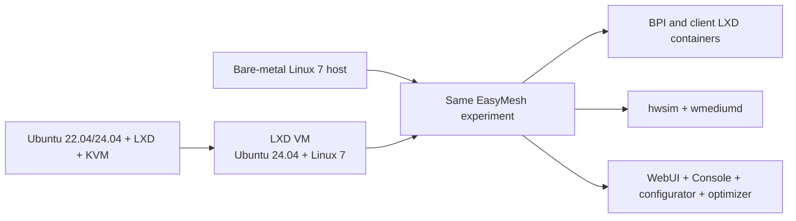

# EasyMesh lab deployment models

The supported lab has two execution models: direct bare metal and a portable
LXD virtual machine. Both run the same controller, colocated Agent, four
extender Agents, ten private clients, ten IoT clients, hwsim, wmediumd,
configurator, optimizer, WebUI, Console, Boardfarm WAN/DHCP, and acceptance
tests.

## Decision

| Property | Bare metal | LXD VM |
| --- | --- | --- |
| Strategic role | Performance/debug reference | Primary portable appliance |
| Kernel owning hwsim | Physical host | Guest |
| BPI/client containers | Host LXD | Guest's nested LXD |
| Isolation | Lowest | High |
| Maximum packet headroom | Highest | Bounded by VM vCPUs |
| Reproducible handoff | Install from source and images | Import one checksummed LXD backup |
| Lab after physical-host reboot | Remains operator-controlled | Existing VM follows LXD autostart policy |
| Lab after guest reboot | n/a | Reconstructs automatically |
| Host management stack | LXD and Docker | LXD/KVM only |

VirtualBox and Vagrant are retired. They added a second hypervisor, kernel
module and packaging stack without improving EasyMesh behavior. Previous box
artifacts remain available through Git history but are not release inputs,
dependencies, or acceptance targets.

## Bare-metal configuration

Use Ubuntu 24.04 with the accepted Linux 7 kernel, patched hwsim module, Docker,
LXD, Boardfarm `ca-desk6`, BPI images, and the source checkout. The physical
kernel owns every simulated radio. This is the correct target for kernel,
Wi-Fi HAL, wmediumd, timing, scale and resource investigations.

Bare-metal autostart is deliberately disabled. An operator explicitly starts
the lab after checking the intended experiment state. This prevents a general
engineering host from consuming radio, memory and CPU resources after reboot.

## LXD VM configuration

The outer Ubuntu 22.04 or 24.04 host needs LXD, `/dev/kvm`, sufficient storage,
and six available logical CPUs and 6 GiB RAM for the standard profile. The
guest owns Linux 7, hwsim, wmediumd, Docker, Boardfarm and nested LXD. LXD NAT
proxy devices expose the WebUI and Console on site-selected host addresses.

The clean builder and imported appliance both use systemd inside the guest to
reconstruct the complete lab. The artifact stores no host-specific IP address,
Git credential, or mounted source-tree dependency.

The active procedures are:

- [`gen/vm/lxd/README.md`](../../../gen/vm/lxd/README.md) for host setup,
  build, operation, import, export and removal;
- [lab operations](../guide/operations.md) for the EasyMesh runtime; and
- [current state](../current-state.md) for the accepted source, images and
  topology.

## Why not an outer LXD system container

An outer system container shares the physical host kernel. hwsim radios then
cross both the outer and inner network namespaces, and module lifetime is no
longer appliance-local. The small resource saving is not worth changing the
radio ownership boundary or reintroducing lifecycle fragility. The portable
target is therefore an LXD VM, not an outer system container.

## Measured baseline

The same 20-client topology was measured on two bare-metal hosts and one LXD
VM. These values establish expected order of magnitude; each release still
records its own startup and resource evidence.

| Measurement | rev120 bare metal | rev130 bare metal | rev140 LXD VM |
| --- | ---: | ---: | ---: |
| CPU boundary | 12 logical CPUs | 4 logical CPUs | 6 guest vCPUs |
| Ready CPU use | 0.37 core equivalent | 0.95 core equivalent | 0.58 guest-vCPU equivalent |
| Ready memory | 4.25 / 62.51 GiB host | 2.67 / 7.60 GiB host | 2.44 / 5.76 GiB guest |
| BPI container process PSS | 310.9 MiB | 297.2 MiB | 309.8 MiB |
| Topology API average | 70 ms | 244 ms | 53 ms |
| Gateway traffic | 20/20 | 20/20 | 20/20 |
| Star/branch/chain | pass after bounded recovery | pass | pass |

The constrained rev130 system is the outlier. The LXD VM did not introduce a
functional difference and provided API latency comparable to the faster
bare-metal host. A QEMU process maps most configured guest RAM; its host RSS is
not the EasyMesh process footprint. Compare guest PSS and cgroup usage instead.

## Release acceptance

An LXD VM artifact is publishable only after all of these pass:

1. clean build from pinned source, Boardfarm and BPI images;
2. automatic cold reconstruction to the complete model and 20 working clients;
3. stable PHY, MAC, AL-MAC, RUID and `/nvram` identities after reboot;
4. WebUI and Console access through imported host proxy settings;
5. named steering, steering matrix, star/branch/chain, RF scenario and optimizer
   tests;
6. individual node and whole-lab lifecycle checks without unrelated restarts;
7. bounded startup, shutdown, process, PSS, journal and database growth;
8. export, checksum verification, import under a new name, boot, check and
   explicit deletion using only documented host commands.

Userspace wmediumd is always the release default. The kernel medium remains an
optional experimental comparison backend and cannot replace the userspace
acceptance pass.
