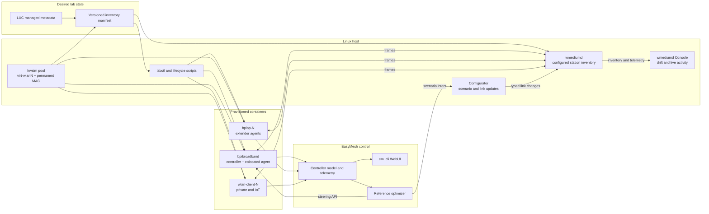

# Live lab resilience and radio inventory design

## Purpose

The lab should behave like an appliance. An operator must be able to start,
stop, or restart any provisioned BPI or WLAN-client container without manually
repairing hwsim assignments, regenerating an incomplete medium, restarting
unrelated nodes, or correcting the topology database.

This design makes the intended lab topology explicit and keeps hwsim,
wmediumd, EasyMesh, the WebUI, and the wmediumd Console consistent with it.
Implementation is staged so each step removes a specific source of fragility
and has an independently reviewable acceptance gate.

## Required behavior

The following are invariants, not best-effort goals:

1. Every managed node has a stable role, ordinal, hwsim PHY assignment, base
   radio MAC, cohort, and enabled/disabled state.
2. A stopped container remains part of the intended inventory. Stopped does
   not mean deleted.
3. wmediumd can start with all intended radios even when some containers are
   stopped.
4. Restarting a provisioned container returns the same PHY and identities and
   requires no wmediumd restart.
5. Starting wmediumd from a partial or ambiguous inventory fails clearly.
6. Adding, removing, or reassigning a radio is applied as one inventory
   generation. Readers never see a half-updated pair matrix.
7. EasyMesh readiness is based on end-to-end state: services, onboarding,
   model ownership, association, metrics, traffic, and topology presentation.
8. The Console distinguishes intended, configured, active, learned, stale,
   and absent objects.
9. Recovery actions are bounded, observable, and idempotent. There are no
   periodic blind restarts.

## State model

The design separates four kinds of state that are currently easy to confuse:

| State | Meaning | Authoritative source |
| --- | --- | --- |
| Intended | Nodes that belong to this lab and their stable assignments | Managed LXC metadata and generated inventory manifest |
| Configured | Stations and links loaded into wmediumd | wmediumd inventory generation |
| Active | PHYs and VIFs currently producing or receiving frames | hwsim/wmediumd runtime telemetry |
| EasyMesh | Agents, BSSs, clients, metrics, and ownership known to the controller | Controller model and APIs |

A stopped extender is intended and configured, but inactive. It remains in the
controller model only until normal EasyMesh liveness aging expires. On restart
it becomes active and onboards again with the same identity.

## Target architecture



The initial implementation does not require another always-running sync
process. Existing lifecycle commands generate and validate the manifest.
wmediumd retains the complete provisioned roster while individual containers
come and go. A live inventory API is added only when the lab must add, remove,
or reassign radios without restarting wmediumd.

## Intended inventory contract

Each managed container receives explicit LXC metadata instead of being
discovered only by a name pattern:

```text
user.easymesh.managed=true
user.easymesh.role=controller-agent|extender|private-client|iot-client
user.easymesh.ordinal=<stable integer>
user.easymesh.enabled=true|false
user.easymesh.hwsim_parent=virt-wlanN
```

The generated JSON manifest contains:

- schema version and monotonically increasing inventory generation;
- container name, role, ordinal, enabled state, and cohort;
- hwsim parent, wiphy identity, permanent/base MAC, and expected primary
  interface;
- image build and repository revision for evidence;
- a deterministic hash over the normalized inventory.

Generation rejects duplicate ordinals, PHYs, or MACs; missing managed
metadata; unresolved PHYs; and assignments outside the configured pool. The
manifest is written atomically and retained with test evidence.

## Lifecycle behavior

| Operator action | Required system response |
| --- | --- |
| Start an existing node | Attach its assigned PHY, start it, observe activity, and run the role-specific readiness gate. No wmediumd reload. |
| Stop an existing node | Stop it cleanly, reclaim extra VIFs, retain its intended station entry, and mark it inactive in the Console. |
| Restart an existing node | Preserve NVRAM and PHY assignment; re-onboard or reassociate automatically; confirm controller ownership and traffic. |
| Add a node | Allocate an unused stable ordinal/PHY, create its metadata, publish a new inventory generation, then start and validate it. |
| Remove a node | Mark it disabled, stop it, age controller state, publish a new generation, then explicitly purge it. |
| Reassign a PHY | Stop the node, atomically publish the replacement identity mapping, attach the new PHY, and start it. |
| Restart wmediumd | Reconstruct the full intended roster, including stopped nodes, before accepting frames. |
| Reboot the host | Boardfarm, hwsim pool, LXD, inventory, wmediumd, mesh nodes, clients, and UIs start in declared dependency order. |

## Implementation plan

### Phase 0: freeze contracts and evidence

Deliverables:

- inventory JSON schema and validation library;
- explicit definitions for intended, configured, active, learned, and
  EasyMesh-visible state;
- a snapshot command that records LXC assignments, hwsim identities,
  wmediumd generation, controller model, and service restart counters;
- failure messages that identify the exact missing or conflicting node.

Acceptance:

- the same unchanged lab produces the same normalized inventory hash;
- invalid duplicate and incomplete fixtures fail unit tests;
- no runtime behavior changes.

### Phase 1: stable intended inventory

Deliverables:

- add managed role/ordinal/enabled/PHY metadata in `bpi.sh`,
  `wlan-client.sh`, and pool scripts;
- generate the full station roster from managed LXC configuration and host
  hwsim permanent identities, including stopped containers;
- make wmediumd preflight compare the manifest, generated configuration, and
  available hwsim pool rather than require every container to be running;
- keep the current active-only discovery as a diagnostic cross-check, not the
  source of truth.

Acceptance:

- with all containers stopped, generation still produces the complete
  five-BPI/20-client roster;
- wmediumd starts with that roster;
- each client and BPI can be started independently and immediately appears as
  active without regenerating the medium;
- an unintended unmanaged container cannot enter the inventory.

### Phase 2: restart-safe node lifecycle

Deliverables:

- centralize `start`, `stop`, `restart`, and `check NODE` in `easymesh-labctl`;
- reclaim OneWifi-created VIFs only after a PHY has returned to the host and no
  live container owns it;
- preserve NVRAM and stable radio assignment across restart;
- use bounded readiness gates per role;
- expose node state and the reason for any failed gate.

Acceptance:

- restart every client one at a time and recover association, DHCP, controller
  ownership, RCPI, and traffic without restarting wmediumd;
- restart every extender one at a time and recover onboarding, ten BSS records,
  backhaul signal, attached clients, and traffic;
- restart the controller and recover the complete model without manual repair;
- repeated commands are idempotent and do not leak VIFs or processes.

### Phase 3: atomic inventory reconciliation

This phase supports topology expansion and removal. It is not needed for an
ordinary restart of an already provisioned node.

Preferred deliverables:

- typed wmediumd control operations for inventory begin, station add/update,
  station disable/remove, and commit/abort;
- generation and compare-and-swap checks on every mutation;
- automatic initialization of pair state from the scenario default or an
  explicit scenario artifact;
- rollback to the last accepted generation on validation failure;
- equivalent read-only telemetry in the Console.

If live mutation proves too invasive, the first implementation may perform a
bounded atomic daemon replacement: validate the new complete configuration,
start a replacement instance, switch sockets, then retire the old instance.
It must not restart containers or EasyMesh processes.

Acceptance:

- add and remove one client and one extender while the remaining lab carries
  traffic;
- no partial pair matrix is externally visible;
- stale control requests are rejected by generation;
- a failed reconcile leaves the prior medium operational.

### Phase 4: automatic drift detection and recovery

Deliverables:

- compare intended, configured, active, and EasyMesh state in one health API;
- show inventory generation, missing/unexpected radios, dormant stations,
  learned VIF age, and controller visibility in the Console;
- have lifecycle commands invoke reconciliation automatically when they change
  intended inventory;
- optionally consume LXD lifecycle events for detection, but keep mutation in
  the typed reconciler and never grant the unprivileged Console LXD control.

Recovery policy:

1. report drift;
2. retry the failed bounded operation;
3. reconcile the affected inventory generation;
4. restart only the affected node when required;
5. require operator approval before destructive identity recreation.

Acceptance:

- injected missing, duplicate, stale, and unexpected states produce specific
  diagnoses;
- the supported non-destructive cases self-heal;
- no monitor creates restart loops.

### Phase 5: reboot, failure, and scale qualification

Profiles:

- small: five BPI nodes and 20 clients;
- medium: the next accepted client/extender profile;
- stress: the supported upper bound, targeted toward 50–100 clients.

Campaigns:

- cold host reboot and warm lab restart;
- randomized node stop/start/restart order;
- extender disappearance, aging, and return;
- controller and wmediumd restart;
- repeated inventory add/remove transactions;
- slow mobility, threshold hovering, flash crowd, and sustained traffic;
- memory, CPU, queue, dropped-frame, VIF, and process-count stability.

Every pass records inventory/config generations, hashes, image builds,
scenario artifacts, service restarts, topology ownership, traffic results, and
resource measurements.

## Operator interface

The intended command surface is small:

```text
easymesh-labctl inventory [--check]
easymesh-labctl start [all|NODE]
easymesh-labctl stop [all|NODE]
easymesh-labctl restart [all|NODE]
easymesh-labctl reconcile [--dry-run]
easymesh-labctl check [all|NODE]
```

Normal node restart must not require `sudo` from the lab operator; narrowly
scoped system services or policy rules perform only the privileged lifecycle
operations. Raw `lxc`, radio reassignment, identity purge, and force recovery
remain expert operations.

## Observability requirements

The wmediumd Console should show, for each node or station:

- intended and configured inventory generation;
- role, ordinal, container, PHY, base MAC, and learned VIFs;
- active/dormant/stale state and last frame time;
- channel, band, SNR/path loss, frame/delivery/drop counters, and applied
  scenario rule;
- drift reason when intended, configured, and active state disagree.

The em_cli WebUI remains the EasyMesh truth: onboarded devices, actual
backhaul, BSS ownership, client association, channel, band, RCPI, and age. The
two views are correlated by stable MAC/role metadata, not inferred display
names.

## Safety boundaries

- Never equate a stopped container with an operator request to delete it.
- Never regenerate NVRAM merely to recover a failed start.
- Never accept a partial inventory by silently dropping unresolved nodes.
- Never expose a generic shell or arbitrary wmediumd opcode through the
  Console.
- Never let a scenario link update mutate inventory identity.
- Never declare recovery from an API acknowledgement alone; verify physical
  association, controller ownership, metrics, and traffic.

## Recommended sequence

Implement Phases 0 and 1 first. They remove the largest startup-order
fragility and make ordinary stop/start/restart independent of wmediumd without
adding an always-running component. Phase 2 then makes that behavior usable by
operators. Add live atomic reconciliation only after the fixed intended
inventory is proven, because it is needed for scale changes—not for routine
node recovery.
