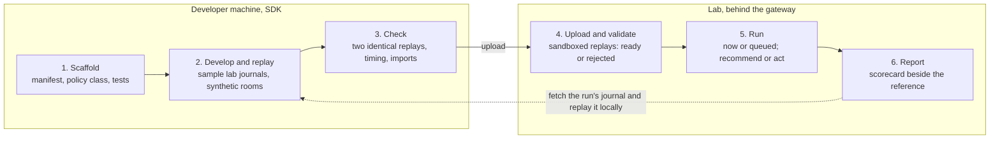
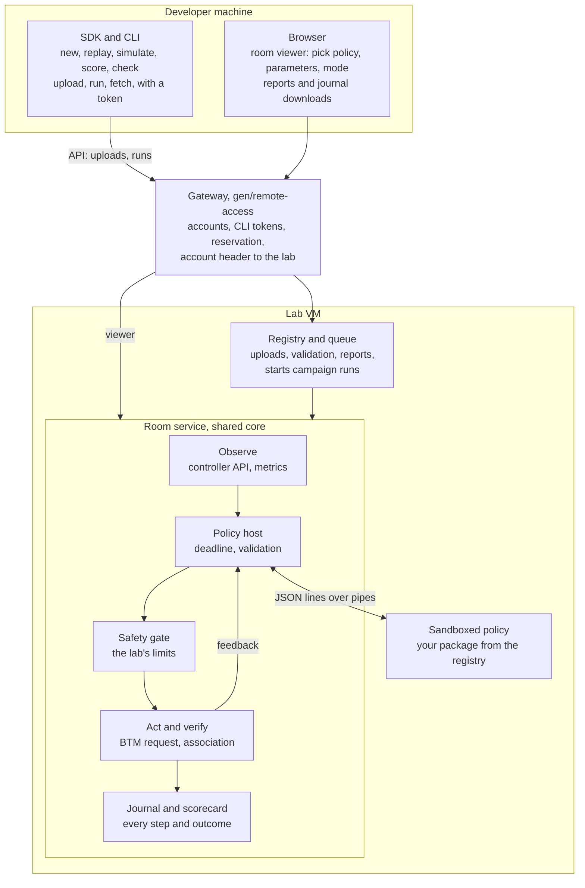
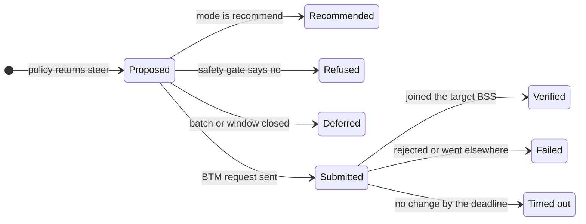

# EasyMesh optimizer workbench

**Status:** Proposed design; no runtime or implementation changes made.

**Prepared:** 29 September 2026.

**Scope:** the RDK lab (this repository) and the prplMesh lab (prplmesh-lab),
reached through the [remote-access gateway](../../deployment/remote-access.md).

An optimizer developer writes one Python class that turns each telemetry
snapshot into decisions. They develop it offline against replayed lab journals,
upload it, and select it for a room run. The lab keeps observation,
measurement, safety, actuation, verification and the journal.

**Prerequisites** from the [rooms plan](../rooms-convergence/design.md): one
shared room core for the RDK and prplMesh labs, vendored from this repository
(its Phase 2), and the gateway extended to the prplMesh lab with one published
lab per host (its Phase 3). This design continues that plan as Phases 6 to 8.

## 1. Goals and non-goals

The developer only needs Python and the SDK; lab time is spent on runs that
count, not on debugging.

**Goals**

- Develop and debug a policy with no lab access, using real lab telemetry.
- The same policy runs unchanged on the RDK and prplMesh labs.
- The policy sees what a real controller sees, and controls what a real
  controller controls: nothing more.
- Every lab run is reproducible on the developer's machine, decision by
  decision.
- Runs are comparable: same rooms, same lab timing, same safety limits, the
  reference optimizer alongside.
- A later contract version follows the Data Elements model (TR-181
  `Device.WiFi.DataElements`).

**Non-goals for now**

- Several developers on one lab at the same time. A lab serves one run at a
  time, as today.
- Access for anonymous or public users. Uploads come from gateway accounts.
- Physical radios. Results are marked as coming from the virtual RF lab.
- Changing the controllers' native steering. Uploaded policies act through the
  same external path as the reference optimizer.

## 2. Starting point

The decision core is already identical in both labs; only the adapters differ.
The workbench packages that core and adds a loader, a sandbox and reporting.

| Piece | Where today | State | Reused as |
| --- | --- | --- | --- |
| Decision core: `policy.py`, `model.py`, `state.py`, `recorder.py`, `simulator.py` | `gen/optimizer/optimizer`, prplmesh-lab `optimizer/optimizer` | Byte-identical; 7 adapter files differ | The SDK's types, replay and synthetic runner |
| Policy interface `evaluate(snapshot, prior_state) -> Evaluation` | Same | No network I/O; see the [optimizer development guide](https://github.com/boardfarmdevs/easymesh-optimizer/blob/main/docs/development.md) | The shape of the plugin API |
| Snapshot schema 1 and 2 | `model.py` | Clients, candidates, health, BSS load, client activity | Observation contract version 1 |
| Reference policies | `ThresholdPolicy`, `BandThresholdPolicy`, `LoadAwarePolicy`, `PreAssociationPolicy` | In-process in the room's conductor | The first plugins |
| Journal | `recorder.py` | Append-only JSON lines, SHA-256 hash chain | Run journal and replay input |
| Replay | `em-optimizer replay` | Identical input and policy give identical output bytes | `easymesh-opt replay` |
| Safety limits | `gen/optimizer/room_service/steering_safety.py` | Enforced by the room, whatever decides | Unchanged gate for every plugin |
| Convergence summary | `gen/optimizer/room_service/conductor.py` `_fleet_status` | Measured best-AP convergence, independent of the policy | The scorecard's main measure |
| Room modes | `stimulus`, `recommend`, `act` | Chosen at service start | Chosen per run |

Two couplings must be undone. The conductor asks the policy object directly
which stations need candidate measurements (`requires_candidate_measurement`),
and in recommend or deferred cases rewrites the policy's own state
(`_recommendation_state`, `_deferred_state`). Both become explicit parts of the
contract: measurement requests and decision feedback.

## 3. Developer workflow



Most of the time is spent in step 2, on the developer's own machine. Lab time
goes to validation and runs, and every lab run comes back as a journal that
replays exactly.

## 4. Architecture



The uploaded policy is the only new code on the decision path, and it sees
nothing but its pipes. Observation, the safety gate, actuation and verification
are the room service's existing machinery. Each lab VM has its own registry and
queue.

## 5. The policy package and its manifest

A policy is a zip of a Python package plus one manifest, `optimizer.toml`. Its
SHA-256 over the canonical file list is its identity, and an uploaded version
never changes.

```text
sticky-best-ap/
  optimizer.toml
  sticky_best_ap/__init__.py      # the policy class
  sticky_best_ap/model.onnx       # optional artifacts, part of the hash
  tests/                          # run by easymesh-opt check, not in the lab
```

```toml
[optimizer]
name = "sticky-best-ap"            # [a-z0-9-], unique per developer
version = "0.3.0"
contract = "labs-snapshot/1"       # later: "data-elements/1"
entry = "sticky_best_ap:StickyBestAp"
description = "Steer when the best same-band AP beats the current one"

[runtime]
libraries = ["numpy"]              # only from the lab runtime's list

[actions]
steer = true
measure = true

[parameters.minimum_gain_rcpi]
type = "int"
default = 12
min = 0
max = 40
unit = "RCPI (2 per dB)"
description = "Minimum candidate advantage before steering"
```

- **Parameters** become a form in the run panel, so a run can tune them
  without a new upload. The chosen values and their digest are recorded with
  the run, as the reference policy already does.
- **Libraries** come from a fixed runtime installed with the lab image.
  Pure-Python helpers may be vendored inside the package; compiled code may
  not.
- **Actions** declare what the policy may emit. The lab refuses a package that
  asks for an action it does not support.
- **Limits proposed:** 50 MB per package, and a state object of at most
  256 KiB per step.

## 6. The Python API

A developer subclasses `Policy` and implements `step`. Everything the policy
knows arrives in its arguments, and everything it wants comes back in the
result.

```python
from easymesh_optimizer import Policy, Observation, Step, Steer, Measure, Abstain


class StickyBestAp(Policy):
    def __init__(self, parameters: dict):
        # validated against the manifest before this is called
        self.minimum_gain = parameters["minimum_gain_rcpi"]

    def step(self, obs: Observation, state: dict) -> Step:
        decisions = []
        for client in obs.clients:
            best = obs.best_candidate(client.sta_mac, same_band=True, max_age_seconds=15)
            if best is None:
                decisions.append(Measure(client.sta_mac, reason="no_fresh_candidates"))
            elif client.rcpi is not None and best.rcpi - client.rcpi >= self.minimum_gain:
                decisions.append(Steer(client.sta_mac, best.bssid, reason="stronger_same_band_ap"))
            else:
                decisions.append(Abstain(client.sta_mac, reason="within_margin"))
        return Step(decisions=decisions, state=state)
```

- **`step` is a pure function** of the observation, the state and the
  parameters. It must not read the clock, the network or files outside its
  package.
- **`state`** is a JSON object the lab stores between steps and returns next
  time. A restarted policy process continues where it left off, and replay
  reproduces it.
- **Helpers** in the SDK are lifted from the reference policy: freshness
  checks, candidate ranking, and per-station hold, dwell, cooldown and backoff
  tracking.
- **Optional hook** `start(run)` receives the lab stack (`rdk` or `prpl`), the
  contract version, the bands and a random seed. It does not receive the room
  name, positions or scenario, because a real controller does not know them.

## 7. Observations, contract version 1

Version 1 is today's normalized snapshot (schema 2) plus three new groups:
`run`, `feedback` and `safety`. Every measurement carries its source and
timestamp, so the policy judges freshness itself.

| Group | Fields | Notes |
| --- | --- | --- |
| Step | `sequence`, `observed_at`, `now` | Lab clock; the only time a policy may use |
| `run` (new) | `stack`, `contract`, `bands`, `radio: "simulated"` | Constant for a run |
| `health` | `devices`, `clients`, `radios`, `bsses`, `source` | Controller inventory counts |
| `clients[]` | `sta_mac`, `connected_bssid`, `connected_device_id`, `connected_device_name`, `band`, `rcpi` (0 to 220), `metric_observed_at`, `measurement_source`, `association_uptime_seconds`, `ssid`, `cohort` | One row per associated station |
| `candidates[]` | `sta_mac`, `bssid`, `device_id`, `device_name`, `band`, `rcpi`, `metric_observed_at`, `measurement_source`, `eligible` | Unassociated station link metrics per candidate AP |
| `bss_loads[]` | `bssid`, `device_id`, `radio_id`, `channel`, `utilization` (0 to 255), `station_count`, `observed_at`, `epoch`, `backhaul_hops`, `source`, `transport` | Native AP metrics |
| `client_activity[]` | `sta_mac`, `bssid`, `packets_per_second`, `bytes_per_second`, `retries_per_second`, error rates, `interval_seconds`, `observed_at`, `epoch` | Native station traffic counters |
| `feedback[]` (new) | `decision_id`, `sta_mac`, `status`, `reason`, `at`, target and outcome details | What happened to earlier decisions (section 8) |
| `safety` (new) | `rate_retry_seconds`, paused stations with reason | So a policy can avoid proposing refused actions |

**Never included:** positions, walls, world files, configured or model SNR, the
room name, the scenario phase, and the planned movements. These stay evaluator
truth and appear only in the report after the run.

**Evolution:** new fields are added in minor versions (`labs-snapshot/1.1`) and
are optional; removals or meaning changes need a new major version. The lab
serves every major version it has ever accepted.

## 8. Decisions, state and the decision lifecycle

A step returns at most one decision per station, plus the new state. Version 1
has three actions.

| Action | Fields | What the lab does |
| --- | --- | --- |
| `steer` | `sta_mac`, `target_bssid`, `reason` | A BTM request through the lab's actuator (RDK `gen/steer.sh` or native; prpl `BTMRequest`), after the safety gate |
| `measure` | `sta_mac`, `reason`, optional `bssids` | Collects unassociated-station link metrics for that station in the next collection round |
| `abstain` | `sta_mac`, `reason` | Nothing; the reason appears in the report |

Later actions, such as backhaul steering and reporting policy, are added as
declared capabilities in later contract versions. Each decision gets an id,
`sequence:sta_mac`, which later feedback refers to.



Every outcome reaches the policy in the next step's `feedback`, with its
reason. A deferred station can be proposed again; a refused one stays blocked
for as long as the safety gate says.

## 9. Wire protocol and determinism

The policy runs as its own process and exchanges one JSON object per line over
standard input and output. The Python SDK hides this; any other language can
implement it directly.

```text
lab    -> policy  {"type":"hello","contract":"labs-snapshot/1","parameters":{...},"run":{"stack":"rdk","bands":["2.4","5","6"],"seed":1729}}
policy -> lab     {"type":"ready","name":"sticky-best-ap","version":"0.3.0"}
lab    -> policy  {"type":"step","sequence":41,"observation":{...},"state":{...}}
policy -> lab     {"type":"result","sequence":41,"decisions":[{"action":"steer","sta_mac":"...","target_bssid":"...","reason":"stronger_same_band_ap"}],"state":{...}}
lab    -> policy  {"type":"stop"}
```

- **Standard error** is captured, size-capped, and attached to the run report
  as the policy's log.
- **Deadline per step**, proposed at 250 ms, the room's shortest evaluation
  interval today (profiling mode). A late result is discarded and counted as
  abstain. Three late or invalid results in a row stop the policy; the room
  continues without an optimizer and the run is marked failed.
- **One decision per station per step**, reasons as stable `[a-z0-9_]`
  strings, ties broken deterministically (by BSSID, as the reference policy
  does).

**Determinism.** A policy may use only `now` for time and the run's `seed` for
randomness. The journal records, for every step, the observation, the state in,
the result out and the feedback. Replaying a journal must reproduce every
result byte for byte. `easymesh-opt check` replays twice before upload, and the
lab replays each finished run once and marks it `reproducible` or
`not reproducible` in the report.

## 10. Policy host inside the room service

A `PolicyHost` in the shared room core replaces the conductor's direct use of
`ThresholdPolicy`. Observation, measurement collection, safety, actuation and
verification stay where they are.

1. **Host.** Starts the sandboxed policy, performs the handshake, sends each
   step with its deadline, collects results and stops the process at the end
   of the run.
2. **Measurements from decisions.** The candidate provider selects stations
   from the policy's `measure` decisions, instead of calling
   `policy.requires_candidate_measurement` on the policy object.
3. **Feedback instead of state rewriting.** Today the conductor rewrites the
   policy's state in recommend mode and when it defers an action. The host
   instead reports `recommended` or `deferred` in the next step's feedback, and
   the policy's state stays its own.
4. **Lab scoring settings.** `_fleet_status` today takes its freshness limit
   and minimum gain from the policy's configuration. They become lab settings,
   so every policy is scored by the same rule.
5. **Mode per run:** `recommend` (decisions recorded, never acted on) or `act`
   (through the safety gate). `stimulus` remains the no-optimizer mode.
6. **Identity in events.** Every `optimizer.*` event carries the policy name,
   version and package hash.

The safety gate is unchanged and applies to every policy:

| Limit | Value today | Source |
| --- | --- | --- |
| Steering requests, whole room | 300 per 60 s | `--steering-rate-limit`, default 300 |
| Same station | At least 5 s between requests | `SteeringSafety.client_interval_seconds` |
| Failures | 3 in 180 s pause that station | `failure_limit`, `failure_window_seconds` |
| Oscillation | 4 moves in 60 s pause that station | `oscillation_limit`, `oscillation_window_seconds` |
| In flight | One action per station until verified | Room verification |

**Reference policies become plugins.** `ThresholdPolicy` is wrapped first, then
the band and load-aware policies. The in-process path stays until replaying
recorded runs gives identical decisions both ways.

## 11. Sandbox for uploaded code

Each run starts the policy as a transient systemd unit inside the lab VM,
connected to the host only by its pipes. The threat model is trusted
collaborators with accounts; the sandbox stops accidents and casual misuse.

| Setting | Value | Effect |
| --- | --- | --- |
| `DynamicUser` | yes | A throwaway user with no files of its own |
| `PrivateNetwork` | yes | No network at all, not even loopback services |
| `RestrictAddressFamilies` | `AF_UNIX` | No new sockets beyond local ones |
| `ProtectSystem`, `ProtectHome` | strict, yes | Read-only system; no home directories |
| `InaccessiblePaths` | `/run`, world and room trees, lab repos | No wmediumd sockets, no world files, no room state |
| `ReadOnlyPaths` | the unpacked package, the policy runtime | Code cannot change itself |
| `PrivateTmp` | yes | A scratch directory, discarded after the run |
| `NoNewPrivileges`, `SystemCallFilter` | yes, `@system-service` | No privilege gain; ordinary system calls only |
| `MemoryMax`, `CPUQuota`, `TasksMax` | proposed 1 GiB, 100 %, 64 | One core, bounded memory and threads |
| `RuntimeMaxSec` | run length plus a margin | No leftover processes |

- **Runtime:** a pinned Python environment at `/opt/easymesh-policy-runtime`,
  built with the lab image, started with `python -I`. Uploads cannot install
  anything.
- **Nothing trusted runs inside.** The host validates every result; a
  malformed decision is dropped and counted.
- **Later, if outside developers join:** one small VM per run, using the same
  protocol.

## 12. Registry, run selection and the campaign queue

Each lab VM keeps its own registry of uploaded policies and its own run queue.
Both are served by the room service on the room's address, behind the gateway,
so they share its reservation and login.

**API** (same origin as the viewer; the CLI calls it with a gateway token)

| Call | Purpose |
| --- | --- |
| `POST /api/optimizers` | Upload a package; returns a validation job |
| `GET /api/optimizers` | Your versions, plus the reference policies |
| `GET /api/optimizers/{name}/{version}` | Manifest, hash, validation report |
| `DELETE /api/optimizers/{name}/{version}` | Remove your version, unless a run uses it |
| `POST /api/runs` | Queue a run: policy version, parameters, mode, rooms, repeats |
| `GET /api/runs`, `GET /api/runs/{id}` | Queue position, progress, result |
| `GET /api/runs/{id}/journal`, `/report`, `/log` | Downloads for the run's owner |
| `POST /api/runs/{id}/cancel` | Owner or administrator |

**Validation on upload.** Manifest and size checks; import and handshake inside
the sandbox; two replays of the lab's reference journals, which must be
identical, on time and well-formed. The version becomes `ready`, or `rejected`
with the reasons.

**Two ways to run.**

- **Interactive:** the person holding the gateway reservation picks the
  policy, version, parameters and mode in the room viewer, then plays rooms as
  today.
- **Campaign:** a queued list of rooms that runs unattended when the lab is
  free. The queue runner holds the native room lease like an operator. It
  applies each room, runs it for the room's duration, then restores the
  default room. The gateway shows the lab as busy with the campaign's progress
  and refuses reservations until it ends or an administrator cancels it.

**Queue rules proposed:** one queued campaign per developer, at most 60 minutes
per campaign (the gateway's existing hard limit), first come first served.

**Gateway changes:** personal access tokens for the CLI, and the signed-in
account passed to the room service in a header only the gateway can set. The
firewall already blocks every other path to the room.

## 13. Scorecard and reports

Every room run produces the same scorecard, computed from events the room
already emits and a convergence rule that does not depend on the policy. The
same scoring code ships in the SDK, so an offline score and a lab score mean
the same thing.

| Measure | From | Meaning |
| --- | --- | --- |
| Converged | `_fleet_status.converged` with lab scoring settings | Every client measured, none with a candidate beyond the lab's minimum gain |
| Time to converge | Evaluation events after each room change or movement | Seconds from the change until converged |
| Time unconverged | Same | Share of the run not converged |
| Absolute best | `absolute_best_converged` | No client has any stronger same-band AP |
| Steers | `optimizer.action`, `optimizer.verification` | Requested, submitted, verified, failed, timed out |
| Safety refusals | `optimizer.safety` | By reason: rate, interval, failures, oscillation |
| Measurements | `optimizer.collection` | Requests made and candidate measurements collected |
| Decision time | Policy host | Median and 95th percentile, late results |
| Traffic | `traffic.sample` | Ping or UDP results, in rooms that run traffic |
| Reproducible | Post-run replay | Whether the journal replays byte for byte |

**Evaluator truth**, shown only in the report: each client's final AP against
the best AP by the room's compiled link SNR, marked as simulator truth.

**Comparison.** Each lab keeps reference results per room and lab image, taken
from the reference policy's latest suite run. The report shows every measure
beside the reference.

**Outputs per run:** a JSON report, an HTML report page, the hash-chained
journal, and the policy's log.

## 14. SDK and offline development

The SDK is the shared decision core from `gen/optimizer`, published as the
`easymesh-optimizer` package with each tagged release. It contains no lab
adapters and needs no lab to run.

| Command | What it does |
| --- | --- |
| `easymesh-opt new NAME` | Scaffold a package: manifest, policy class, tests, the reference threshold policy as an example |
| `easymesh-opt replay JOURNAL` | Run your policy over a lab journal and write your own journal |
| `easymesh-opt simulate ROOM` | Run it over a synthetic room from the golden worlds, marked synthetic |
| `easymesh-opt score JOURNAL` | The lab's scorecard, computed locally |
| `easymesh-opt check` | Manifest, tests, two identical replays, time per step, allowed imports |
| `easymesh-opt upload --lab URL` | Upload with your gateway token |
| `easymesh-opt run`, `status`, `fetch` | Queue a campaign, follow it, download the report and journal |

- **Sample journals:** reference runs of every room on both labs, published as
  release files and refreshed with each lab image.
- **Synthetic rooms:** `simulator.py` over the golden worlds, for fast
  iteration. They are never presented as live results.
- **Debugging a lab run:** fetch its journal and run `easymesh-opt replay`
  under a normal debugger. Each decision is reproduced exactly.
- **Later option:** the Pages playground runs a policy in Pyodide against
  synthetic rooms, with nothing to install.

## 15. Data Elements view, contract version 2

Contract `data-elements/1` gives the policy the controller's view as the Data
Elements model (Broadband Forum TR-181 `Device.WiFi.DataElements`, from the
Wi-Fi Alliance Data Elements specification). A policy written only against it
runs on both labs and, in principle, on any controller that implements the
model.

- **Shape:** the observation is a `Network` subtree: devices, their radios,
  BSSes and associated stations, and each radio's unassociated-station
  measurements. Decisions map onto the model's steering and measurement
  operations where the chosen specification version defines them.
- **Lab facts outside the model** (measurement source and age, the
  simulated-radio flag, feedback, safety status) go in a vendor extension
  prefix, as prplMesh already does with `X_PRPLWARE-COM_TimeStamp`.
- **The journal keeps the lab-native observation** plus the view version, so a
  Data Elements run replays exactly.

| Lab | Source | Effort |
| --- | --- | --- |
| prplMesh | NBAPI already exposes `Device.WiFi.DataElements.Network`. The prpl observer reads `Network.Device.{i}.Radio.{i}.UnassociatedSTA.{i}` (`MACAddress`, `SignalStrength`) and calls `AddUnassociatedStation` | Mostly pass-through |
| RDK | em_cli REST (`/api/v1/topology`, `/clients`, `/devices`, `/bsses`, `/unassoc_sta_query`) | A mapping layer in the RDK adapter |

**The full field mapping is a Phase 8 deliverable.** It is checked against the
specification version the labs choose, not assumed here. Version 1 stays
supported alongside it.

## 16. Security, identity and fairness

Uploads and runs are tied to gateway accounts. The design assumes invited
collaborators, not the public.

- **Identity:** gateway accounts; personal access tokens for the CLI, stored as
  hashes like the gateway's session tokens.
- **Visibility:** uploaded versions and run results are private to their
  owner. Reference policies are visible to everyone. Sharing and a comparison
  table are later options.
- **Audit:** uploads, deletions, and run starts, ends and cancellations, each
  with account and package hash, in the gateway audit log and the run journal.
- **Quotas proposed:** 50 MB per package, 20 kept versions per developer, one
  queued campaign per developer, 60 minutes per campaign.
- **Honest inputs:** evaluator truth is kept out by the sandbox's inaccessible
  paths, not by convention.
- **Supply chain:** the policy runtime's libraries are pinned and installed at
  image build. Uploads cannot add compiled code or install packages.
- **Data:** journals hold lab telemetry only; station MACs are the lab's own
  virtual clients.

## 17. Plan: Phases 6 to 8

The three phases run in order. Phase 6 needs the shared room core (rooms plan
Phase 2); Phase 7 also needs the gateway for both labs (rooms plan Phase 3).

### Phase 6: policy host and contract (lab side)

1. **Contract module** in `gen/optimizer`: version 1 observation built from
   `Snapshot`, the decision and feedback types, and JSON schemas for every
   message.
2. **`PolicyHost` and sandbox runner** in the shared room core, with deadlines
   and failure handling.
3. **Conductor changes:** measurement selection from `measure` decisions,
   feedback instead of state rewriting, lab scoring settings for convergence.
4. **`ThresholdPolicy` as the first plugin.** Replaying recorded runs must give
   identical decisions in-process and as a plugin.
5. **Policy and mode chosen per run** in the room viewer, for interactive runs.

**Done when:** the threshold policy, running as a sandboxed plugin, passes the
RDK catalog 27 of 27 and the prpl catalog as today, with convergence times
matching the in-process policy. A test policy that crashes, hangs or returns
garbage leaves the room safe and running without an optimizer.

### Phase 7: SDK, registry, runs and reports (developer side)

1. **SDK package and CLI**, published from this repository with each tagged
   release.
2. **Sample journals** for every room on both labs.
3. **Registry API** with upload validation.
4. **Campaign queue** and the gateway's busy state.
5. **Scorecard and report pages**, with reference results per room and image.
6. **Gateway:** personal access tokens and the signed-in account header.
7. **Developer guide and tutorial**, from scaffold to report.

**Done when:** a developer outside the LAN, with only an account, scaffolds a
policy and replays a sample journal. They upload it, queue three rooms on each
lab and receive both reports. Replaying a fetched journal locally then gives
identical decisions.

### Phase 8: Data Elements view

1. **Choose the specification version**, proposed as the one prplMesh's NBAPI
   implements.
2. **Mapping:** prpl first, then RDK.
3. **Conformance:** the threshold policy written twice, once per view, must
   make the same decisions on the same recorded journals.
4. **SDK types and documentation** for the new view.

**Done when:** a policy written only against the Data Elements view passes the
same rooms as its version 1 twin on both labs.

## 18. What stays as it is

Every phase ships only when these still hold.

- **The reference optimizer** remains the default and runs in-process until
  Phase 6 parity is proven.
- **Suites:** same rooms and pass criteria. The reference policy's suite runs
  also produce the comparison baselines.
- **Native controller steering** and backhaul steering are untouched.
- **Local operation** under the gateway's maintenance mode is unchanged.
- **The journal format** (schema version 1, hash chain) is extended with new
  record kinds, never replaced.
- **The Pages playground** stays offline.

## 19. Risks and fallbacks

The main risk is that the reference policies rely on more than the contract
carries. Replay parity is the gate for that.

| Risk | Effect | Fallback |
| --- | --- | --- |
| Band scanning, load counters or pre-association need inputs version 1 lacks | Those policies cannot become plugins yet | Start with `ThresholdPolicy`; add fields in minor versions; keep those policies in-process until covered |
| The conductor's couplings are harder to undo | Phase 6 slips | Replay parity tests gate each step; the in-process path stays |
| A policy escapes or misuses the sandbox | Lab disturbed | Accounts only, systemd sandbox, host validates everything; a VM per run if outsiders join |
| Campaigns and interactive users compete for the lab | Waiting | One campaign per developer, 60-minute cap, administrator cancel |
| A policy is nondeterministic (threads, ML libraries) | Runs cannot be replayed exactly | `check` catches most cases; the report marks the run not reproducible |
| The scorecard does not match a developer's goal | Disputed results | Versioned scorecard; traffic rooms for throughput goals |
| Controllers implement different Data Elements versions | Mapping gaps | One chosen version; the vendor extension carries the gaps |

## 20. Open questions

Eight questions to settle before Phase 6; each has a proposed answer.

- [ ] **First developers:** in-house, invited partners, or public? Proposed:
  in-house and invited partners.
- [ ] **Visibility:** private per developer, or shared with a comparison table?
  Proposed: private by default; opt-in sharing later.
- [ ] **What counts as better:** convergence and time to converge first, then
  steers and failures; throughput only in traffic rooms? Proposed: yes.
- [ ] **Run modes:** interactive and campaigns from the start? Proposed: both,
  campaigns only when the lab is free.
- [ ] **Runtime libraries:** which ones? Proposed: numpy and scipy first, an ML
  inference runtime on request.
- [ ] **Data Elements version:** which one? Proposed: the version prplMesh's
  NBAPI implements.
- [ ] **Room identity:** should a policy know which room it is in? Proposed:
  no, as a real controller would not.
- [ ] **SDK distribution:** release files from this repository or PyPI?
  Proposed: release files first.
