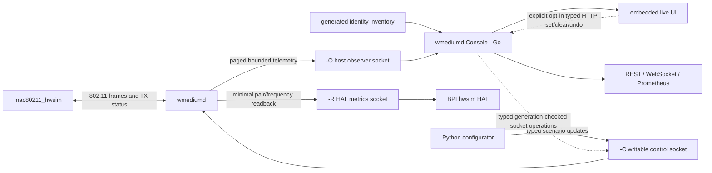

# wmediumd Console: architecture, operation and design

[Subsystem index](README.md)

## Goal

An operator should be able to open one page and immediately answer:

- Is the lab using wmediumd, and is it keeping up with the offered load?
- Which hwsim radios and VIFs are active, who owns them, and on which band,
  channel and frequency are they transmitting?
- Which directed radio paths have carried traffic recently?
- Which startup rule, live pair value or frequency override is effective on a
  path right now?
- What SNR, received signal, modeled PER, retry and delivery/drop behavior is
  being applied?
- How many management, control, data, unicast, multicast and broadcast frames
  has the medium seen?
- Which RF generation, scenario phase, steering action and EasyMesh topology
  change occurred at the same time?

This is an **experiment-observation plane**. It must not become another
scenario writer, steering optimizer or source of EasyMesh measurements.

## Implementation status

The implemented observation path is:

- patched wmediumd exposes bounded packet telemetry through a separate,
  host-only `-O` Unix socket;
- the static Go `wmediumd-console` process serves an embedded UI, immutable
  REST APIs, a WebSocket snapshot stream and Prometheus metrics;
- startup generates a bounded radio identity inventory, so the UI names
  `agent-1`, `extender-N`, `sta-NN` and `iot-NN` rather than showing only MAC
  addresses;
- controls are disabled by default. An explicit startup option enables only
  typed, atomic pair-SNR and exact-frequency operations plus one-step undo;
  and
- the existing `-R` endpoint remains the small, read-only HAL measurement
  interface and is not changed into a general telemetry endpoint.

The code is in `gen/wmediumd/observer/`; its focused operator and API manual is
`gen/wmediumd/observer/README.md`. Persistent cross-component correlation beyond the interfaces described here is
not a current Console capability.

### Current data flow



The Console reports simulator truth. It does not infer or change EasyMesh
associations, run configurator scenarios, or make optimizer decisions.

## Important model boundary

wmediumd does not implement the Wi-Fi association state machine or EasyMesh
topology. The laboratory patch does retain a deliberately narrow ownership
ledger learned only from ACKed successful association/reassociation responses
or valid ACKed ToDS/FromDS data. This lets observers reject multicast fan-out
and stale old-AP traffic without treating packet activity as ownership. The UI
must keep three concepts separate:

1. **Configured potential links**: every radio pair to which a default,
   startup link or live override can apply.
2. **Recently active medium paths**: radio/frequency paths on which wmediumd
   has actually seen frames during the selected time window.
3. **Protocol-positive ownership**: current client-to-radio ownership from the
   bounded wmediumd ledger; complete EasyMesh topology and backhaul parentage
   still come from controller APIs.

A client association may be drawn over a recently active medium path only when
the ownership ledger reports that edge. Multicast, packet counts and recency
alone are never association evidence. Likewise, an unused pair with a
configured 50 dB SNR is not a connection carrying traffic.

## Runtime interfaces

The accepted launcher starts one patched daemon with three separately
permissioned sockets:

```text
/run/wmediumd-control.sock
    writable scenario endpoint; APPLY, readback and restore

/run/meta-cmf-wmediumd/metrics/control.sock
    multi-client read-only endpoint; mounted in a BPI as
    /wmediumd-metrics/control.sock

/run/meta-cmf-wmediumd/observer/telemetry.sock
    host-only, multi-client read-only endpoint; paged traffic telemetry,
    radio/frequency state, active links, VIF ownership, protocol-positive
    association ownership and event ring
```

The `-R` read-only endpoint supplies daemon instance ID, control generation,
station count, pair/frequency SNR readback and capability flags. It deliberately
rejects both APPLY operations. The hwsim HAL uses it to answer simulated
Unassociated STA Link Metrics requests.

The `-O` endpoint adds the following bounded state without JSON encoding, file
I/O or blocking subscribers in wmediumd's frame loop:

- learned `VIF MAC -> radio + frequency` ownership;
- daemon and radio/frequency packet counters;
- sparse active directed link counters and applied SNR/PER state;
- modeled attempts, retries, ACK/no-ACK, injection and drop reasons;
- queue depth/delay, active-state eviction and netlink health; and
- a low-rate bounded event ring with gap detection.

Artifact provenance beyond hashes, EasyMesh association correlation and
long-term history are intentionally deferred to Phases 3 and 4.

Optional `wmediumd -p FILE` pcapng output contains scheduled frames and modeled
ACKs, but it is not enabled by the launcher. Continuously parsing a pcap or
debug log would be delayed, expensive and unable to recover every internal
decision. It remains an opt-in forensic artifact, not the live telemetry API.

## Selected service architecture

`wmediumd-console` is a separate, unprivileged Go process on the lab host/VM.
The Python configurator remains the stimulus compiler and runner.

| Choice | Benefit | Cost or risk |
| --- | --- | --- |
| Extend the Python configurator | reuses its control client, inventory and run artifacts; fastest proof of concept | mixes short-lived actuation with a long-lived observer; WebSocket/history work adds lifecycle complexity; less predictable CPU/memory under 50-100-client telemetry |
| Separate Go service | small deployable process; strong concurrency for polling, aggregation, history and many browser clients; embedded static UI; bounded memory; matches the existing Go WebUI operating model | requires a Go decoder for the binary protocol and a small identity adapter |
| Put the page in `onewifi_em_cli` | one familiar WebUI | incorrectly couples simulator truth to a BPI/controller component, increases its already important memory footprint and makes the view disappear when the controller is unhealthy |

The separation is useful scientifically as well as operationally:

```text
Python configurator  -> changes the experiment stimulus
external optimizer   -> makes policy decisions from EasyMesh observations
Go observer          -> displays evaluator truth and correlations
```

The Console is a self-contained, statically linked binary with embedded
HTML/CSS/JavaScript and a hardened systemd unit. The service connects only to
the `-O` socket by default and listens on `127.0.0.1:8890`. The accepted VM
configuration binds guest port 8890 and forwards it to host port 18890. A
writable socket is opened only when the operator explicitly enables typed
controls.

## Operate the current Console

Inside a VM, verify the default read-only service and open its UI:

```sh
systemctl status wmediumd-console.service
curl -fsS http://127.0.0.1:8890/api/v1/status | jq .
curl -fsS http://127.0.0.1:8890/api/v1/controls | jq .
```

The LXD VM host proxies the page to `http://HOST:18890/`; bind the proxy to a
trusted host/LAN address only when another workstation must view it. Normal
`/api/v1/controls` output says `enabled:false` and `mode:read-only`.

Typed controls are a diagnostic convenience, not the scenario runner. Enable
them only for a bounded session as described in
`gen/wmediumd/observer/README.md`. A request must carry the instance ID,
generation, same-origin header, JSON content type and per-process CSRF token.
Pair/frequency batches are atomic. Undo restores the exact captured prior value
or prior override absence, and is invalid after another generation or daemon
restart.

The launcher publishes a PID-qualified binary-hash manifest under `/run`, so
the hardened non-root service can verify the root-owned live executable
without `CAP_SYS_PTRACE`.

The accepted profile requires 25 resolved identities, 600 directed pairs,
healthy packet telemetry, immutable read-only HTTP behavior, and no change to
wmediumd state when the Console starts, stops, or fails. Exact binary hashes
belong in the deployment evidence described by
[current state](../../current-state.md).

## wmediumd telemetry additions

### Hot-path design

wmediumd is single threaded. A per-frame log write, JSON encoding or blocking
subscriber would directly reduce medium capacity. Instrumentation in C must be
limited to:

- fixed-width `uint64_t` counter increments;
- one frame classification performed when `HWSIM_CMD_FRAME` arrives;
- sparse radio-pair/frequency entry lookup with a bounded allocation policy;
- a bounded ring for **low-rate state events**, not every frame; and
- paged binary snapshots served when requested.

No WebSocket, database, HTTP, DNS, LXD or controller query belongs in
wmediumd. If the observer is absent or slow, frame processing must be unchanged.

### Counting levels

Do not create a full packet-type histogram for every VIF-to-VIF pair. Use these
bounded levels:

| Level | Key | Values |
| --- | --- | --- |
| daemon | daemon instance | frames, bytes, modeled attempts/retries, fan-out, all outcome reasons, allocation/protocol/netlink errors |
| radio-frequency | source radio + MHz | frames/bytes by 802.11 type and address class, EAPOL count, plus last subtype/access category |
| directed active link | source radio + destination radio + MHz | frames/bytes, attempts/retries, delivery outcomes, effective SNR origin, last activity |
| VIF ownership | VIF MAC | owner radio, last learned frequency and last-seen time |

At 105 radios, the full pair universe is 10,920 directed cells. Traffic state
should remain sparse: materialize a frequency-qualified statistics entry only
after a frame uses that path and age inactive entries out of the live cache.
The authoritative cumulative radio counters remain available even after an
inactive link is evicted.

### Frame classification

The default classifier reads only the 802.11 header:

- management, control or data;
- management/control subtype, or QoS/non-QoS data;
- access category: background, best effort, video or voice;
- unicast, multicast or broadcast destination;
- protected/unprotected flag;
- length, frequency and attempted rates.

For unprotected LLC/SNAP data, the current aggregate EtherType classifier
counts EAPOL only. It never retains payload bytes, IP addresses, hostnames or
application ports. Protected data is not decoded; guessing its contents would
be false.

### Outcome vocabulary

The UI must label internal decisions precisely. “Delivered” means injected by
wmediumd toward hwsim, not proven received by an application.

| Counter | Exact meaning |
| --- | --- |
| `frames_seen` | one `HWSIM_CMD_FRAME` accepted from a configured simulated sender |
| `tx_attempts` | attempts evaluated across the kernel-provided multi-rate retry series |
| `retries` | attempts after the first modeled attempt |
| `tx_acked` / `tx_no_ack` | wmediumd's modeled transmit-status result |
| `drops_no_receiver` | unicast destination had no learned owning radio/VIF |
| `drops_offchannel` | receiver ownership/frequency was not eligible for this transmission |
| `rx_injected` | clone submitted toward an eligible hwsim receiver |
| `drops_cca` | multicast receiver signal was below the carrier-sense threshold |
| `drops_per` | receiver-specific random PER decision rejected delivery |
| `drops_interference` | enabled interference model rejected/overlapped delivery |
| `multicast_frames` | original multicast/broadcast transmissions, counted once |
| `multicast_candidates` | receiver fan-out evaluations before eligibility filters |
| `netlink_clone_einval` | tracked clone received the known command-2 `EINVAL` |
| `netlink_other_errors` | any other tracked netlink/protocol failure |

The second counter can include `EINVAL` from a non-clone command or an
unclassified sequence; it does not mean only non-`EINVAL` errors. Health
warnings describe this distinction without changing either counter or hiding
failures. Compare counter deltas over a test interval, not just lifetime totals.

The existing netlink sequence tracker stores only a sequence number. To
attribute asynchronous clone rejection, retain a bounded sequence record with
source radio, destination radio, frequency, frame class and enqueue time until
the kernel response arrives or the record expires.

### SNR, PER and path-loss presentation

The current lab uses the SNR model. For a selected link display:

```text
effective SNR
  -> base matrix or exact-frequency override
  -> optional fading and same-frequency interference adjustment
  -> effective signal = adjusted SNR - 91 dBm
  -> PER for this frame's rate and length
  -> random delivery decision and retry result
```

PER is not one permanent property of a link; it varies with rate, length,
fading and interference. The UI should show both:

- the configured/effective SNR input; and
- observed-window PER decisions, attempts and delivery ratio, with the last
  evaluated rate and frame length.

Do not label SNR as path loss. When the startup model is `path_loss`, expose its
coordinates, transmit power, calculated path loss and resulting SNR as such.
For the accepted SNR model, show `path_loss: not modeled`.

## Observer protocol

Retain the existing fixed-width, network-byte-order `SOCK_SEQPACKET` framing.
The implemented capability-advertised operations on the new `-O` socket are:

```text
TELEMETRY_SUMMARY              opcode 9
DUMP_RADIO_FREQUENCIES         opcode 10
DUMP_ACTIVE_LINKS              opcode 11
DUMP_VIFS                     opcode 12
DUMP_EVENTS                    opcode 13
```

Every dump operation uses the same bounded page request/header contract. Pair
matrix and frequency-override readback retain
their existing opcodes 5 and 8.

Every response uses the existing 24-byte header, including opcode, status and
control generation. `HELLO` supplies daemon instance/capabilities/limits. Each
paged response then includes:

```text
snapshot telemetry sequence
oldest retained event sequence
total record count
next cursor (all-ones when complete)
more/gap flags
```

The existing 64 KiB maximum makes pagination mandatory for medium and stress
profiles. Requests specify a bounded page size and optional `changed_after`
telemetry sequence. Unknown opcodes remain protocol errors, so the current HAL
client continues to work unchanged on `-R`.

One response is coherent because the wmediumd event loop is not processing a
frame while it handles that request. A multipage walk may span new activity;
each page's watermark makes that visible. The Go client retries a current-state
walk when the control generation changes and marks event history incomplete
when the retained ring cannot cover the requested sequence.

The low-rate event ring contains only:

- VIF learned or changed;
- a directed link becoming active;
- a control generation being applied;
- a netlink rejection; and
- bounded active-link eviction.

Daemon identity and telemetry/event overrun counters are carried by every
snapshot rather than synthesized as ring entries.

Per-frame UI rates come from counter deltas, not a per-frame event firehose.

## Identity enrichment

wmediumd knows radio MACs and transmit-learned VIF ownership but not container,
SSID, BSSID, AP/client role or EasyMesh AL-MAC. The implemented identity path
keeps discovery outside the service:

1. `wmediumd-up.sh` runs a bounded generator after radio assignment.
2. The generator maps the same sysfs permanent-radio identity used by
   `gen-config.sh` to active LXD owners and writes one atomic JSON inventory.
3. The Console reads only that file and joins on exact radio MAC; it cannot
   access the LXD/Incus daemon and never invents an unresolved owner.
4. VIF ownership and last observed frequency come independently from wmediumd
   telemetry.

Polling controller topology/client/BSS APIs and correlating current
associations/backhaul parents is Phase 3 work.

Frequency remains medium truth. Derive the visual band/channel from MHz and
show both, for example `5180 MHz / 5 GHz / channel 36`. A controller API value
that disagrees is a visible `identity disagreement`, not silently overwritten.

## Current service APIs

The normal managed service is read only. It exposes these implemented routes:

| Endpoint | Purpose |
| --- | --- |
| `GET /api/v1/status` | service and daemon identity, generation, freshness, health and gaps |
| `GET /api/v1/snapshot` | coherent UI summary: identities, paths, counters, rates and events |
| `GET /api/v1/stations` | configured radio identities and enrichment |
| `GET /api/v1/identities` | generated label/role/owner/interface overlay |
| `GET /api/v1/radio-frequencies` | radio/frequency counters and activity |
| `GET /api/v1/vifs` | learned VIF ownership and last-seen state |
| `GET /api/v1/links?kind=all\|pair\|frequency` | configured pair matrix and exact-frequency overrides |
| `GET /api/v1/active-links` | bounded recently active directed paths |
| `GET /api/v1/telemetry` | daemon/radio/link/VIF counters and rates |
| `GET /api/v1/events?limit=N` | bounded wmediumd state/health event ring |
| `GET /api/v1/health` | factual queue, netlink, collection and gap state |
| `GET /api/v1/artifacts` | startup-config and running-binary hashes |
| `GET /api/v1/controls` | read-only/typed-control capability and undo state |
| `GET /metrics` | low-cardinality Prometheus summary without MAC labels by default |
| `WS /api/v1/stream` | initial snapshot followed by sequenced deltas |

When and only when the process starts with `--enable-control` and the dedicated
writable socket, four POST routes become available: atomic pair set, atomic
frequency set, frequency clear and one-step undo. Every operation is typed,
same-origin/CSRF checked, and must name the current daemon instance and
generation. There is no shell, arbitrary opcode or generic socket-proxy route.

## Current UI

### Live overview

The header shows daemon readiness/health, generation, identity coverage,
frames/bytes and attempts per second, delivery/drop rates, queue depth and
event-ring state. Detail panels expose the exact counters, hashes and learned
ownership. A factual error or gap is visible; an unused potential link is not
reported as a failure.

### Medium graph

The graph draws one node per configured hwsim radio, enriched with its
label/role/owner. The default mode shows recently active directed paths with
band/channel, frame count, last SNR and drops. A configured-state mode shows
the selected source radio's potential pair edges instead of attempting to draw
the complete matrix. Clicking a node selects that source; table searches
filter MAC, owner, label or frequency.

### Link and packet tables

The active-link table keeps direction explicit and shows frequency,
frames/bytes, attempts/retries, ACK state, receiver injections, individual
drop reasons, last signal/SNR/PER and last activity. Separate radio-frequency
and VIF tables expose type/address-class totals and learned ownership. The
configured-pair table remains distinct so a 50 dB unused pair cannot look like
an active connection.

### Artifact and timeline panels

The artifact panel displays the startup configuration and live running-binary
paths/hashes plus the identity-inventory result. The current timeline is the
bounded wmediumd event ring (VIF learning/change, first link activity,
generation apply, netlink rejection and active-link eviction).

## Health and overload signals

Current health uses authoritative daemon and collector counters:

- incoming frames/s and bytes/s;
- current/peak queue depth and last/maximum queue delay;
- modeled attempts, retries, receiver injections and multicast fan-out work;
- tracked clone `EINVAL` versus other netlink errors;
- active-link eviction, informational event-ring overwrite counts, and actual
  observer event-history gaps; and
- observer collection freshness and event-history gaps.

Phase 4 should add read-only process CPU/RSS/thread/fd sampling, kernel socket
drop counters, scheduler-loop lag and persistence backlog.

Phase 4 thresholds should be configurable and first established from the
20-client profile. CPU affinity can reduce scheduling jitter but is not extra capacity;
one saturated wmediumd thread, growing netlink drops or increasing queue age is
an overload condition even if the UI itself remains responsive.

## Security and privacy

- Bind HTTP to `127.0.0.1` by default and use the established SSH/reverse proxy
  pattern for remote access.
- Run as the unprivileged `wmediumd-console` user with no capabilities. The
  shared `lxd` group gates only the wmediumd sockets; the hardened unit hides
  all known LXD/Incus daemon sockets from the service namespace.
- Open `/run/wmediumd-control.sock` only after explicit `--enable-control`;
  otherwise every HTTP mutation returns 405 and the socket is never opened.
- Permit only typed pair/frequency set, frequency clear and one-step undo with
  daemon-instance/generation checks. Never implement an arbitrary command,
  opcode or socket proxy.
- Disable CORS and all browser write routes by default. If direct network
  exposure is later required, use a TLS/authenticating reverse proxy.
- Retain MAC identities only because they are required to understand this lab.
  Do not collect payloads, IP/port flows or SSID credentials.
- Make pcapng capture an explicit, duration/size-bounded operator action in the
  launcher, not a hidden observer side effect.

## Package layout

```text
gen/wmediumd/observer/
|-- cmd/wmediumd-observer/main.go
|-- internal/wmdproto/       binary socket client and golden fixtures
|-- internal/identity/       bounded generated identity overlay
|-- internal/state/          counter deltas, windows and health
|-- internal/artifacts/      startup config and live binary provenance
|-- internal/httpapi/        REST, WebSocket and Prometheus handlers
|-- web/                     embedded static UI
|-- packaging/               hardened systemd service and defaults
`-- wmediumd-console         static release binary
```

Keep protocol constants in one machine-readable schema from which C, Go and
Python golden fixtures are checked. A wire-compatibility test must decode the
same captured response in the Go observer and Python `ControlClient` tests.

## Test and acceptance criteria

### Correctness

1. A deterministic unicast test makes `frames_seen`, attempts, retries,
   ACK/no-ACK and injected-delivery counts agree with the wmediumd decision
   path and bounded pcap evidence.
2. A multicast test counts one source frame, the exact eligible receiver
   fan-out and separate off-channel, CCA, PER/interference and injected
   outcomes.
3. Management/control/data and key management subtypes are classified from
   golden 802.11 headers; protected data is never decoded further.
4. Pair and exact-frequency APPLY/readback/clear/restore changes show the exact
   effective value, origin and generation without a daemon restart.
5. A VIF channel change updates ownership/frequency once and does not assign
   one VIF to two radios.
6. Restarting wmediumd changes instance ID, resets cumulative counters and
   forces every browser to obtain a new snapshot.

### Safety

1. In default read-only mode the writable socket is unopened and every APPLY
   route is rejected; opt-in mode exposes only the four typed operations.
2. Starting, stopping or crashing the observer does not change the control
   generation, matrix, associations, daemon PID or scenario restore result.
3. A stalled browser and a full history queue cannot block the medium loop.
4. Browser APIs expose no shell execution, control-socket proxy or packet
   payload.

### Performance and scale

At each accepted profile, compare identical declared traffic with telemetry
disabled and enabled. Initial acceptance targets are:

- no new kernel netlink drops or missed scenario deadlines;
- no telemetry-ring gaps at the default one-second collection interval;
- no more than five percentage points of one CPU additional wmediumd cost;
- no more than 5% increase in p99 scenario deadline lateness;
- bounded wmediumd telemetry memory, with a design target below 4 MiB at 105
  radios;
- observer RSS below 50 MiB with one browser and bounded history queues; and
- live snapshot age below two seconds under the 20- and 50-client profiles.

Targets should be revised from recorded evidence rather than waived silently.

### End-to-end demonstrations

- **Two-AP crossover**: the graph shows the claimed phase/generation and
  changing directed SNR/retry/delivery behavior before the EasyMesh RCPI and
  association overlays change.
- **Client carousel**: active edges move among APs while physical radio-role
  bindings and scenario functions remain fixed.
- **Extender outage/recovery**: all affected RF paths become unusable, clients
  move, the controller later ages the extender, and the same identity returns
  after exact medium restoration.
- **Multiband activity**: simultaneous 2.4, 5 and 6 GHz traffic appears in
  independent frequency contexts with correct channel labels.
- **Overload gate**: deliberately increasing offered traffic makes queue lag,
  CPU and any netlink/telemetry loss visible and machine-readable.
