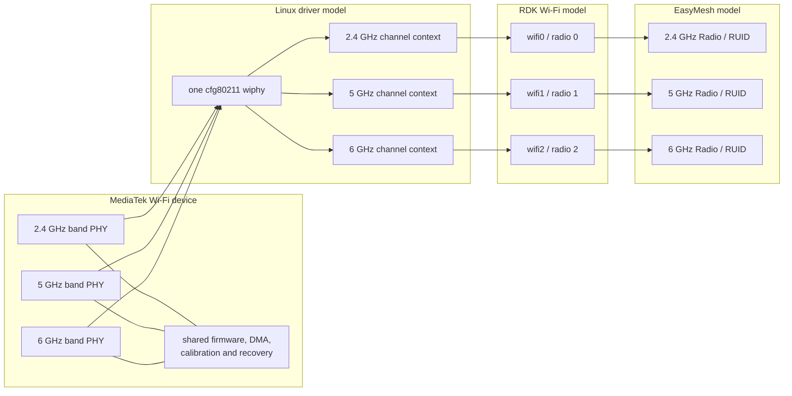

# MediaTek single-wiphy radio model

## Purpose

This document explains why the RDK Banana Pi image presents one Linux `wiphy`
per mesh device while EasyMesh, OneWifi and the WebUI expose three radios. It
also records the consequences for hwsim, wmediumd, identity, telemetry,
steering, lifecycle management, performance and comparison with prplMesh.

The most important distinction is:

> One wiphy does not mean one RF chain or one operating band.

The MediaTek device contains multiple band-specific PHY/MAC engines capable of
concurrent operation. The Linux driver and RDK platform build place those
engines below one device-level wireless object, while the RDK and EasyMesh
models project them back into separate logical radios.

This is a platform architecture, not an EasyMesh requirement. The virtual lab
preserves it deliberately because the purpose of the BPI containers is to
exercise the same HAL and OneWifi contracts used by the target image.

## Terms and boundaries

| Term | Meaning in this lab |
| --- | --- |
| `wiphy` | Linux cfg80211 representation of a wireless hardware device |
| band PHY | A band-specific MediaTek PHY/MAC engine below the device |
| RDK radio | OneWifi/Wi-Fi HAL logical radio such as `wifi0`, `wifi1` or `wifi2` |
| RUID | EasyMesh Radio Unique Identifier for one logical EasyMesh radio |
| VIF | Linux virtual interface created on a wiphy |
| BSS/BSSID | AP service and its over-the-air interface identity |
| channel context | Per-VIF or per-link channel definition maintained by mac80211/driver |
| hwsim station | One base transmitter identity configured in wmediumd |

A wiphy may advertise several frequency bands and own many VIFs. A VIF may be
an AP, station, monitor or another supported interface type. The wiphy is
therefore not interchangeable with an EasyMesh Radio object, BSSID, netdev or
antenna chain.

## Physical MediaTek organization

The MT7996 family is an integrated Wi-Fi device. It contains band-specific
radio engines but shares device-level resources such as:

- the PCIe attachment and DMA infrastructure;
- firmware and management processors;
- EEPROM/calibration state;
- queueing and acceleration facilities;
- reset and recovery control;
- regulatory coordination; and
- Wi-Fi 7 multi-link coordination.

The upstream `mt76` architecture reflects this organization. One `mt76_dev`
owns an array of band PHYs. The additional radio PHY objects reuse the main
`ieee80211_hw`, and therefore its wiphy, rather than registering unrelated
wireless cards. Band lookups select the appropriate internal PHY.

Linux supports this representation. `struct wiphy` describes a physical
wireless device and carries a band table, interface combinations and channel
capabilities. It is not constrained to one band.

Primary references:

- [Linux cfg80211 documentation](https://docs.kernel.org/next/driver-api/80211/cfg80211.html)
- [upstream MediaTek mt76 mac80211 integration](https://github.com/torvalds/linux/blob/master/drivers/net/wireless/mediatek/mt76/mac80211.c)
- [upstream MT7996 registration](https://github.com/torvalds/linux/blob/master/drivers/net/wireless/mediatek/mt76/mt7996/init.c)

The exact BPI image uses its vendor/BSP integration, but the decisive local
evidence is the image's `FEATURE_SINGLE_PHY` contract and its interface map:
all three configured RDK radios belong to `phy_index` zero.

## RDK and EasyMesh projection

RDK needs independent management objects even though Linux exposes a combined
device. Channel, BSS, statistics, policy and EasyMesh protocol state remain
per logical radio.



OneWifi and the Wi-Fi HAL therefore expose:

```text
one Linux wiphy
|-- wifi0    2.4 GHz    independent RDK radio index and EasyMesh RUID
|-- wifi1    5 GHz      independent RDK radio index and EasyMesh RUID
`-- wifi2    6 GHz      independent RDK radio index and EasyMesh RUID
```

The HAL interface map, not wiphy enumeration order, defines the logical radio
and VAP indexes. Supplying more wiphys does not automatically create more
usable RDK radios.

## Why the RDK hwsim lab preserves this model

Each `bpibroadband` or `bpiap` container receives exactly one hwsim wiphy. The
HAL projects that wiphy into the three configured logical radios. This mirrors
the target image's platform contract and keeps these invariants stable:

- one permanent base hwsim identity per BPI device;
- three stable RDK radio indexes and RUIDs per device;
- platform-defined VAP indexes and names;
- one retained `/nvram` identity set per device; and
- a deterministic owner for all VIFs created below the wiphy.

Attaching three hwsim wiphys is not an equivalent configuration. The image is
not compiled as a generic three-card platform. Earlier failures showed that
phy-index matching, interface-map lookup and downstream OneWifi assumptions
can leave interfaces unmapped or crash initialization when this contract is
violated. Extra wiphys also have no corresponding platform slots.

The invariant is implemented by `gen/bpi.sh`, which attaches one pool radio
regardless of the three logical bands in the RDK data model.

## Concurrent-channel consequences

A single wiphy must carry simultaneous 2.4, 5 and 6 GHz AP VIFs. The important
unit is the VIF/channel context, not a global channel stored on the parent
wiphy.

The accepted lab uses:

| Logical radio | Accepted lab channel | Width |
| --- | ---: | ---: |
| 2.4 GHz | 6 | 20 MHz |
| 5 GHz | 36 | 20 MHz |
| 6 GHz | operating class 131 channel | 20 MHz |

Linux 7 rejects a standalone radio-wide `NL80211_CMD_SET_WIPHY` channel change
after a sibling AP VIF is active. That is correct for a command that would
appear to move the whole device. The AP start path, however, carries the VIF's
own channel definition and can create the separate channel context.

The hwsim HAL adaptation therefore lets `START_AP` establish each VIF channel
instead of first issuing the conflicting radio-wide channel command. The lab
also clamps the concurrent contexts to 20 MHz because the wide 80/160 MHz BPI
defaults exceed what the validated synthetic combination accepts. This clamp
is a simulation constraint; it is not a statement about physical MT7996
capability.

Relevant patches include:

- `rdk-wifi-hal/0002`: accept the runtime hwsim phy index in single-phy mode;
- `rdk-wifi-hal/0003`: map VIFs without assuming the kernel phy number is zero;
- `rdk-wifi-hal/0022`: let AP start establish each logical radio channel; and
- `ccsp-one-wifi/0008`: use 20 MHz concurrent hwsim channel contexts.

## hwsim kernel consequences

Stock mac80211_hwsim normally refuses wmediumd registration when its
`channels` module parameter is greater than one. The lab requires three
concurrent contexts, and each frame already carries its operating frequency in
the hwsim generic-netlink protocol. The reviewed kernel patch changes the
registration refusal into a warning; the matching multichannel wmediumd then
uses the per-frame frequency.

The accepted host pool is loaded with Linux 7, `channels=3` and the 6 GHz
regulatory test domain. The wiphy remains a single permanent object when it is
moved into a container; its host-assigned phy number is not renumbered to
`phy0` inside the network namespace. The HAL must consequently identify it by
stable properties instead of a literal kernel enumeration index.

Unloading or reconstructing the hwsim module invalidates every wiphy identity
in the lab. It is therefore a provisioning or whole-lab recovery action, never
a normal node restart operation.

## wmediumd consequences

### Base identities and learned VIFs

wmediumd is configured with one base transmitter identity for each RDK BPI
container and one for each WLAN-client container. AP BSSIDs and backhaul STA
interfaces are dynamic VIF identities learned from frames and associated with
their owning base radio.

For four extenders and 20 clients, the operational RDK roster is:

```text
1 controller/colocated Agent wiphy
+ 4 extender wiphys
+ 20 WLAN-client wiphys
= 25 configured wmediumd stations
```

This must not be mistaken for five single-band mesh devices. Each of the five
mesh wiphys can emit VIF frames on all three band/channel contexts.

### Frequency is mandatory state

A source/destination MAC pair is insufficient to describe the medium. The
same base owner can transmit through VIFs on 2.4, 5 and 6 GHz. wmediumd must
therefore qualify delivery, active-link telemetry, overrides and multicast
fan-out by frequency.

Without frequency qualification, typical failures are:

- a 2.4 GHz broadcast being injected into a 5 or 6 GHz receiver context;
- a steering gradient changing the wrong candidate BSS;
- client RCPI being attributed to the wrong logical radio;
- off-channel drops being interpreted as packet loss on the selected band; or
- a restarted VAP losing its owner mapping.

The Console consequently distinguishes configured base stations, learned
VIFs, active frequency paths and EasyMesh association inference. A VIF is not
shown as an independent physical device merely because it has a distinct MAC.

### Scale and CPU comparison

wmediumd's configured pair matrix grows approximately with the square of the
base-station roster. The single-wiphy RDK representation therefore uses fewer
configured stations than a model with one wiphy per band.

At the same five-device/20-client topology:

| Implementation | Mesh wiphys | Client wiphys | Operational total |
| --- | ---: | ---: | ---: |
| RDK BPI lab | 5 | 20 | 25 |
| prplMesh native lab | 15 | 20 | 35 |

prplMesh currently provisions five additional reserve wiphys, making 40
daemon inventory entries, but reserves are not operational nodes and are
hidden from the Console graph. Performance comparisons must use operational
radio and frame counts, not only the number of EasyMesh devices or clients.

The smaller RDK base roster does not eliminate traffic load: every logical
radio still emits beacons, management frames and client traffic through VIFs.
It reduces configured pair cardinality, while the actual packet rate remains
determined by all active BSSs and clients.

## EasyMesh identity consequences

EasyMesh requires a distinct RUID for each logical radio. Those RUIDs cannot be
derived by treating each Linux wiphy as exactly one EasyMesh Radio. The mapping
must instead preserve all of these levels:

```text
device AL MAC
  -> one base wiphy owner
     -> three logical RDK radios / RUIDs
        -> BSSIDs and backhaul STA VIFs
           -> associated client MACs
```

The controller database and topology APIs must use the logical RUID/BSSID
hierarchy. The host medium inventory uses the base hwsim identity. Joining
these models by enumeration order is unsafe because VIFs can be recreated and
controller onboarding order can change.

Container restart must preserve the device AL MAC, RUID set, VAP identities,
base hwsim assignment and `/nvram`. Recreating any of them turns a restart into
a new EasyMesh device or radio from the controller's perspective.

## Metrics and RCPI consequences

Associated-client metrics originate at a specific AP VIF and must retain its
BSSID and logical-radio owner through:

```text
nl80211 / hostapd
  -> RDK Wi-Fi HAL
  -> OneWifi
  -> libwebconfig/RBUS
  -> EasyMesh Agent
  -> controller Radio/BSS/STA model
```

The base wiphy alone cannot identify the band or BSS. Losing the VIF, channel
or RUID association produces apparently valid signal data attached to the
wrong radio.

Candidate-link RCPI has the inverse mapping problem. wmediumd provides a
frequency-qualified potential path between a client base radio and a target
AP VIF. The HAL must translate the target BSSID/frequency to the correct
logical RDK radio before publishing an ordinary candidate measurement.

This is why the metrics interfaces and scenario language retain both MAC and
frequency even when the parent wiphy is the same.

## Steering consequences

A steering target is a BSSID, not a wiphy. The controller must select:

- the station MAC;
- the current source BSSID and its owning logical radio;
- the target BSSID;
- the target operating class, channel and band; and
- the correct Agent that owns the target BSS.

The steering script's temporary RF bias must also change the client-to-source
and client-to-target VIF paths on the appropriate frequency. Applying a bias
only to a base BPI wiphy pair would affect all three bands and invalidate a
band-steering experiment.

After movement, physical association, AP-side ownership, controller ownership
and WebUI presentation must converge on the same BSSID. A correct base-wiphy
identity is necessary but not sufficient evidence of a successful steer.

## Backhaul and multihop consequences

Fronthaul APs and the backhaul STA may be VIFs below the same parent wiphy. The
medium must still distinguish their roles and frequencies. A backhaul parent
is established by the child bSTA association to a particular upstream
backhaul BSSID, not by the fact that two devices' base wiphys can hear one
another.

Multihop validation must therefore verify:

- the child's live bSTA BSSID;
- the upstream Agent and logical radio that own that BSSID;
- the band/channel of the backhaul path;
- IEEE 1905/EasyMesh parent state; and
- end-to-end traffic through the selected parent.

The WebUI's backhaul edge and signal cannot be derived from base-wiphy
proximity alone.

## Lifecycle consequences

The base hwsim wiphy is permanent provisioned identity. Dynamic VIFs are
runtime state. Normal lifecycle behavior must respect that division:

- stopping a container returns its assigned base wiphy to the host;
- cleanup may delete only dynamic VIFs owned by that wiphy;
- restarting the container must reattach the same permanent wiphy;
- wmediumd must retain the provisioned base identity while it is dormant;
- VIF learning must resume without redefining the radio inventory; and
- unrelated containers and wiphys must not be restarted or cleaned.

Broad host-side VIF cleanup is particularly dangerous because three logical
radios share one ownership boundary. A cleanup intended for one logical radio
can remove the other bands' VIFs and make the entire BPI disappear.

## Failure-domain consequences

The representation also mirrors a real shared failure domain. Firmware crash,
PCIe reset, device removal or wiphy loss can remove every band together. A
single VAP or logical-radio restart should remain narrower, but implementation
mistakes in radio-wide HAL paths may inadvertently disrupt sibling bands.

Tests should distinguish:

| Event | Expected scope |
| --- | --- |
| VAP restart | one BSS, with management-frame subscriptions restored |
| logical-radio reconfiguration | one band and its VAPs where supported |
| OneWifi restart | all logical radios in that BPI process |
| container stop | all bands for one EasyMesh device |
| wiphy/module loss | entire affected radio pool or host lab |

This distinction is also relevant to optimizer experiments: a simulated
single-band fade must modify frequency-qualified paths, while a device outage
must suppress every VIF owned by the base wiphy.

## Difference from the prplMesh lab

The prplMesh native-NL80211 profile assigns one hwsim wiphy to each EasyMesh
radio. Its per-radio fronthaul processes map directly to `wlan0`/2.4 GHz,
`wlan2`/5 GHz and `wlan4`/6 GHz.

```text
prplMesh device
|-- 2.4 GHz EasyMesh radio -> one hwsim wiphy
|-- 5 GHz EasyMesh radio   -> one hwsim wiphy
`-- 6 GHz EasyMesh radio   -> one hwsim wiphy
```

That mapping is simpler for generic hwsim and native NL80211, but it does not
reproduce the BPI `FEATURE_SINGLE_PHY` contract. Neither model is imposed by
EasyMesh.

The differences matter when comparing the stacks:

- **onboarding:** compare EasyMesh devices, radios and BSSs, not wiphy count;
- **wmediumd load:** normalize by base stations, active BSSs and frame rate;
- **failure tests:** a prpl band-wiphy outage is narrower than an RDK BPI
  wiphy outage;
- **telemetry:** both must report per logical radio/BSS despite different
  kernel ownership; and
- **optimizer inputs:** expose the same normalized device/radio/BSS/client
  model rather than raw wiphy topology.

The Console should reveal the real medium representation. RDK legitimately
shows one base infrastructure station per BPI, while prplMesh legitimately has
three operational band radios per mesh device. Deliberately unassigned reserve
radios are inventory capacity, not topology, and must not be promoted into the
operator graph.

## Patch classification implications

The single-wiphy model helps classify the downstream RDK series accurately.

Expected virtual-platform adaptations include:

- handling a nonzero host-assigned hwsim phy index;
- projecting one hwsim wiphy into the configured logical-radio map;
- enabling several concurrent hwsim channel contexts;
- applying a strict 6 GHz regulatory test environment;
- learning and aging VIF identities below one base radio; and
- preserving frequency in wmediumd delivery and metrics.

The following remain generic defects and must not be excused by this model:

- incorrect allocation or object ownership;
- malformed WSC, IEEE 1905 or steering transactions;
- stale controller association ownership;
- timer starvation, unbounded command sessions or memory leaks;
- incorrect snapshot/delta semantics; and
- failure to restore subscriptions or state after an ordinary VAP lifecycle.

The single-wiphy architecture explains integration complexity. It does not
turn unrelated correctness defects into acceptable platform behavior.

## Operational verification

Inside a BPI container, verify that one kernel wiphy backs three logical RDK
radios:

```sh
iw phy
iw dev
ps | grep OneWifi
```

On the host, verify one stable pool radio is attached per BPI container:

```sh
lxc config device show bpibroadband
lxc config device show bpiap
lxc list -c n,config:user.build
```

Check that the three logical bands are live through the product model and
topology rather than expecting three `phyN` objects:

```sh
curl -fsS http://127.0.0.1:8888/api/v1/topology | jq .
curl -fsS http://127.0.0.1:8888/api/v1/bsses | jq .
```

Check wmediumd's base and learned identities separately:

```sh
curl -fsS http://127.0.0.1:8890/api/v1/stations | jq .
curl -fsS http://127.0.0.1:8890/api/v1/vifs | jq .
curl -fsS http://127.0.0.1:8890/api/v1/radio-frequencies | jq .
```

The exact externally forwarded ports depend on the deployment profile; the
commands above use the appliance-local service ports.

## Design rules

1. Keep one permanent hwsim wiphy per RDK BPI container.
2. Never infer EasyMesh Radio count from Linux wiphy count.
3. Never infer band, BSS or association from a base wiphy MAC alone.
4. Preserve frequency on every wmediumd observation and mutation.
5. Treat RUIDs and BSSIDs as logical identities below the base wiphy owner.
6. Preserve base wiphy assignment and `/nvram` across ordinary restart.
7. Clean dynamic VIFs only within the proven owner wiphy.
8. Do not compare RDK and prplMesh performance using client count alone.
9. Keep hwsim-only adaptations compile-time or runtime gated from physical
   MediaTek builds.
10. Validate generic product fixes on physical hardware as well as hwsim.

## Conclusion

MediaTek exposes a coordinated multi-band wireless device, while RDK and
EasyMesh require independently managed logical radios. `FEATURE_SINGLE_PHY`
is the translation boundary between those models. The lab reproduces it with
one hwsim wiphy and several VIF/channel contexts.

That choice improves fidelity to the BPI target but makes the virtual-radio
integration harder than a one-wiphy-per-band design. Correct experiments must
keep the base device, logical radios, VIFs, frequencies and EasyMesh identities
separate. Once those boundaries are explicit, the consequences for medium
simulation, telemetry, steering and lifecycle behavior are deterministic and
testable.
