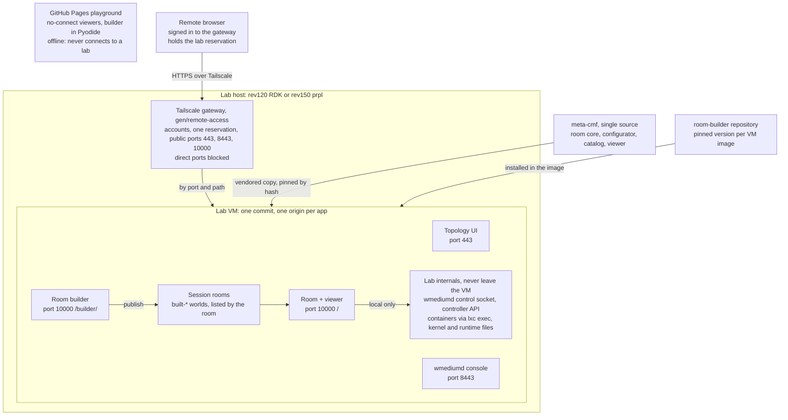
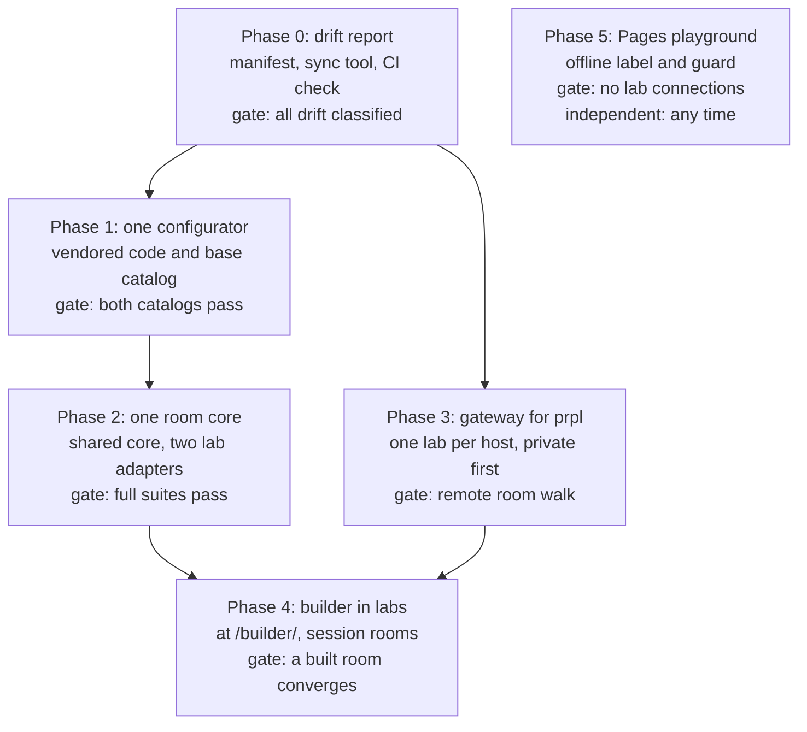

# EasyMesh rooms: design and implementation plan

[Documents](../README.md)

**Status:** Proposed plan. Its shared room code (section on the core and the
adapters) was done differently on 30 September: the room service is one
package in [easymesh-optimizer](https://github.com/boardfarmdevs/easymesh-optimizer)
(`room_service`, pinned here as `gen/optimizer`) with each stack's settings in
`room_service/lab.py`, not a core vendored into two labs. The tables below keep
the names of the time (`room_demo`).

**Prepared:** 29 September 2026.

**Scope:** the RDK lab (this repository), the prplMesh lab (prplmesh-lab), the
[room builder](https://github.com/boardfarmdevs/easymesh-room-builder) and the
[remote-access gateway](../reference/remote-access.md).

Each lab runs everything in its own VM on its own host and is reached only
through the Tailscale gateway. This repository becomes the single source of the
shared room code, and GitHub Pages stays the offline playground.

## 1. Decisions

Eight decisions shape the plan. They replace the earlier idea of a
Pages-hosted viewer that connects to any lab.

| Topic | Decision | Why |
| --- | --- | --- |
| Where a lab's rooms run | Everything in the lab VM: room service, room viewer, builder, topology UI, wmediumd console | The room service must sit next to wmediumd, the controller and the containers. Page and service stay on one origin and one version |
| Remote access | The existing gateway (`gen/remote-access`), extended to prpl. Private (Serve) first; public (Funnel) only by a deliberate step | Already built for RDK: HTTPS, accounts, one exclusive reservation, firewall on the direct ports |
| GitHub Pages | Offline playground only: the no-connect room viewers and the builder in Pyodide. No live connections | Avoids cross-site access, third-party cookies, mixed content and version skew |
| Shared source | This repository. prplmesh-lab vendors a pinned copy, checked by hash | The viewer is already byte-identical; the room core and configurator nearly so |
| Room builder | Stays in its own repository. Each lab VM installs a pinned version, served at `/builder/` on the room's address | Funnel offers only ports 443, 8443 and 10000, all taken. One address also means one reservation and one cookie |
| Rooms made in the builder | Session rooms in their own tree in the VM, never in the golden catalog | The room refuses layouts that are not installed. Suites keep testing the golden catalog only |
| Roles | Operators only. No view role yet | Decided 29 September 2026; the gateway has none today |
| Hosts | One published lab per host (section 3) | A Tailscale hostname carries only one lab's three public ports |

## 2. Architecture

The room service is the only process that touches wmediumd, the controller and
the containers. A remote user reaches it, and every other app, only through the
gateway; Pages never connects to a lab.

## 3. Hosts

Recommended: RDK on rev120, prplMesh on rev150, and rev140 kept for builds and
unpublished development labs. Each published host is its own tailnet node, so
each lab gets its own hostname and the gateway's three public ports.

| Host | Published lab | Lab VM | Also on the host, not published | Notes |
| --- | --- | --- | --- | --- |
| rev120 | RDK | `rdk-emosa-0929` (RDK lab with the EMOSA option, 31 rooms with pods) | `easymesh-lab` (physical; its USB devices are attached to rev120) | The gateway already supports this port layout. Alternative: a plain RDK lab (#1) |
| rev150 | prplMesh | A fresh `prpl-MMDD`, built from scratch there | `emosa-osl-0925`; today also the room browser test host | Also proves a prpl from-scratch build on a third host |
| rev140 | none | none | Yocto builds; `rdk-0929`, `rdk-0925`, `prpl-0929` as development labs | Builds load the CPU, which would disturb published labs. Fallback: publish `prpl-0929` here if rev150 lacks capacity |

Publishing a lab blocks direct LAN access to its VM's web ports; local work
then runs under the gateway's maintenance mode.

## 4. Phases at a glance

Phases 1 and 2 converge the code while Phase 3 opens access; Phase 4 needs
both. Every phase ships only when both labs' suites still pass.

## 5. Phase 0: shared-code manifest and drift report

This repository gets one list of what is shared and a tool that proves
prplmesh-lab's copy matches. Nothing is converged yet; this phase only makes
drift visible.

1. **Manifest** (`gen/shared/manifest.json`): each shared path, its path in
   prplmesh-lab, and a class: `identical`, `parametrized` (one file, lab
   settings passed in) or `lab-owned` (differs on purpose).
2. **Sync tool** (`gen/shared/sync.py`): copies the `identical` and
   `parametrized` files from a checkout of this repository at a given commit
   into prplmesh-lab. It writes `vendor/meta-cmf.lock` there, with the commit
   and a sha256 per file.
3. **Check in both repositories' CI**: prplmesh-lab fails when a vendored file
   differs from its lock. This repository reports the files that changed since
   the commit prplmesh-lab pins.
4. **Drift report**: the first run records today's differences as the Phase 1
   and 2 work list.

Differences measured on 29 September, in both labs:

| Area | Differing today | Size |
| --- | --- | --- |
| Room viewer (`worlds/viewer`) | none | byte-identical |
| Configurator code (`wmdcfg`) | 9 files | `world.py` 3 lines, `actuator.py` 5; `observers.py` 151, `inventory.py` 138, `compiler.py` 63, `kernel_actuator.py` 60, `runner.py` 38, `cli.py` 29, `kernel_metrics_proxy.py` 13 |
| Golden rooms | 11 of 27 | all from one station position in `home-five-agent` |
| Room service (`room_demo`) | 7 of 16 shared modules | `conductor.py` 262 lines, `interactions.py` 141, `cli.py` 79, `band_profiles.py` 40, `events.py` 33, `worlds.py` 4, `client_wifi.py` 4. RDK alone has `backhaul.py`, `trace.py` and `trace_report.py`; prpl alone has `topology.py` |

**Done when:** both repositories run the check in CI, and the report lists
every differing file with a class.

## 6. Phase 1: one configurator and one world catalog

prplmesh-lab's configurator and base room catalog become the vendored copy of
this repository's; only declared lab settings and lab room sets differ.

1. **Code.** `world.py` and `actuator.py` differ trivially and become
   identical. The other seven files are classified in the drift report. Stack
   differences such as runtime paths (`/run/meta-cmf-wmediumd` against
   `/run/prpl-wmediumd`) become a `stack` setting. Genuinely lab-specific parts
   (container inventory, controller observers) become lab-owned modules behind
   one interface.
2. **Catalog drift.** This repository's position wins: `sta_static_04` at
   [11, 3] in `home-five-agent` (prpl has [12, 2]). prplmesh-lab recompiles its
   11 affected `home-a` rooms and reruns them on its lab.
3. **Catalog shape.** The base catalog (`worlds`: layouts, mobility, golden) is
   shared. The lab room sets stay lab-owned for now: RDK `worlds-wired` and
   `worlds-pods`, prpl `worlds-wired` (its fifth extender is the wired Agent).
   Converging the two `worlds-wired` sets is a later step.
4. **Viewer.** Listed as `identical`; it already is.
5. **Room builder.** Its reference parity tests pin the commit of this
   repository that prplmesh-lab vendors. Optional: move the builder's faster
   link computation here (identical output, proven on the 112 upstream golden
   rooms). The builder could then vendor `wmdcfg` instead of keeping its own
   port.

**Done when:** prplmesh-lab's configurator and base catalog match its lock, and
`build-goldens --check` passes in both repositories. The RDK catalog passes 27
of 27 and the prpl catalog as today (26 or 27 of 27). The 11 changed prpl rooms
pass on their own.

## 7. Phase 2: one room core with an RDK and a prpl adapter

The room service becomes a shared core from this repository plus one small
adapter per lab. The HTTP API, ports, systemd units and viewer behaviour stay
as they are.

| Part | Lives in | Contents |
| --- | --- | --- |
| Core (vendored, identical) | `gen/demo/room_demo` | server, engine, events, journal, pool, recovery, steering safety, RF manifest, traffic experiment, worlds, interactions, conductor, client Wi-Fi, band profiles |
| RDK adapter | this repository | em_cli observer and candidate provider (loopback port 8888), native steering and `gen/steer.sh`, device names (`agent-1` is the gateway), topology projection, backhaul control (`backhaul.py`), traces |
| prpl adapter | prplmesh-lab | prplMesh observer and candidate provider (NBAPI, and the controller UI's API on loopback port 8092), `BTMRequest` steering, device names (`controller` is the gateway), `topology.py`, station MAC bindings |

1. **Adapter interface** in the core: observe, candidates, steer, device roles,
   topology projection, and optional backhaul and trace hooks. The conductor
   calls only this interface.
2. **Move the differences.** The conductor's 262 differing lines move into the
   two adapters. `interactions.py`, `band_profiles.py`, `client_wifi.py` and
   `cli.py` converge, or take a lab setting.
3. **Steering actions for both labs.** prpl's `optimizer.action` tracking in
   `events.py` becomes core. RDK's current state gains the same additive
   `steering_actions` field.
4. **Location independence.** Modules stop deriving the repository root from
   their own position (`parents[3]` against `parents[2]` today). The lab's
   entry point passes the repository root and runtime paths.
5. **Tuning as settings.** RDK's profiling limits (5 actions in flight, 8 s, 16
   verifications) and prpl's 5 verification workers become settings with each
   lab's current defaults.

**Done when:** the core files match the lock in prplmesh-lab. On RDK: the
catalog 27 of 27, the geometry rooms, the world switch through every world and
back to the default. On prpl: its catalog and geometry rooms as today. The room
browser tests pass unchanged on both.

## 8. Phase 3: the gateway for both labs, one lab per host

The gateway (`gen/remote-access`) learns the prpl lab's port layout. Each
published host then runs one gateway for its one lab. This phase needs only
Phase 0 and can run beside Phases 1 and 2.

1. **Stack-aware discovery.** `configure --stack rdk|prpl` selects the LXD
   proxy devices, cross-checked against the VM's config
   (`user.prplmesh.source-commit` exists only on prpl VMs).

   | App | Public port | RDK device | prpl device |
   | --- | --- | --- | --- |
   | Topology UI | 443 | `easymesh-webui` | `controller-ui` |
   | wmediumd console | 8443 | `wmediumd-console` | `wmediumd-console` |
   | Room (and later `/builder/`) | 10000 | `room-demo-viewer` | `room-demo-viewer` |

2. **Room lease check.** Unchanged; both labs serve the same room API.
3. **prpl host install.** The gateway stays a host tool of this repository.
   rev150 installs it from a checkout of this repository, and prplmesh-lab's
   deploy guide points to it.
4. **Lab placement.** rev120 publishes its RDK lab. rev150 gets a prpl VM built
   from scratch, then publishes it. rev140 stays unpublished.
5. **Private first.** `publish --mode private`, one account per person, then
   the two-browser checks from `remote-access.md` on each lab.
6. **Test runs move.** Room browser tests run from rev150 against LAN ports
   today, and publishing blocks those ports. They move onto each lab's own host
   under maintenance mode. Teaching them to reserve through the gateway is a
   later option.
7. **Public only deliberately.** `publish --mode public --confirm-public`, per
   lab, after step 5 passes.
8. **Docs.** `remote-access.md` covers prpl, and the umbrella's
   `lab-configurations.md` gains each lab's published address.

**Done when:** from outside the LAN, a signed-in user reserves each lab, walks a
room and releases it, while a second browser is refused. Direct LAN access to
both VMs' web ports is blocked. Each lab's suites pass from its own host under
maintenance mode.

## 9. Phase 4: the builder inside each lab, with session rooms

Each lab VM runs the builder at `/builder/` on the room's address. A room drawn
there is published into a session tree, and the room service offers it next to
the golden rooms. This needs Phase 2 (one room core to change once) and Phase 3
(the gateway to route `/builder/`).

**Room core (this repository, vendored to prpl)**

1. **`GET /api/demo/lab-profile`**, read-only: mesh roles, bound stations and
   pool size, bands, supported backhaul policies, and features (traffic, band
   profiles, pods). It exposes exactly what world selection already enforces.
2. **Session tree** at `/var/lib/easymesh-room/session/{golden,layouts,mobility}`.
   Room ids there start with `built-`. The catalog lists them after the golden
   rooms, marked `"source": "session"`. Selection applies the same checks:
   plan hash, layout hash, roles, bands. The catalog cache already reloads when
   files change.
3. Session rooms are never the default and are not part of any suite.
   Restore-default is unchanged.

**Builder (room-builder repository)**

4. **Relative API paths** (`api/` instead of `/api/`, one line in
   `js/api.js`), so the builder works under `/builder/`.
5. **Lab mode:** `serve --lab http://127.0.0.1:8891` checks designs against the
   lab's live profile. The static profiles remain for Pages and offline use.
6. **Publish to this lab:** a server-side action writes the compiled world,
   layout and movements into the session tree. It overwrites only its own
   `built-` rooms, with a limit such as 50. The UI needs one menu entry, no new
   module.
7. **Service:** `room-builder.service` as an unprivileged `roombuilder` user,
   designs in `/var/lib/room-builder`, port 8790 on the guest address.

**Gateway and VM builds (this repository, prplmesh-lab)**

8. **Path routing** on public port 10000: `/builder/` goes to the builder, the
   rest to the room. The same reservation and cookie cover both.
9. **VM builds:** both labs' `build.sh` install the pinned builder and add an
   LXD proxy device `room-builder`. The umbrella `manifest.json` pins the
   builder commit, like the other projects.
10. **Viewer:** session rooms appear in its existing world list. A "built"
    badge is optional.

**Done when:** on each published lab, a user draws a room at `/builder/`,
publishes it, selects it in the viewer and watches it run and converge. A
design that does not fit the lab is refused by the builder, and by the room if
sent directly. Suites still pass on the golden rooms alone.

## 10. Phase 5: GitHub Pages as the offline playground

The three Pages sites stay as they are and say plainly that they are offline.
No page connects to a lab. This phase is independent and small.

1. **Lab sites** (this repository, prplmesh-lab): the no-connect viewer with
   the golden rooms, unchanged. After Phase 1 both show the same base rooms.
2. **Builder site:** the Pyodide build, unchanged. Lab mode and publishing
   never ship in it.
3. **Label:** each playground page states that it is offline and that live
   labs are reached through their gateway. Add the line only where a page does
   not already say it.
4. **Guard:** each site build fails if it contains a lab address or a live
   viewer mode. `gen/explorer/scripts/build-pages.mjs` already refuses a viewer
   that is not `no-connect`; prplmesh-lab and the builder get the same check.
5. **No live links while labs are private:** public pages do not list tailnet
   addresses. A link is added only when a lab goes public.

**Done when:** the three sites build and publish as today, each says it is
offline, and the guard passes.

## 11. Phases 6 to 8: optimizer workbench

Three further phases let an optimizer developer upload a policy and select it
for room runs: a sandboxed policy host, then the SDK, registry and reports,
then a Data Elements view. They follow Phases 2 and 3 and are designed in the
optimizer workbench proposal, which moved with the optimizer to
[easymesh-optimizer](https://vcpe.dev/easymesh-optimizer/) on 2 October 2026; there
they are the later stages of pluggable optimizer algorithms.

## 12. What stays as it is

Every phase ships only when these still hold.

- **Local flow in each VM:** the room service keeps its command line, port
  8891, systemd unit and interactive, replay and no-connect modes. em_cli's
  room-layout proxy is unchanged.
- **Room API:** same origin, shipped with the viewer from one commit. No
  cross-site headers are added, and the room service gets no login of its own;
  the gateway does that.
- **Suites:** same rooms, same checks, same pass criteria. Only the place where
  browser tests run changes after publishing (Phase 3, step 6).
- **Unpublished labs** (rev140's development labs, `emosa-osl-0925`,
  `easymesh-lab`) are untouched.
- **Pages:** the no-connect viewers and the Pyodide builder keep working
  offline.
- **Builder parity:** the builder's byte-parity tests against the configurator
  keep running, now pinned to the vendored commit.
- **Labs as a service:** compatible. Remote optimizers are Python clients of
  the same gateway, so the browser-only restrictions avoided here never applied
  to them.

## 13. Risks and fallbacks

The largest risk is behaviour drift while the conductor converges (Phase 2);
the rest are operational.

| Risk | Effect | Fallback |
| --- | --- | --- |
| Converging the conductor changes steering in one lab | Convergence or suite regressions | Move code into adapters verbatim first, converge in small steps, run the full suite per step, keep the old modules until green |
| Publishing blocks direct LAN access | Local users and LAN bookmarks stop working for that VM | Use the gateway, or maintenance mode for local sessions. Publish privately first |
| Browser tests on rev150 hit blocked ports | Suites fail after publishing | Run them on the lab's host under maintenance mode (Phase 3, step 6) |
| The catalog fix changes 11 prpl rooms | Different results on those rooms | Rerun them. If one fails, keep prpl's position as a temporary lab overlay |
| rev150 lacks capacity next to `emosa-osl-0925` | prpl build fails or timing gets noisy | Publish `prpl-0929` on rev140 and accept the build load, or stop `emosa-osl-0925` |
| The builder adds exposure inside the VM | A new service behind the public port | Unprivileged user, writes only the session tree, room re-checks every world, behind the same reservation |
| Session rooms pile up | Disk use, a cluttered world list | Count limit, `built-` prefix, marked source |
| Tailscale unavailable | No remote access | Labs keep working locally; the gateway is only the entry point |
| A filtered laptop blocks `ts.net` | That laptop cannot reach live labs | None from our side. The Pages playground and LAN access under maintenance still work |

## 14. Open questions

Seven questions to settle before Phase 0 starts; each has a proposed answer.

- [ ] **RDK lab on rev120:** publish `rdk-emosa-0929` as it is, with pods and
  31 rooms, or build a plain RDK lab? Proposed: as it is.
- [ ] **prpl on rev150:** is there capacity next to `emosa-osl-0925`?
  Proposed: check memory and disk first; otherwise publish from rev140.
- [ ] **prpl topology app:** is `controller-ui` the right app on port 443 for
  prpl? Proposed: yes.
- [ ] **`worlds-wired`:** converge RDK's and prpl's wired room sets now, or
  after Phase 2? Proposed: after.
- [ ] **Builder engine:** vendor this repository's `wmdcfg` or keep the
  builder's own port? Proposed: vendor, once the faster link computation is
  here.
- [ ] **Accounts:** who gets the first gateway accounts, and does any lab go
  public (Funnel)? Proposed: private only until Phase 4 is done.
- [ ] **Session rooms:** limit and lifetime. Proposed: 50 per lab, removed when
  the VM is rebuilt.
