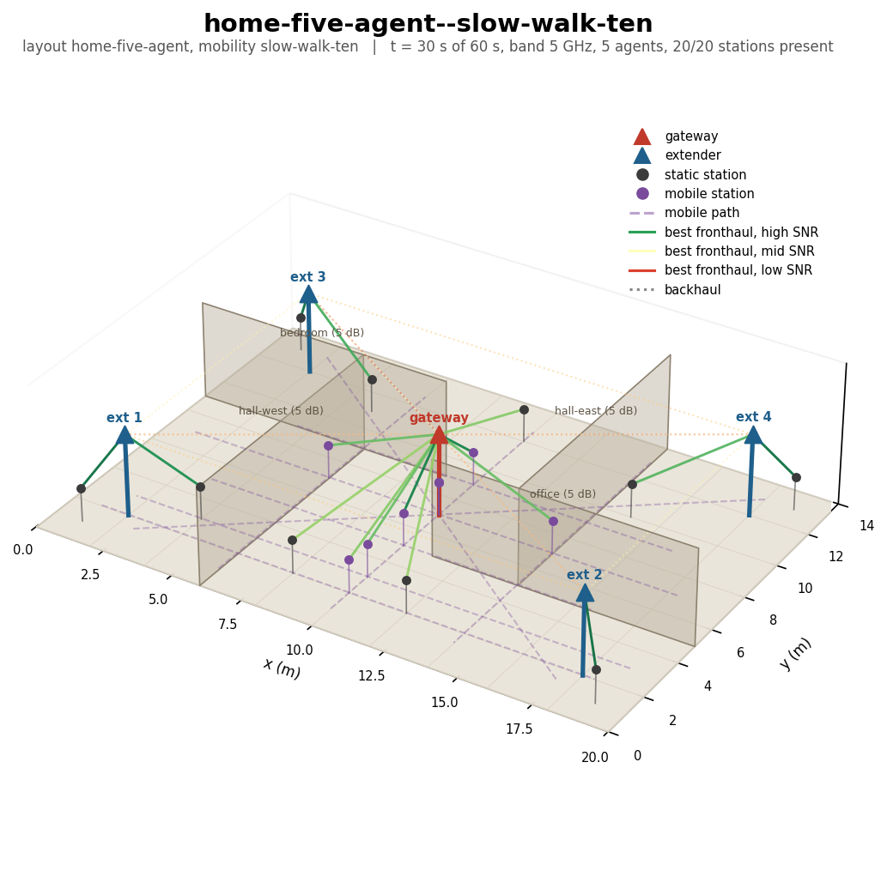
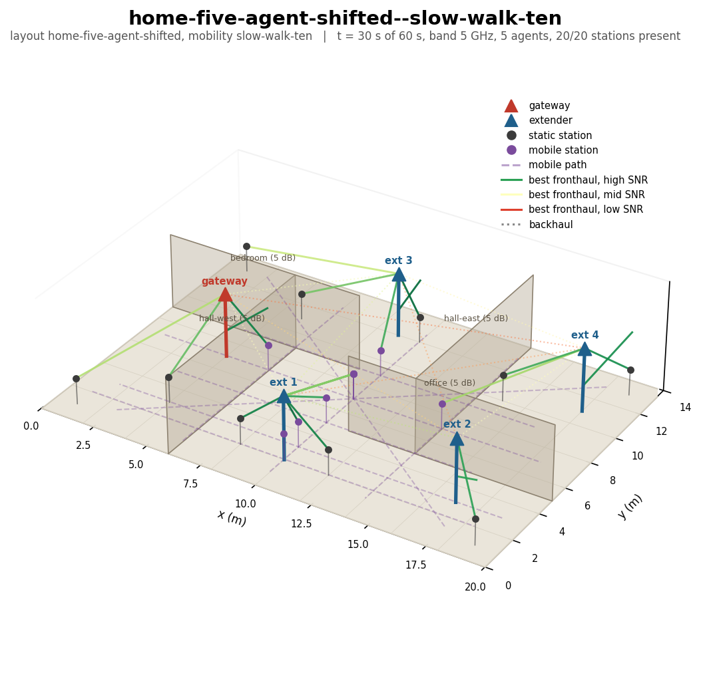
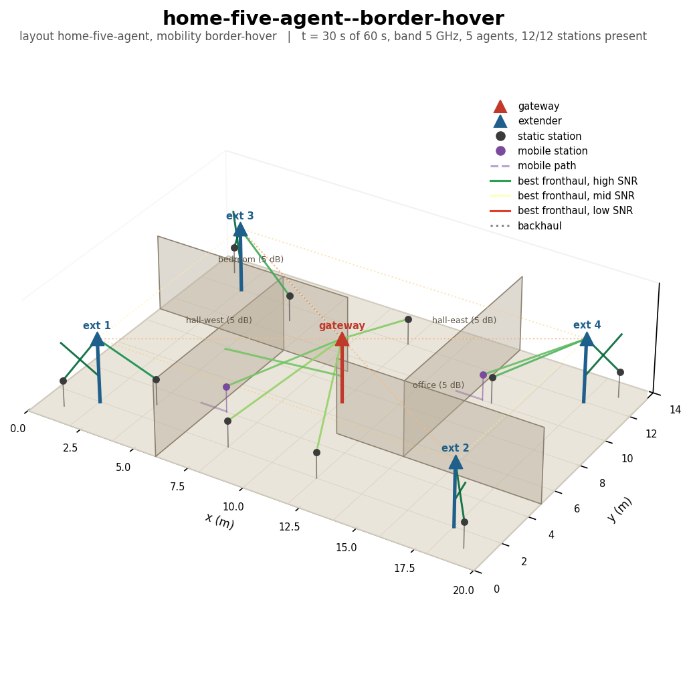
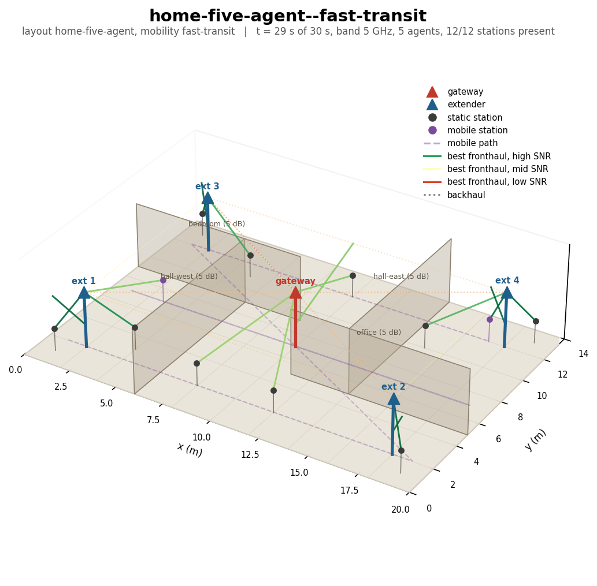
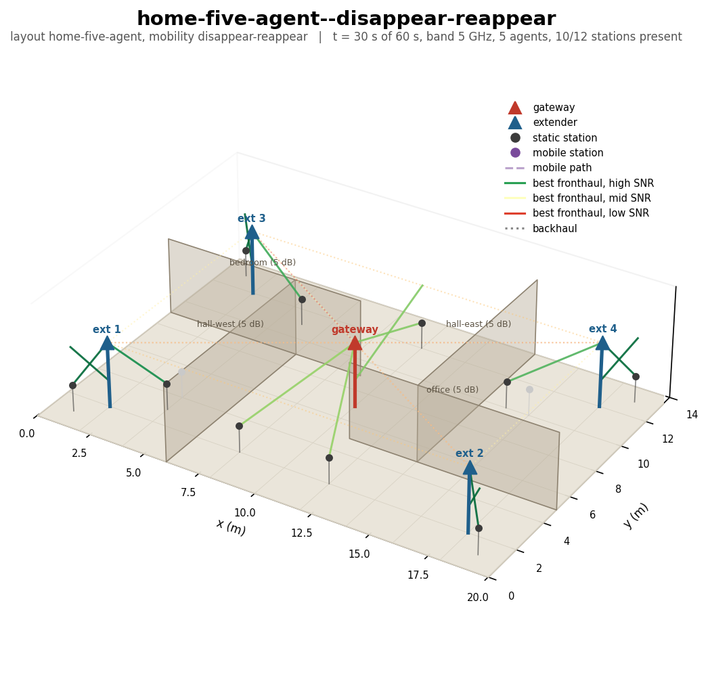
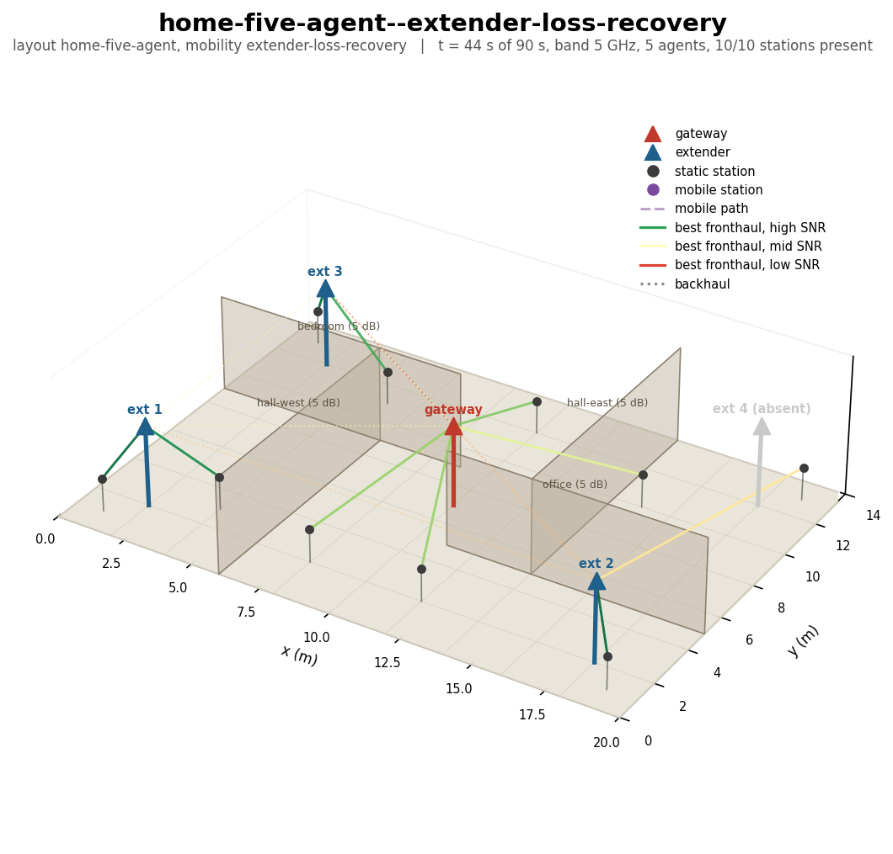
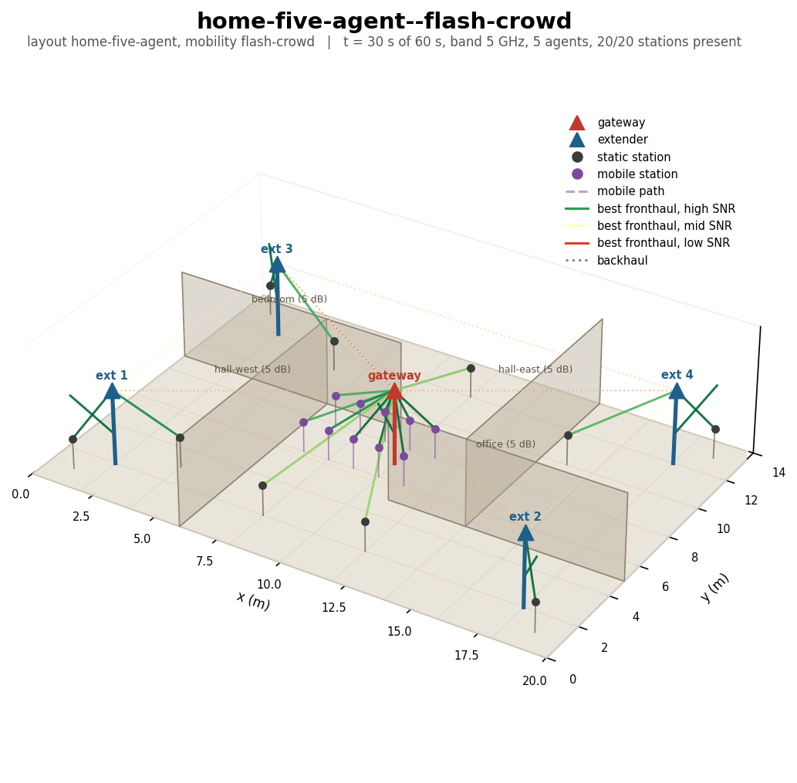
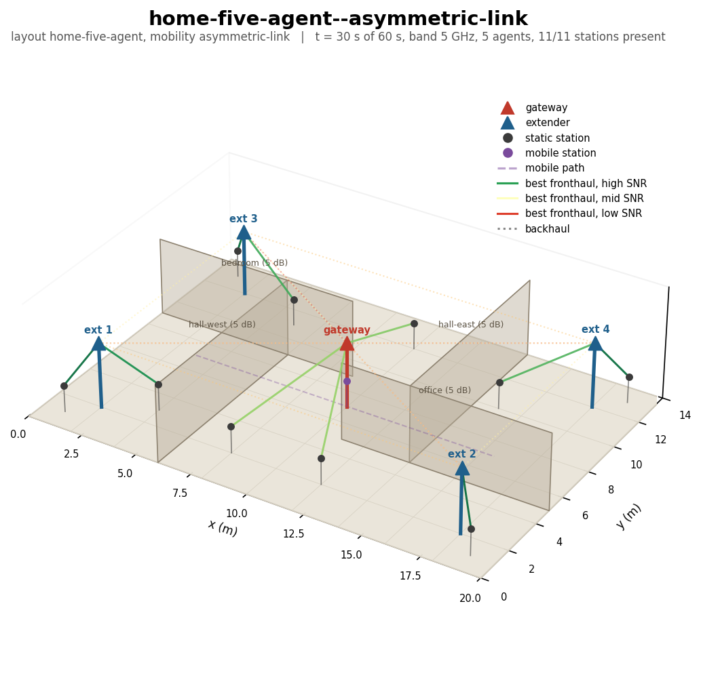
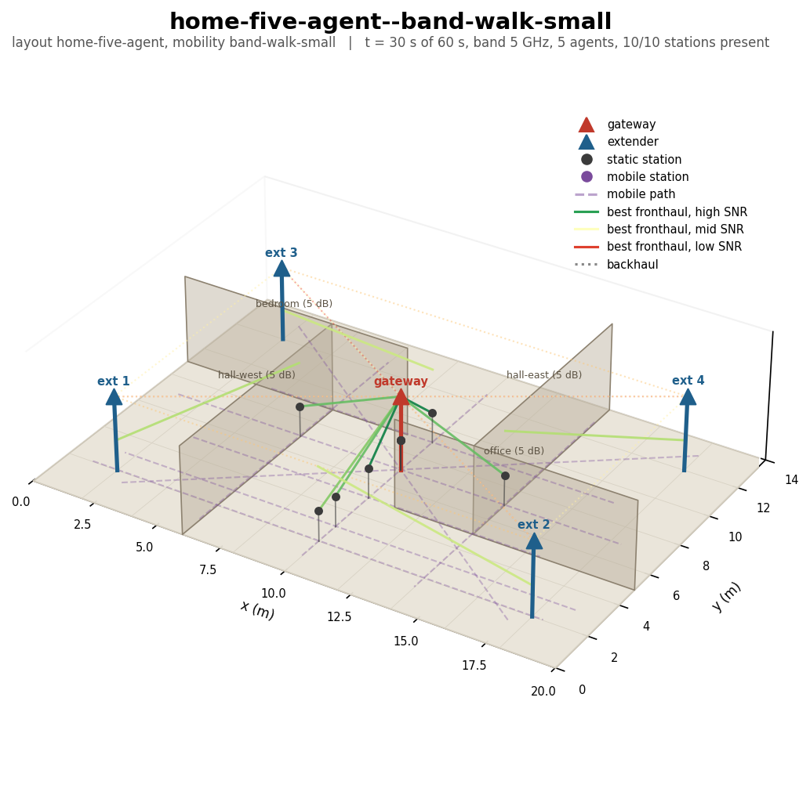

# Rendering the RF worlds in 3D

The files in `golden/` are deterministic `wmdcfg.world-plan.v1` RF plans. The
`render-world-3d.py` helper turns any generation of a plan into a static PNG,
a scalable SVG, or both. PNG is convenient for GitHub and reports; SVG is
useful for presentations and lossless resizing.

The drawing represents:

- the floor plan and fixed-loss walls;
- the gateway, extenders, and static or mobile stations;
- the complete path followed by each mobile station;
- one direction-independent best serving fronthaul link for every present
  station; and
- optional AP-to-AP backhaul links.

Link colours use the selected band's SNR: red is weak, amber is intermediate,
and green is strong. The renderer is a visualization of a compiled world; it
does not modify or execute the scenario.

## Interactive world viewer

The browser viewer in `viewer/index.html` animates every checked-in golden
world at its real scenario rate. It interpolates station movement between
generations, colours each station's strongest serving link by SNR on the
selected band, draws movement trails, and can show the simulated backhaul.
Clicking a node lists its current peers with distance, wall loss, and
bidirectional SNR for 2.4, 5, and 6 GHz. Its preview-only Interact mode can
drag a client, move it to a clicked destination at a selected speed, show
crossed walls and predicted links, or preview disappearance. These operations
are local visualization overrides and do not change wmediumd.

The public viewer is published as a static site from the repository's
`gh-pages` branch:

<https://boardfarmdevs.github.io/meta-cmf-bananapi-vcpe/viewer/>

Select a world in the sidebar or address one directly, for example:

<https://boardfarmdevs.github.io/meta-cmf-bananapi-vcpe/viewer/?world=home-a-slow-walk-ten>

For local use, serve the `worlds/` directory over HTTP so the viewer can fetch
the golden JSON files:

```sh
cd gen/wmediumd/configurator/worlds
python3 -m http.server 8000
```

Then open <http://localhost:8000/viewer/>. In Camera mode, drag to orbit,
shift-drag to pan, use the wheel to zoom, press space to play or pause, and
click a node to inspect its links. Select Interact to drag a client, or
right-click it to choose destination movement and presence controls. Opening
`index.html` directly also works with the file picker. Three.js is bundled, so
the viewer does not require a public CDN.

## Install the renderer dependencies

Run this once in a Python virtual environment:

```sh
python3 -m venv .venv
. .venv/bin/activate
python3 -m pip install matplotlib numpy
```

No desktop or X server is required. The script selects Matplotlib's headless
`Agg` backend.

## Render all golden worlds

Run from `gen/wmediumd/configurator`:

```sh
python3 worlds/render-world-3d.py \
  worlds/golden/*.world.json \
  --outdir worlds/pictures
```

The default picture uses the generation closest to the middle of each world
and displays 5 GHz SNR. Existing files with the same names are replaced. Use
`--format svg` to generate only SVG files, or generate both formats together:

```sh
python3 worlds/render-world-3d.py \
  worlds/golden/*.world.json \
  --format both \
  --outdir worlds/pictures
```

Before rendering, the checked-in worlds can be verified against their layout
and mobility sources:

```sh
./worlds/build-goldens.sh --check
```

Use `--write` instead of `--check` only when intentionally regenerating the
golden plans after changing a source layout or mobility definition.

## Render one time and band

For example, render the generation nearest 30 seconds using 6 GHz link SNR:

```sh
python3 worlds/render-world-3d.py \
  worlds/golden/home-a-slow-walk-ten.world.json \
  --time-ms 30000 \
  --band 6 \
  -o /tmp/home-a-slow-walk-ten-30s-6ghz.png
```

Useful options are:

- `--format png|svg|both`: select raster, vector, or both output formats;
- `--time-ms N`: use the generation nearest `N` milliseconds;
- `--band 2.4|5|6`: select the SNR values used to colour links;
- `--elev DEGREES` and `--azim DEGREES`: change the camera position; and
- `--no-backhaul`: hide AP-to-AP links.

With one input, `-o` names the output directly for `png` or `svg`. With
`--format both`, it is treated as a basename: for example,
`-o /tmp/world-picture` creates `/tmp/world-picture.png` and
`/tmp/world-picture.svg`.

## Golden-world gallery

### Stationary baseline


### Ten slow-moving stations



### Shifted-agent slow walk



### Border hover



### Fast transit



### Disappear and reappear



### Extender loss and recovery



### Flash crowd



### Asymmetric link



### Small three-band walk


